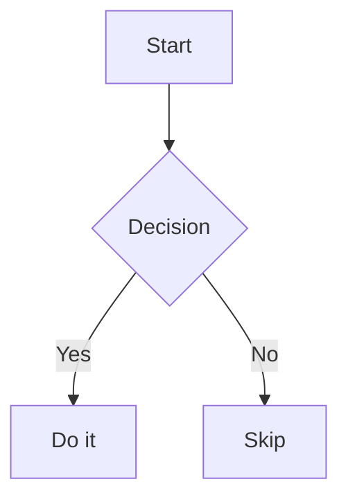

# md-to-docx — Syntax & Configuration Reference

The complete reference for authoring documents with `md-to-docx`: the Markdown
subset it understands, the HTML‑comment **directive** system, and every
**configuration** key.

---

## Table of contents

- [1. Overview](#1-overview)
- [2. Markdown syntax](#2-markdown-syntax)
  - [2.1 Headings](#21-headings)
  - [2.2 Inline formatting](#22-inline-formatting)
  - [2.3 Links](#23-links)
  - [2.4 Line breaks](#24-line-breaks)
  - [2.5 Lists](#25-lists)
  - [2.6 Tables](#26-tables)
  - [2.7 Code blocks](#27-code-blocks)
  - [2.8 Mermaid diagrams](#28-mermaid-diagrams)
  - [2.9 Images](#29-images)
  - [2.10 Horizontal rules](#210-horizontal-rules)
  - [2.11 Page breaks](#211-page-breaks)
  - [2.12 Comments](#212-comments)
  - [2.13 Blockquotes](#213-blockquotes)
- [3. Directives (`@`-comments)](#3-directives--comments)
  - [3.1 Grammar](#31-grammar)
  - [3.2 `@config` / `@doc` — document configuration](#32-config--doc--document-configuration)
  - [3.3 `@style` — inline run styling](#33-style--inline-run-styling)
  - [3.4 `@header` / `@footer` — running header & footer](#34-header--footer--running-header--footer)
  - [3.5 `@pagebreak`](#35-pagebreak)
  - [3.6 Variables](#36-variables)
- [4. Configuration reference](#4-configuration-reference)
  - [4.1 Loading & precedence](#41-loading--precedence)
  - [4.2 Units & value formats](#42-units--value-formats)
  - [4.3 Keys](#43-keys)
  - [4.4 Complete annotated example](#44-complete-annotated-example)
- [5. Programmatic configuration](#5-programmatic-configuration)

---

## 1. Overview

A `md-to-docx` source file has two layers:

1. **Markdown content** — a hand‑rolled, line‑oriented subset of Markdown
   (headings, lists, tables, code, images, …) described in [§2](#2-markdown-syntax).
2. **Directives** — HTML comments that begin with an `@` sigil
   (`<!-- @config … -->`, `<!-- @style … -->`, …). They are invisible in every
   Markdown viewer but instruct the converter. See [§3](#3-directives--comments).

There is **no YAML frontmatter** (`---`). All document configuration lives in
`@config` directives — see [§4](#4-configuration-reference).

---

## 2. Markdown syntax

> The parser is line‑based, not full CommonMark. Each line is classified on its
> own; consecutive paragraph lines do **not** merge into one paragraph.

### 2.1 Headings

```markdown
# Heading 1
## Heading 2
### Heading 3 … up to ###### Heading 6
```

Levels `H1`–`H6` map to Word heading styles (configurable per level — see
[`heading`](#heading)). Every heading also becomes an internal‑link target
([§2.3](#23-links)).

### 2.2 Inline formatting

| Syntax | Result |
|:-------|:-------|
| `**bold**` or `__bold__` | **bold** |
| `*italic*` or `_italic_` | *italic* |
| `` `inline code` `` | monospace run (styled via [`inline_code`](#inline_code)) |

`_`/`__` are not matched mid‑word, so `my_var_name` stays literal. Markers may
nest, e.g. `**bold with `code` inside**`.

### 2.3 Links

**External:**

```markdown
[google.com](https://google.com)
```

**Internal** (link to a heading by its slug):

```markdown
See the [Architecture Overview](#architecture-overview).
```

Slugs are GitHub‑style: lowercased, punctuation removed, spaces → `-`, and
Unicode letters (including Vietnamese diacritics) preserved. Duplicate headings
get `-1`, `-2`, … suffixes (a second `## Notes` → `#notes-1`). An unresolved
internal link renders as plain text and emits a `link` warning.

### 2.4 Line breaks

Use `<br>` (or `<br/>`) to force a line break inside one block — most useful in
table cells, where a literal newline cannot exist:

```markdown
| Case   | Description                          |
| ------ | ------------------------------------ |
| Case A | Line 1<br>Line 2<br>**Bold line 3**  |
```

Inline markdown is still parsed within each segment, and `<br><br>` yields two
consecutive breaks. A line that is *only* `<br>` (outside a table) is treated as
a blank paragraph. `<br>` also works **inside** an `@style` span
([§3.3](#33-style--inline-run-styling)) — e.g. a multi-line styled block can put
`<br>` on its own line to add blank lines while keeping the style:

```markdown
<!-- @style align=right size=12 color=f00 -->
A right-aligned, red note
<br><br>
<!-- /style -->
```

### 2.5 Lists

```markdown
- Top level
  - Nested one
    - Nested two
- Back to top
  this wrapped line is lazily joined onto the item above

1. First
2. Second
```

- **Nesting** is derived from relative indentation, so both 2‑space and 4‑space
  schemes work. Bullet depth is capped at three levels (configurable glyphs via
  [`list.bullets`](#list)).
- **Lazy continuation:** a plain line directly after a list item is appended to
  that item on a new line (the newline becomes a hard line break, not a space).
- **Numbered lists restart at 1.** Any real content block (paragraph, heading,
  table, …) between two numbered lists starts a fresh sequence; blank lines and
  nested bullets do not break it.

### 2.6 Tables

```markdown
| Left   | Center | Right |
|:-------|:------:|------:|
| a      | b      | c     |
```

- The alignment row (`:---`, `:--:`, `--:`) sets per‑column alignment.
- Rows alternate fill colors; header and rows are fully styled via
  [`table`](#table).
- Cells support inline markdown, `<br>` ([§2.4](#24-line-breaks)), internal
  links, and `@style` ([§3.3](#33-style--inline-run-styling)). Escape a literal
  pipe as `\|`.
- Column widths are auto‑sized from content.

### 2.7 Code blocks

````markdown
```js
console.log('hello');
```
````

Fenced blocks render in a shaded box with a language label chip (when
`code.label.show` is on). Styling via [`code`](#code). A fence with no language
is rendered without a label. HTML comments inside a code block are preserved
literally.

### 2.8 Mermaid diagrams

````markdown

````

Mermaid blocks are rendered to PNG and embedded as images. Text is normalized so
every diagram shows at roughly `mermaid.font_size` pt for a consistent look. A
diagram taller than one page is shrunk to fit (down to `mermaid.min_font_pt`); the
`--split-tall-mermaid` CLI flag slices it into page‑height images at full size
instead. If rendering is unavailable, the block falls back to a plain code block
and a `mermaid` warning is emitted. Tuning keys: [`mermaid`](#mermaid).

### 2.9 Images

```markdown


{width=600 height=400}
```

- Size override: `=WxH` (either dimension may be omitted, e.g. `=600x`) or
  `{width=… height=…}`.
- Paths resolve relative to the Markdown file (CLI) or the `baseDir` option (API).
- With `image.caption: true` (default), the alt text renders as an italic,
  centered caption below the image. An unreadable image degrades to an empty
  paragraph plus an `image` warning.

### 2.10 Horizontal rules

```markdown
---
```

Three or more `-`, `*`, or `_` on their own line render as a bottom border rule.

### 2.11 Page breaks

Any of these force a page break:

```markdown
<!-- @pagebreak -->                            ← preferred ([§3.5](#35-pagebreak))
<div style="page-break-after: always"></div>
page-break-after: always
```

### 2.12 Comments

An HTML comment whose line **starts** with `<!--` is consumed (single‑ or
multi‑line) and, unless it is a directive, dropped — exactly as Markdown viewers
hide it:

```markdown
<!-- a private note, not rendered -->

<!-- a
multi-line note -->
```

The closing `-->` line is dropped in full, so don't put visible text after it on
the same line. A comment that begins **mid‑line** (`text <!-- note -->`) is not
stripped and renders literally — except a paired `@style` comment, which is
interpreted ([§3.3](#33-style--inline-run-styling)).

### 2.13 Blockquotes

Lines beginning with `>` form a blockquote:

```markdown
> **Key insight:** the buffer lives at a low address while the
> return address sits higher up.
>
> A second paragraph, separated by a blank quote line.
```

Consecutive `>` lines are joined into one paragraph; a `>` line with nothing
after it starts a new paragraph within the same quote. The block ends at the
first line that does not start with `>`. Inline formatting (`**bold**`, links,
`@style`, …) works inside. By default a quote renders as indented italic text;
the [`quote.*`](#quote) keys can add a left bar or shaded box.

---

## 3. Directives (`@`-comments)

### 3.1 Grammar

A comment whose inner text starts with the `@` sigil is a **directive**. Plain
comments (no `@`) are dropped ([§2.12](#212-comments)).

Two body shapes are accepted:

| Shape | Looks like | Used by |
|:------|:-----------|:--------|
| **Inline args** (one line) | `<!-- @style color=red bold -->` | `@style`, single‑line `@header`/`@footer` |
| **Block YAML** (multi‑line) | `<!-- @config\n  key: value\n-->` | `@config`, `@doc`, block `@header`/`@footer` |

Inline‑argument tokens:

| Token | Meaning |
|:------|:--------|
| `flag` | boolean `true` (e.g. `bold`) |
| `key=value` | value without spaces (e.g. `color=red`, `size=9`) |
| `key="value"` | quoted value with spaces (e.g. `font="Times New Roman"`) |

Directive summary:

| Directive | Shape | Purpose | Section |
|:----------|:------|:--------|:--------|
| `@config` | block | document configuration | [3.2](#32-config--doc--document-configuration) |
| `@doc` | block | document metadata → `doc.*` variables | [3.2](#32-config--doc--document-configuration) |
| `@style … /style` | inline, paired, or self‑close `/-->` | style a text run (or align a paragraph) | [3.3](#33-style--inline-run-styling) |
| `@header` / `@footer` | inline or block | running header / footer | [3.4](#34-header--footer--running-header--footer) |
| `@pagebreak` | inline | page break | [3.5](#35-pagebreak) |

Variable references (`{doc.title}`, `{vars.x}`, `{date}`, …) work anywhere — see
[§3.6](#36-variables).

### 3.2 `@config` / `@doc` — document configuration

`@config` carries the document configuration. Its body is mini‑YAML, parsed by
the same parser the old `---` frontmatter used. Place it anywhere (conventionally
at the top); multiple blocks deep‑merge in document order (later wins).

```markdown
<!-- @config
page:
  margin: 2.5
body:
  font: Times New Roman
footer:
  page_number: true
-->
```

`@doc` holds document **metadata**; its body populates the `doc.*` variable
namespace ([§3.6](#36-variables)) rather than styling config:

```markdown
<!-- @doc
title: Quarterly Report
subtitle: Q2 2026
-->
```

Reference it anywhere as `{doc.title}`, `{doc.subtitle}`, …

The full set of styling keys is in [§4](#4-configuration-reference).

> **Cover pages** are not a directive. Write one as ordinary body content — e.g.
> a centered `@style` title ([§3.3](#33-style--inline-run-styling)) — followed by a `@pagebreak`, and use
> `skip_on_first_page` ([§3.4](#34-header--footer--running-header--footer)) to keep
> the header/footer off it.

### 3.3 `@style` — inline run styling

Wrap text in a paired `@style … /style` to style just that run. Markdown inside
is still parsed, and it works inside table cells.

```markdown
This is <!-- @style color=#cc0000 bold -->very important<!-- /style --> text,
with a <!-- @style highlight=yellow italic -->highlighted note<!-- /style -->,
and H<!-- @style sub -->2<!-- /style -->O.
```

Closing tag: `<!-- /style -->` (or `<!-- @/style -->`).

**Three forms** — pick whichever reads best:

```markdown
<!-- the wrapping form: explicit close, styles exactly the wrapped text -->
A <!-- @style color=red -->wrapped run<!-- /style --> here.

<!-- multi-line wrapping: open / body / close on separate lines (the body
     lines are joined with a space into one paragraph) -->
<!-- @style align=center size=28 bold -->
OPS_20260309_134 — a long centered title
<!-- /style -->

<!-- self-close ( /--> ): styles the REST OF THE LINE, no close tag needed -->
Price: <!-- @style color=red bold /-->1,000,000 VND

<!-- self-close alone on its own line: styles the NEXT line (handy for a long
     title you want to keep on a line of its own) -->
<!-- @style align=center size=26 bold /-->
OPS_20260309_134 SHOPEEPAY/ZALOPAY — long title on its own line
```

| Argument | Effect | Notes |
|:---------|:-------|:------|
| `color=…` | text color | hex `#cc0000` / `cc0000` / `abc`, or a [named color](#named-colors) |
| `bg=…` | background fill | same color formats |
| `highlight=…` | Word text highlight | a [Word highlight name](#word-highlight-names) (e.g. `yellow`) |
| `bold` | bold | flag |
| `italic` | italic | flag |
| `underline` | single underline | flag |
| `strike` | strikethrough | flag |
| `sup` | superscript | flag |
| `sub` | subscript | flag |
| `font="…"` | font family | quote if it contains spaces |
| `size=N` | font size in pt | |
| `align=center` \| `right` \| `left` \| `justify` | **paragraph** alignment | only when the `@style` *starts the line* — centers/right‑aligns/justifies the whole paragraph. Combine with `size`/`bold` to make a title without using a heading. Overrides the document‑wide `body.align` default ([§7](#7-config-reference)). |

Most args style the text *run*; **`align` is the exception** — it aligns the
whole paragraph, so it only takes effect when the `@style` (wrapping or
self‑close) is the first thing on the line. Used elsewhere it is ignored.

```markdown
<!-- a centered, large, bold title — no heading needed -->
<!-- @style align=center size=28 bold /-->Document Title
```

Invalid values (bad color, non‑numeric size) are skipped, and a `style` warning
is emitted. An unclosed wrapping `@style` renders literally (a self‑close `/-->`
never needs a close).

<a id="named-colors"></a>
**Named colors:** `black`, `white`, `red`, `green`, `blue`, `yellow`, `orange`,
`purple`, `gray`/`grey`, `silver`, `maroon`, `olive`, `lime`, `aqua`/`cyan`,
`teal`, `navy`, `fuchsia`/`magenta`, `pink`. Any other color must be hex.

<a id="word-highlight-names"></a>
**Word highlight names:** `yellow`, `green`, `cyan`, `magenta`, `blue`, `red`,
`darkBlue`, `darkCyan`, `darkGreen`, `darkMagenta`, `darkRed`, `darkYellow`,
`darkGray`, `lightGray`, `black`. (These are Word's fixed highlight palette;
unlike `color`/`bg`, highlight does not accept arbitrary hex.)

### 3.4 `@header` / `@footer` — running header & footer

A running header/footer has three zones — `left`, `center`, `right` — laid out
with tab stops, and may embed tokens.

Inline form:

```markdown
<!-- @header left="{doc.title}" center="Confidential" right="{date}" size=9 color=888888 border_bottom=true -->
<!-- @footer left="© 2026 {vars.org}" center="{page} / {pages}" right="{vars.version}" -->
```

Block form (recommended when you set several options):

```markdown
<!-- @footer
left: "{doc.title}"
center: "Page {page} of {pages}"
right: "© 2026 Acme"
font: Arial
size: 9
color: "888888"
border_top: true
skip_on_first_page: true
-->
```

**Tokens.** Zones may embed any [variable](#36-variables) (`{doc.*}`, `{vars.*}`,
`{date}`, …). Two are page‑number **fields**, meaningful only here (in body text they
stay literal):

| Token | Expands to |
|:------|:-----------|
| `{page}` | current page number |
| `{pages}` | total page count |

**Options:**

| Key | Type | Default | Description |
|:----|:-----|:--------|:------------|
| `left` / `center` / `right` | string | — | zone content (may contain tokens) |
| `font` | string | `body.font` | font family |
| `size` | number (pt) | `body.size` | font size |
| `color` | hex | `body.color` | text color (6‑digit hex, no `#`; quote in YAML to keep leading zeros) |
| `border_top` | bool | `false` | rule above the line (footer) |
| `border_bottom` | bool | `false` | rule below the line (header) |
| `skip_on_first_page` | bool \| int | `false` | leave the first page(s) un‑numbered. `true` (=`1`) blanks page 1 via a Word title‑page section. An integer **N** splits the doc into its own section after the **N‑th `@pagebreak`**: the leading section gets no header/footer at all (incl. borders) and the body section **restarts page numbering at 1**. N counts page‑break‑delimited segments, not rendered pages — set N on `@header`/`@footer`; the larger of the two wins and applies to both. With fewer than N page breaks it falls back to blanking page 1 only (and warns). |
| `page_number` | bool | `false` | shorthand: when set with no zones, places `{page}` in the right zone |

A `@footer` directive overrides the legacy [`footer.page_number`](#footer) config.

### 3.5 `@pagebreak`

A readable alias for a page break:

```markdown
<!-- @pagebreak -->
```

### 3.6 Variables

Declare variables once and reference them as `{path}` **anywhere** in the document —
body text, headings, list items, table cells, and header/footer zones.

**Declaring.** Two namespaces, both written in `@doc`/`@config`:

```markdown
<!-- @doc
title: Quarterly Report
subtitle: Q2 2026
author: Jane Doe
-->
<!-- @config
vars:
  version: 2.1
  org: Acme Corp
-->
```

| Namespace | Source | Reference |
|:----------|:-------|:----------|
| `doc.*` | the `@doc` body (and any `doc:` section in `@config`) | `{doc.title}`, `{doc.subtitle}`, `{doc.author}`, … |
| `vars.*` | the `vars:` section of `@config` | `{vars.version}`, `{vars.org}`, … |

Keys are arbitrary and may nest (`{doc.client.name}` from a nested `client:` map).

**Built‑in variables:**

| Variable | Value |
|:---------|:------|
| `{date}` | build date, `YYYY-MM-DD` |
| `{now}` | alias of `{date}` |

**Reserved fields:** `{page}` and `{pages}` are page‑number fields — they resolve only
in a header/footer ([§3.4](#34-header--footer--running-header--footer)); elsewhere they
stay literal.

**Referencing:**

```markdown
# {doc.title}

Version {vars.version}, prepared by {doc.author} on {date}.
```

**Resolution rules:**

- A `{path}` that resolves to a scalar is replaced by its value; markdown around it
  (e.g. `*{doc.title}*`) still applies.
- An **unknown** variable is left literal and emits a `var` warning — useful for
  catching typos. (So a literal `{word}` in prose will warn; wrap it in inline code to
  silence it.)
- Variables are **not** expanded inside inline code (`` `{doc.title}` ``) or fenced
  code blocks — code is verbatim.

---

## 4. Configuration reference

### 4.1 Loading & precedence

Configuration comes from three layers, **highest priority first**:

1. **In‑document `@config` / `@doc`** directives.
2. **Programmatic overrides** — the `config` option of the API ([§5](#5-programmatic-configuration)).
3. **Built‑in defaults.**

Note the deliberate precedence: **in‑document config wins over programmatic
overrides**, so a document can always pin its own look.

### 4.2 Units & value formats

| Kind | Format | Example |
|:-----|:-------|:--------|
| Length | centimetres | `margin: 2.5` |
| Font size / spacing | points (pt) | `size: 11`, `space_before: 20` |
| Line spacing | multiple of a line | `line_spacing: 1.5` |
| Color | 6‑digit hex, **no** `#` | `color: 1F272E` |
| Boolean | `true` / `false` | `bold: true` |

> Quote hex colors that are all digits or have leading zeros (`color: "008000"`)
> so the YAML parser keeps them as strings. The `@style` directive — but **not**
> `@config` — additionally accepts `#`‑prefixed and named colors.

### 4.3 Keys

#### `title`

| Key | Type | Default | Description |
|:----|:-----|:--------|:------------|
| `title` | string | `""` | Legacy document‑title config key; not rendered. Prefer declaring the title in `@doc` and referencing it as `{doc.title}` ([§3.6](#36-variables)). |

#### `page`

| Key | Type | Default | Description |
|:----|:-----|:--------|:------------|
| `page.size` | `A4` \| `Letter` | `A4` | Paper size. |
| `page.margin` | number (cm) or map | `2` | All‑sides margin, or a map `{ top, right, bottom, left }` for per‑side margins. |

#### `body`

| Key | Type | Default | Description |
|:----|:-----|:--------|:------------|
| `body.font` | string | `Arial` | Default body font. |
| `body.size` | number (pt) | `11` | Default body font size. |
| `body.color` | hex | `1F272E` | Default text color. |
| `body.line_spacing` | number (×) | `1.5` | Line spacing (a multiple: `1` = single, `1.5`, `2` = double). Also the document‑wide default for any block without its own. |
| `body.space_before` | number (pt) | `0` | Space before each paragraph. |
| `body.space_after` | number (pt) | `6` | Space after each paragraph. |

> **Spacing keys are uniform across block types.** `body`, `heading` (+ each `h1`…`h6`),
> `list`, `quote`, `table`, and `code` all accept `line_spacing`, `space_before`, and
> `space_after`. `code` and `table` default to `line_spacing: 1.0` (tight); the rest default
> to `1.5`.

#### `heading`

`heading.font` (default `Arial`) sets the font for all headings.

`heading.line_spacing` (number, default `1.5`) sets the line spacing for **all** heading
levels at once; a per‑level `h{N}.line_spacing` overrides it for that level.

`heading.skip_blank_after` (bool, default `true`) drops the single blank line you
conventionally leave right after a heading, so it doesn't render as an extra empty
paragraph below the heading. Only the *first* blank line is dropped — a second blank
line is kept, so you can still add deliberate spacing. Set it to `false` to keep the
blank line. (Note: the blank line right after a `@pagebreak` is *always* dropped,
independent of this key.)

Each level `h1`…`h6` accepts the same sub‑keys:

| Sub‑key | Type | Description |
|:--------|:-----|:------------|
| `size` | number (pt) | font size |
| `bold` | bool | bold |
| `italic` | bool | italic |
| `color` | hex | text color |
| `line_spacing` | number (×) | line spacing (overrides `heading.line_spacing`) |
| `space_before` | number (pt) | space before |
| `space_after` | number (pt) | space after |
| `align` | `null` \| `center` \| `right` | alignment (`null` = left) |

Per‑level defaults (all levels: `line_spacing` `1.5`):

| Level | size | bold | italic | color | space_before | space_after |
|:------|----:|:----:|:------:|:------|------:|-----:|
| h1 | 20 | ✓ | — | `1F272E` | 20 | 8 |
| h2 | 16 | ✓ | — | `1F272E` | 16 | 7 |
| h3 | 13 | ✓ | — | `1F272E` | 13 | 6 |
| h4 | 11 | ✓ | — | `1F272E` | 10 | 5 |
| h5 | 11 | ✓ | ✓ | `1F272E` | 8 | 4 |
| h6 | 10 | — | ✓ | `555555` | 6 | 3 |

**Heading numbering** — `heading.numbering` turns on native Word multilevel
numbering (`1`, `1.1`, `1.2.3` …). The numbers are *live* Word fields: they
renumber automatically if you add/move/delete headings in Word, and the prefix
inherits each heading's own size/bold/colour. It is **off by default**.

| Sub‑key | Type | Default | Description |
|:--------|:-----|:--------|:------------|
| `enabled` | bool | `false` | turn heading numbering on |
| `from` | number (1–6) | `1` | shallowest level to number |
| `to` | number (1–6) | `3` | deepest level to number |
| `trailing_dot` | bool | `true` | `1.2.3.` instead of `1.2.3` |
| `separator` | `space` \| `tab` \| `none` | `space` | gap between the number and the heading text |

```yaml
heading:
  numbering:
    enabled: true
    from: 1
    to: 3
```

Headings outside the `from`…`to` range are left unnumbered. Numbering is
**continuous across the whole document** and follows Word's rules, so deeper
counters reset under each shallower heading. If the document *skips* a level
inside the numbered range (e.g. an `h1` followed directly by an `h3`), Word will
show gaps like `1.0.1`; the converter emits a `heading-numbering` warning so the
structural jump isn't silent. An out‑of‑range `from`/`to` is clamped (with a
warning), and `from > to` disables numbering (with a warning).

#### `table`

| Key | Type | Default | Description |
|:----|:-----|:--------|:------------|
| `table.header.fill` | hex | *(none)* | Header row fill; empty = no fill. |
| `table.header.color` | hex | `1F272E` | Header text color. |
| `table.header.bold` | bool | `true` | Header bold. |
| `table.header.size` | number (pt) | `10` | Header font size. |
| `table.row.odd_fill` | hex | `F0F4F8` | Odd‑row fill. |
| `table.row.even_fill` | hex | `FFFFFF` | Even‑row fill. |
| `table.row.color` | hex | `1F272E` | Row text color. |
| `table.row.size` | number (pt) | `10` | Row font size. |
| `table.border` | hex | `C0C8D0` | Border color. |
| `table.border_size` | number | `4` | Border thickness (⅛ pt). |
| `table.cell_padding` | number (cm) | `0.15` | Cell padding. |
| `table.line_spacing` | number (×) | `1.0` | Cell line spacing (tight by default). |
| `table.space_before` | number (pt) | `0` | Space before cell paragraphs. |
| `table.space_after` | number (pt) | `0` | Space after cell paragraphs. |

<a id="quote"></a>

#### `quote`

Styling for blockquotes ([§2.13](#213-blockquotes)). Defaults to indented italic
text; set `quote.border.color` for a left bar or `quote.fill` for a shaded box.

| Key | Type | Default | Description |
|:----|:-----|:--------|:------------|
| `quote.color` | hex | `1F272E` | Quote text color. |
| `quote.italic` | bool | `true` | Render the quote italic. |
| `quote.indent` | number (cm) | `0.63` | Left indent. |
| `quote.line_spacing` | number (×) | `1.5` | Line spacing. |
| `quote.space_before` | number (pt) | `0` | Space before each quote paragraph. |
| `quote.space_after` | number (pt) | `6` | Space after each quote paragraph. |
| `quote.border.color` | hex | *(none)* | Left bar color; empty = no bar. |
| `quote.border.size` | number | `24` | Left bar thickness (⅛ pt). |
| `quote.fill` | hex | *(none)* | Background fill; empty = none. |

#### `code`

| Key | Type | Default | Description |
|:----|:-----|:--------|:------------|
| `code.font` | string | `Courier New` | Code font. |
| `code.size` | number (pt) | `9` | Code font size. |
| `code.color` | hex | `333333` | Code text color. |
| `code.fill` | hex | `F3F4F5` | Code block background. |
| `code.indent` | number (cm) | `0.63` | Left/right indent of the block. |
| `code.line_spacing` | number (×) | `1.0` | Line spacing (tight by default). |
| `code.space_before` | number (pt) | `0` | Space before the block. |
| `code.space_after` | number (pt) | `0` | Space after the block. |
| `code.label.show` | bool | `true` | Show the language label chip. |
| `code.label.fill` | hex | `E8E8E8` | Label background. |
| `code.label.color` | hex | `666666` | Label text color. |
| `code.label.size` | number (pt) | `8` | Label font size. |

#### `inline_code`

| Key | Type | Default | Description |
|:----|:-----|:--------|:------------|
| `inline_code.font` | string | `Courier New` | Inline‑code font. |
| `inline_code.size` | number (pt) | `0` | Font size; `0` = follow `body.size`. |
| `inline_code.color` | hex | `555555` | Inline‑code text color. |

#### `mermaid`

| Key | Type | Default | Description |
|:----|:-----|:--------|:------------|
| `mermaid.render_scale` | number | `2` | Render PNG at N× resolution (`mmdc -s`). |
| `mermaid.base_font_px` | number (px) | `16` | Mermaid's base font at scale 1. |
| `mermaid.font_size` | number (pt) | `9.5` | Target on‑page text size for every diagram; `0` = follow `body.size`. |
| `mermaid.min_font_pt` | number (pt) | `7.5` | Floor when shrinking a tall diagram. |
| `mermaid.fit_page` | bool | `true` | Shrink a too‑tall diagram to fit one page. |
| `mermaid.fit_tolerance` | number | `0.06` | Slack before slicing (absorbs render jitter). |

The styling of mermaid **source text** shown by `--keep-mermaid-text` is set by
`mermaid_code.{font,size,color,fill}` (defaults: `Courier New`, `7`, `555555`,
`F3F4F5`).

#### `image`

| Key | Type | Default | Description |
|:----|:-----|:--------|:------------|
| `image.caption` | bool | `true` | Render the alt text as an italic caption below the image. |

#### `footer`

Legacy page‑number footer. For richer control use the `@footer` directive
([§3.4](#34-header--footer--running-header--footer)), which overrides this.

| Key | Type | Default | Description |
|:----|:-----|:--------|:------------|
| `footer.page_number` | bool | `false` | Show a right‑aligned page number. |
| `footer.font` | string | `body.font` | Footer font. |
| `footer.size` | number (pt) | `body.size` | Footer font size. |
| `footer.color` | hex | `body.color` | Footer text color. |

#### `list`

| Key | Type | Default | Description |
|:----|:-----|:--------|:------------|
| `list.indent` | number (cm) | `0.63` | Indent per nesting level. |
| `list.bullets` | string[] | `["•", "◦", "▪"]` | Bullet glyphs by depth. |
| `list.line_spacing` | number (×) | `1.5` | Line spacing for list items. |
| `list.space_before` | number (pt) | `0` | Space before each item. |
| `list.space_after` | number (pt) | `2` | Space after each item. |

#### `link`

| Key | Type | Default | Description |
|:----|:-----|:--------|:------------|
| `link.color` | hex | `0563C1` | Hyperlink color. |

#### `output`

| Key | Type | Default | Description |
|:----|:-----|:--------|:------------|
| `output.filename` | string | `""` | Output filename without extension (CLI). Empty = use the input filename. |

### 4.4 Complete annotated example

```markdown
<!-- @config
doc:
  title: My Report   # referenced as {doc.title} in headers/footers/body

page:
  size: A4         # A4 | Letter
  margin: 2        # cm (all sides); for per-side margins use a nested map (see below)

body:
  font: Arial
  size: 11
  color: 1F272E
  line_spacing: 1.5   # multiple: 1 = single, 1.5, 2 = double (document-wide default)
  space_before: 0     # pt
  space_after: 6      # pt
  align: null    # null (=left) | center | right | left | justify — default alignment for all body paragraphs

heading:
  font: Arial
  line_spacing: 1.5    # shared by h1–h6; override per level with h{N}.line_spacing
  numbering:
    enabled: false   # native Word multilevel numbering (1, 1.1, 1.2.3 …)
    from: 1          # shallowest level numbered
    to: 3            # deepest level numbered
    trailing_dot: true
    separator: space # space | tab | none
  h1:
    size: 20
    bold: true
    color: 1F272E
    space_before: 20   # spacing before (pt)
    space_after: 8     # spacing after (pt)
    align: null    # null | center | right
  h2:
    size: 16
  # h3–h6 follow the same structure

table:
  header:
    fill: 2D4E6E
    color: FFFFFF
    bold: true
    size: 10
  row:
    odd_fill: F0F4F8
    even_fill: FFFFFF
    color: 1F272E
    size: 10
  border: C0C8D0
  border_size: 4
  cell_padding: 0.15  # cm

code:
  font: Courier New
  size: 9
  color: 333333
  fill: F3F4F5
  indent: 0.63        # cm
  label:
    show: true
    fill: E8E8E8
    color: 666666
    size: 8

inline_code:
  font: Courier New
  color: 555555

mermaid:
  render_scale: 2
  font_size: 9.5
  min_font_pt: 7.5
  fit_page: true
  fit_tolerance: 0.06

image:
  caption: true

list:
  indent: 0.63
  bullets:
    - •
    - ◦
    - ▪

link:
  color: 0563C1

output:
  filename: my-report
-->

<!-- @header center="{doc.title}" size=9 color=888888 border_bottom=true skip_on_first_page=true -->
<!-- @footer center="Page {page} of {pages}" size=9 color=888888 border_top=true skip_on_first_page=true -->

# Document starts here
```

> The config parser is a minimal YAML subset: **indented** nested maps and `- `
> list items only — inline `{ … }` maps and `[ … ]` arrays are not supported. For
> per‑side page margins, nest them:
>
> ```markdown
> page:
>   margin:
>     top: 2
>     right: 1.5
>     bottom: 2
>     left: 1.5
> ```

---

## 5. Programmatic configuration

The API accepts a `config` object of the same keys (nested), at lower priority
than in‑document `@config`:

```js
import { convert } from '@luytbq43/md-to-docx';

const { buffer, warnings, meta } = await convert(markdown, {
  baseDir: '/path/to/assets',
  config: {
    body: { font: 'Times New Roman', size: 12 },
    footer: { page_number: true },
  },
});
```

See the [README](../README.md#programmatic-api) for the full API surface
(`convert`, `convertFile`, `warnings`, `meta`).
