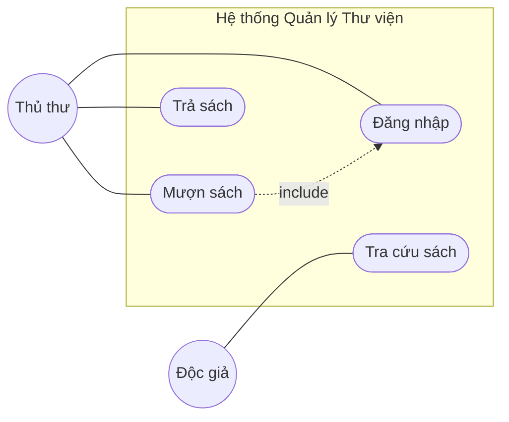
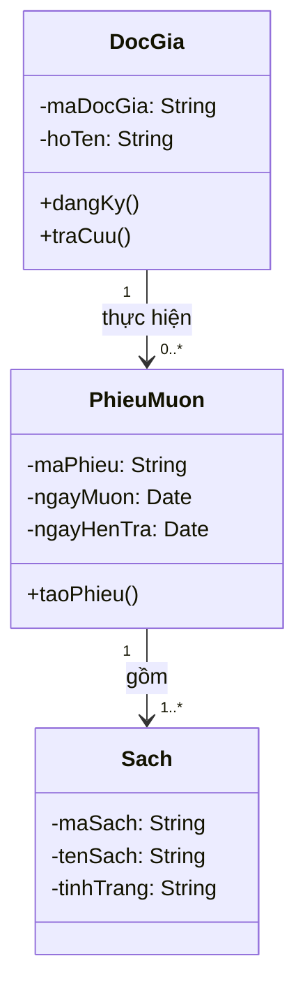
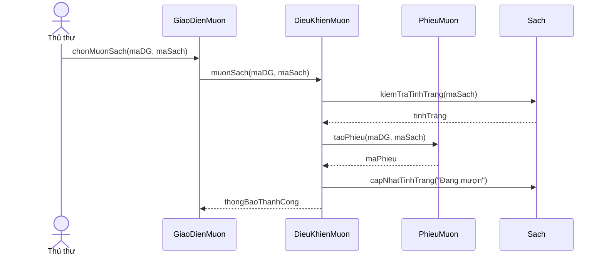
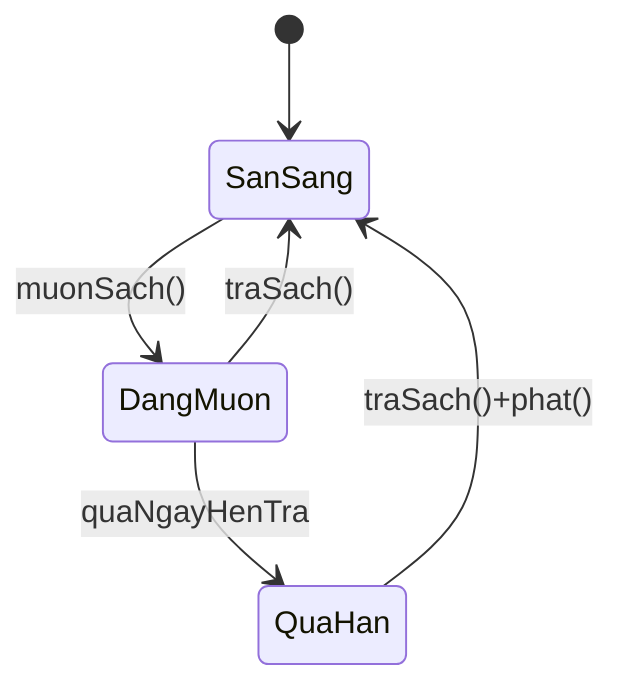
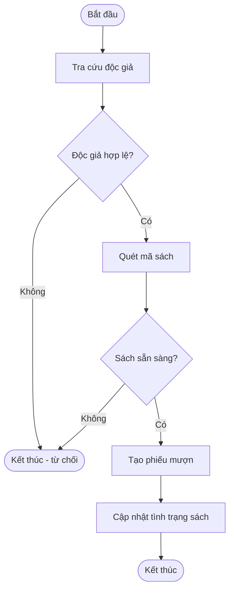
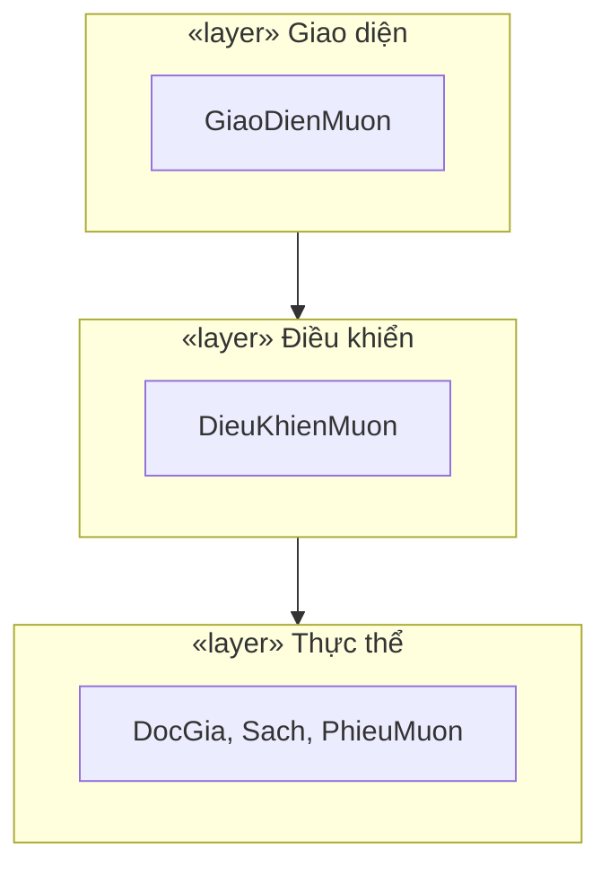
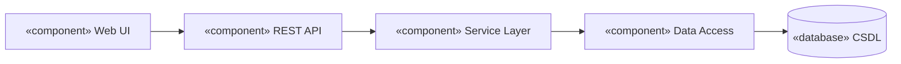
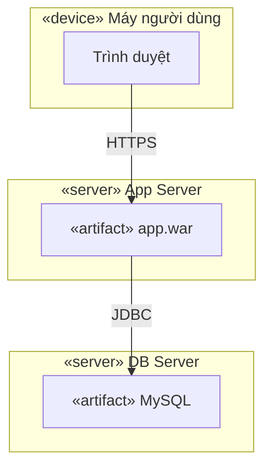

# Template đặc tả & Quy tắc đồng bộ biểu đồ

## 1. Template đặc tả Use Case (kịch bản)

Dùng cho mọi use case trọng yếu. Mỗi UC một bảng như sau:

| Mục | Nội dung |
|---|---|
| **Mã / Tên UC** | UC-03 / Mượn sách |
| **Tác nhân chính** | Thủ thư |
| **Tác nhân phụ** | (hệ thống thẻ, nếu có) |
| **Mô tả** | Thủ thư lập phiếu mượn cho độc giả |
| **Tiền điều kiện** | Thủ thư đã đăng nhập; độc giả có thẻ hợp lệ |
| **Kích hoạt (trigger)** | Độc giả yêu cầu mượn sách |
| **Luồng sự kiện chính** | 1. Thủ thư tra cứu độc giả. 2. Hệ thống hiển thị thông tin & số sách đang mượn. 3. Thủ thư quét mã sách. 4. Hệ thống kiểm tra tình trạng sách. 5. Hệ thống tạo phiếu mượn. 6. Hệ thống cập nhật tình trạng sách = "Đang mượn". |
| **Luồng phụ / ngoại lệ** | 4a. Sách đã được mượn → báo lỗi, dừng. 2a. Độc giả vượt hạn mức → từ chối. |
| **Hậu điều kiện** | Phiếu mượn được lưu; tồn kho sách giảm |
| **Yêu cầu liên quan** | FR-05 |

> **Quy tắc**: số bước trong "Luồng chính" phải ánh xạ 1–1 với các message trong biểu đồ tuần tự của UC đó.

## 2. Quy tắc đồng bộ chéo (checklist khi rà soát)

- [ ] **Actor**: mọi tác nhân ở mô tả nghiệp vụ (Ch.1) đều có trong biểu đồ use case tổng quát, và ngược lại.
- [ ] **Use case ↔ Yêu cầu**: mọi yêu cầu chức năng (FR) được phủ bởi ≥1 use case; mọi use case truy về ≥1 FR.
- [ ] **Use case ↔ Sequence**: mọi UC trọng yếu có ≥1 biểu đồ tuần tự; tên UC khớp.
- [ ] **Sequence ↔ Class**: mọi đối tượng (lifeline) trong sequence là một lớp trong biểu đồ lớp; mọi message gọi tới một đối tượng phải tương ứng một **phương thức** của lớp đó (xuất hiện trong biểu đồ lớp thiết kế chi tiết Ch.5).
- [ ] **Lifeline phải là TÊN LỚP CỤ THỂ** — `DieuKhienDatVe`, `BenhNhanService`, `HoaDon`... KHÔNG đặt tên vai trò chung chung như "Điều khiển", "Giao diện", "Hệ thống". Đây là nguyên nhân gốc khiến message không khớp lớp nào.
- [ ] **Thông báo/kết quả trả về dùng return `-->>` (nét đứt)**, KHÔNG viết `->>` kèm `()` như gọi phương thức. Vd đúng: `DK-->>GD: thongBaoThanhCong` (nhãn, không ngoặc); SAI: `DK->>GD: thongBaoThanhCong()`.
- [ ] **Class ↔ CSDL**: mọi lớp thực thể (entity) ánh xạ tới ≥1 bảng; thuộc tính khớp cột; quan hệ + bội số khớp khóa ngoại.
- [ ] **Tên nhất quán**: 1 khái niệm = 1 tên (vd luôn "DocGia", không lẫn "BanDoc"/"KhachHang").
- [ ] **Bội số (multiplicity)** hợp lý và nhất quán giữa class diagram và lược đồ CSDL.
- [ ] **include/extend** dùng đúng nghĩa; không vẽ association giữa 2 use case.

## 3. Mermaid templates

> **Ba mức biểu đồ lớp** (theo cấu trúc 6 chương):
> - **Mô hình lĩnh vực / Domain (Ch3.1)** — chỉ lớp thực thể + quan hệ, KHÔNG thuộc tính chi tiết/phương thức/lớp biên-điều khiển.
> - **Lớp phân tích / Analysis (Ch3.2)** — thêm lớp Biên–Điều khiển–Thực thể (BCE) tham gia UC tiêu biểu.
> - **Lớp thiết kế chi tiết (Ch5.1)** — đầy đủ thuộc tính + kiểu, phương thức, tầm vực (+/-/#). Đây là bản `check-sync.py` đối chiếu với sequence.

### Use case (mermaid không có UC diagram gốc → dùng graph)

> Nếu xuất sang draw.io để đẹp hơn, dùng skill `mermaid-to-drawio`.

### Class diagram

### Sequence diagram (luồng chính, message khớp phương thức)

### State machine (vòng đời đối tượng)

### Activity diagram

### Package diagram (Ch4.2 — phân chia module / hệ thống con, kiến trúc BCE / 3 lớp)

### Component diagram (Ch4.3 — thành phần vật lý của phần mềm)

### Deployment diagram (Ch4.4 — bố trí trên phần cứng & mạng)

