<!-- @doc
title: Phân tích và Thiết kế Hệ thống Quản lý Kho Hàng
author: Nhóm sinh viên - Trường CNTT&TT, ĐHBK Hà Nội
-->
<!-- @config
page:
  size: A4
body:
  font: Times New Roman
  size: 13
  line_spacing: 1.5
heading:
  line_spacing: 1.3
table:
  row:
    odd_fill: FFFFFF
    size: 11
  header:
    size: 11
    color: '000000'
-->
<!-- @footer center="{page}" skip_on_first_page=5 -->

<!-- @style align=center size=15 bold /-->
ĐẠI HỌC BÁCH KHOA HÀ NỘI

<!-- @style align=center size=15 bold /-->
TRƯỜNG CÔNG NGHỆ THÔNG TIN VÀ TRUYỀN THÔNG

<!-- @style align=center size=17 bold /-->
BÀI TẬP LỚN

<!-- @style align=center size=21 bold /-->
PHÂN TÍCH VÀ THIẾT KẾ HỆ THỐNG QUẢN LÝ KHO HÀNG

<!-- @table header=false -->
| GVHD | Ths. Phạm Thị Phương Giang |
|---|---|
| Lớp | B2CQ - CNTT - K69(01) |
| Nhóm | 202490032 - Bùi Tuấn Anh 202490069 - Bùi Quốc Luýt 202490077 - Bạch Minh Quang 202490071 - Vũ Quang Minh 202490090 - Phạm Đoàn Bảo Thiên |

<!-- @style align=center italic /-->
Hà Nội, tháng 7 năm 2026

<!-- @pagebreak -->
<!-- @style align=center size=16 bold /-->
LỜI NÓI ĐẦU
Trong bối cảnh chuyển đổi số, công tác quản lý kho hàng đóng vai trò then chốt đối với các doanh nghiệp thương mại - sản xuất: bảo đảm đủ hàng phục vụ bán ra, giảm tồn dư đọng vốn, kiểm soát dòng hàng hóa và cung cấp số liệu tin cậy cho công tác kế toán và ra quyết định. Tuy nhiên, tại nhiều doanh nghiệp vừa và nhỏ, việc quản lý kho vẫn dựa trên sổ sách và bảng tính Excel rời rạc, dẫn tới sai lệch số liệu, khó truy vết và báo cáo chậm trễ.
Bài tập lớn này thực hiện **phân tích và thiết kế hệ thống thông tin quản lý kho hàng** theo phương pháp **hướng đối tượng** với ngôn ngữ mô hình hóa **UML** (Unified Modeling Language - ngôn ngữ mô hình hóa thống nhất). Báo cáo đi qua đầy đủ các giai đoạn: khảo sát hiện trạng, mô tả nghiệp vụ, phân tích chức năng (biểu đồ use case), phân tích cấu trúc (biểu đồ lớp), phân tích hành vi (biểu đồ trình tự, biểu đồ trạng thái), thiết kế chi tiết (biểu đồ thành phần) và thiết kế cơ sở dữ liệu, giao diện.
Nhóm xin chân thành cảm ơn cô **Ths. Phạm Thị Phương Giang** đã tận tình hướng dẫn trong suốt quá trình thực hiện học phần. Do thời gian và kinh nghiệm còn hạn chế, báo cáo khó tránh khỏi thiếu sót; nhóm rất mong nhận được góp ý của cô và các bạn để hoàn thiện hơn.
<!-- @pagebreak -->
<!-- @style align=center size=16 bold /-->
MỤC LỤC
**CHƯƠNG 1: KHẢO SÁT HIỆN TRẠNG**
    1.1. Giới thiệu doanh nghiệp
    1.2. Phạm vi và đối tượng của hệ thống
        1.2.1. Phạm vi hệ thống
        1.2.2. Đối tượng sử dụng
    1.3. Thực trạng quy trình quản lý hiện tại và các hạn chế
        1.3.1. Quy trình quản lý hiện tại
        1.3.2. Các hạn chế của quy trình hiện tại
    1.4. Mục tiêu và yêu cầu của hệ thống
        1.4.1. Mục tiêu chung
        1.4.2. Yêu cầu chức năng
        1.4.3. Yêu cầu phi chức năng
    1.5. Lựa chọn công nghệ và công cụ
        1.5.1. Lựa chọn công nghệ triển khai
        1.5.2. Hướng phân tích - thiết kế: hướng đối tượng (OO)
    1.6. Kết luận chương
**CHƯƠNG 2: MÔ TẢ NGHIỆP VỤ**
    2.1. Quy trình phân tích - thiết kế (hướng đối tượng)
    2.2. Tổng quan nghiệp vụ
    2.3. Nghiệp vụ 1: Quản lý tài khoản
    2.4. Nghiệp vụ 2: Quản lý nhà cung cấp
    2.5. Nghiệp vụ 3: Quản lý hàng hóa
    2.6. Nghiệp vụ 4: Quản lý kho
    2.7. Nghiệp vụ 5: Nhập kho
    2.8. Nghiệp vụ 6: Xuất kho
    2.9. Nghiệp vụ 7: Kiểm kê tồn kho
    2.10. Nghiệp vụ 8: Báo cáo nhập - xuất - tồn
    2.11. Biểu đồ hoạt động (theo nghiệp vụ chính)
        2.11.1. Nghiệp vụ nhập kho
        2.11.2. Nghiệp vụ xuất kho
        2.11.3. Nghiệp vụ kiểm kê
    2.12. Kết luận chương
**CHƯƠNG 3: PHÂN TÍCH CHỨC NĂNG**
    3.1. Mục đích giai đoạn
    3.2. Xác định tác nhân
    3.3. Nguyên tắc tách use case
    3.4. Phân tích chức năng bằng biểu đồ use case tổng quát
    3.5. Phân tích chức năng bằng biểu đồ use case phân rã
        3.5.1. Nhóm truy cập và tài khoản
        3.5.2. Nhóm đối tác
        3.5.3. Nhóm hàng hóa và kho
        3.5.4. Nhóm nhập, xuất, kiểm kê, báo cáo
    3.6. Bảng tổng hợp use case
    3.7. Đặc tả use case
        3.7.1. UC01 - Đăng nhập
        3.7.2. UC02 - Đăng xuất
        3.7.3. UC03 - Thêm tài khoản
        3.7.4. UC04 - Sửa tài khoản
        3.7.5. UC05 - Xóa tài khoản
        3.7.6. UC06 - Tìm kiếm tài khoản
        3.7.7. UC07 - Xem danh sách tài khoản
        3.7.8. UC08 - Thêm nhà cung cấp
        3.7.9. UC09 - Sửa nhà cung cấp
        3.7.10. UC10 - Xóa nhà cung cấp
        3.7.11. UC11 - Tìm kiếm nhà cung cấp
        3.7.12. UC12 - Xem danh sách nhà cung cấp
        3.7.13. UC13 - Thêm hàng hóa
        3.7.14. UC14 - Sửa hàng hóa
        3.7.15. UC15 - Xóa hàng hóa
        3.7.16. UC16 - Tìm kiếm hàng hóa
        3.7.17. UC17 - Xem danh sách hàng hóa
        3.7.18. UC18 - Thêm kho
        3.7.19. UC19 - Sửa kho
        3.7.20. UC20 - Xóa kho
        3.7.21. UC21 - Tìm kiếm kho
        3.7.22. UC22 - Xem danh sách kho
        3.7.23. UC23 - Lập phiếu nhập kho
        3.7.24. UC24 - Sửa phiếu nhập kho
        3.7.25. UC25 - Xóa phiếu nhập kho
        3.7.26. UC26 - Tìm kiếm phiếu nhập
        3.7.27. UC27 - Xem danh sách phiếu nhập
        3.7.28. UC28 - Lập phiếu xuất kho
        3.7.29. UC29 - Sửa phiếu xuất kho
        3.7.30. UC30 - Xóa phiếu xuất kho
        3.7.31. UC31 - Tìm kiếm phiếu xuất
        3.7.32. UC32 - Xem danh sách phiếu xuất
        3.7.33. UC33 - Lập phiếu kiểm kê
        3.7.34. UC34 - Xem báo cáo nhập xuất tồn
**CHƯƠNG 4: PHÂN TÍCH CẤU TRÚC**
    4.1. Giới thiệu giai đoạn
    4.2. Xác định các lớp chính
    4.3. Phân tích cấu trúc bằng biểu đồ lớp tổng thể
        4.3.1. Nhóm danh mục (Master Data)
        4.3.2. Nhóm nghiệp vụ nhập - xuất
        4.3.3. Nhóm kiểm kê và lịch sử
    4.4. Phân tích cấu trúc theo nhóm entity (biểu đồ lớp cắt lát)
        4.4.1. Nhóm tài khoản / xác thực (UC01-UC07)
        4.4.2. Nhóm nhà cung cấp (UC08-UC12)
        4.4.3. Nhóm hàng hóa (UC13-UC17)
        4.4.4. Nhóm kho (UC18-UC22)
        4.4.5. Nhóm phiếu nhập (UC23-UC27)
        4.4.6. Nhóm phiếu xuất (UC28-UC32)
        4.4.7. Nhóm kiểm kê (UC33)
        4.4.8. Nhóm báo cáo NXT (UC34)
    4.5. Bảng mô tả thuộc tính các lớp
    4.6. Giải thích các phương thức của lớp
        4.6.1. Lớp NguoiDung
        4.6.2. Lớp HangHoa
        4.6.3. Lớp TonKho
        4.6.4. Lớp PhieuNhapKho
        4.6.5. Lớp PhieuXuatKho
        4.6.6. Lớp PhieuKiemKe
        4.6.7. Lớp NhaCungCap / Kho (và các danh mục tương tự)
        4.6.8. Lớp LichSuThaoTac
        4.6.9. Liên hệ phương thức với use case (tóm tắt)
    4.7. Tóm tắt quan hệ quan trọng
    4.8. Kết luận chương
**CHƯƠNG 5: PHÂN TÍCH HÀNH VI**
    5.1. Phân tích hành vi bằng biểu đồ trình tự
        5.1.1. UC01 - Đăng nhập
        5.1.2. UC02 - Đăng xuất
        5.1.3. UC03 - Thêm tài khoản
        5.1.4. UC04 - Sửa tài khoản
        5.1.5. UC05 - Xóa tài khoản
        5.1.6. UC06 - Tìm kiếm tài khoản
        5.1.7. UC07 - Xem danh sách tài khoản
        5.1.8. UC08 - Thêm nhà cung cấp
        5.1.9. UC09 - Sửa nhà cung cấp
        5.1.10. UC10 - Xóa nhà cung cấp
        5.1.11. UC11 - Tìm kiếm nhà cung cấp
        5.1.12. UC12 - Xem danh sách nhà cung cấp
        5.1.13. UC13 - Thêm hàng hóa
        5.1.14. UC14 - Sửa hàng hóa
        5.1.15. UC15 - Xóa hàng hóa
        5.1.16. UC16 - Tìm kiếm hàng hóa
        5.1.17. UC17 - Xem danh sách hàng hóa
        5.1.18. UC18 - Thêm kho
        5.1.19. UC19 - Sửa kho
        5.1.20. UC20 - Xóa kho
        5.1.21. UC21 - Tìm kiếm kho
        5.1.22. UC22 - Xem danh sách kho
        5.1.23. UC23 - Lập phiếu nhập kho
        5.1.24. UC24 - Sửa phiếu nhập kho
        5.1.25. UC25 - Xóa phiếu nhập kho
        5.1.26. UC26 - Tìm kiếm phiếu nhập
        5.1.27. UC27 - Xem danh sách phiếu nhập
        5.1.28. UC28 - Lập phiếu xuất kho
        5.1.29. UC29 - Sửa phiếu xuất kho
        5.1.30. UC30 - Xóa phiếu xuất kho
        5.1.31. UC31 - Tìm kiếm phiếu xuất
        5.1.32. UC32 - Xem danh sách phiếu xuất
        5.1.33. UC33 - Lập phiếu kiểm kê
        5.1.34. UC34 - Xem báo cáo nhập xuất tồn
    5.2. Phân tích hành vi đối tượng phiếu (biểu đồ trạng thái)
        5.2.1. Phiếu nhập kho
        5.2.2. Phiếu xuất kho
    5.3. Kết luận chương
**CHƯƠNG 6: KIẾN TRÚC HỆ THỐNG**
    6.1. Component Diagram
    6.2. Quan hệ chính giữa các lớp (thiết kế)
    6.3. Kết luận chương
**CHƯƠNG 7: THIẾT KẾ CƠ SỞ DỮ LIỆU**
    7.1. Danh sách bảng
    7.2. Đặc tả một số bảng quan trọng
        7.2.1. Bảng HangHoa
        7.2.2. Bảng TonKho
        7.2.3. Bảng PhieuNhapKho / PhieuXuatKho
        7.2.4. Bảng PhieuKiemKe
    7.3. Thiết kế giao diện
        7.3.1. Sơ đồ điều hướng màn hình
    7.4. Kết luận chương
**TÀI LIỆU THAM KHẢO**
<!-- @pagebreak -->
<!-- @style align=center size=16 bold /-->
DANH MỤC HÌNH VẼ
Hình 2.1: Biểu đồ hoạt động nghiệp vụ nhập kho
Hình 2.2: Biểu đồ hoạt động nghiệp vụ xuất kho
Hình 2.3: Biểu đồ hoạt động nghiệp vụ kiểm kê
Hình 3.1: Biểu đồ use case tổng quát
Hình 3.2: Biểu đồ use case phân rã nhóm truy cập và tài khoản
Hình 3.3: Biểu đồ use case phân rã nhóm đối tác
Hình 3.4: Biểu đồ use case phân rã nhóm hàng hóa và kho
Hình 3.5: Biểu đồ use case phân rã nhóm nhập, xuất, kiểm kê, báo cáo
Hình 4.1: Biểu đồ lớp nhóm danh mục (Master Data)
Hình 4.2: Biểu đồ lớp nhóm nghiệp vụ nhập - xuất
Hình 4.3: Biểu đồ lớp nhóm kiểm kê và lịch sử
Hình 4.4: Biểu đồ lớp cắt lát nhóm tài khoản / xác thực
Hình 4.5: Biểu đồ lớp cắt lát nhóm nhà cung cấp
Hình 4.6: Biểu đồ lớp cắt lát nhóm hàng hóa
Hình 4.7: Biểu đồ lớp cắt lát nhóm kho
Hình 4.8: Biểu đồ lớp cắt lát nhóm phiếu nhập
Hình 4.9: Biểu đồ lớp cắt lát nhóm phiếu xuất
Hình 4.10: Biểu đồ lớp cắt lát nhóm kiểm kê
Hình 4.11: Biểu đồ lớp cắt lát nhóm báo cáo NXT
Hình 5.1: Biểu đồ trình tự UC01 - Đăng nhập
Hình 5.2: Biểu đồ trình tự UC02 - Đăng xuất
Hình 5.3: Biểu đồ trình tự UC03 - Thêm tài khoản
Hình 5.4: Biểu đồ trình tự UC04 - Sửa tài khoản
Hình 5.5: Biểu đồ trình tự UC05 - Xóa tài khoản
Hình 5.6: Biểu đồ trình tự UC06 - Tìm kiếm tài khoản
Hình 5.7: Biểu đồ trình tự UC07 - Xem danh sách tài khoản
Hình 5.8: Biểu đồ trình tự UC08 - Thêm nhà cung cấp
Hình 5.9: Biểu đồ trình tự UC09 - Sửa nhà cung cấp
Hình 5.10: Biểu đồ trình tự UC10 - Xóa nhà cung cấp
Hình 5.11: Biểu đồ trình tự UC11 - Tìm kiếm nhà cung cấp
Hình 5.12: Biểu đồ trình tự UC12 - Xem danh sách nhà cung cấp
Hình 5.13: Biểu đồ trình tự UC13 - Thêm hàng hóa
Hình 5.14: Biểu đồ trình tự UC14 - Sửa hàng hóa
Hình 5.15: Biểu đồ trình tự UC15 - Xóa hàng hóa
Hình 5.16: Biểu đồ trình tự UC16 - Tìm kiếm hàng hóa
Hình 5.17: Biểu đồ trình tự UC17 - Xem danh sách hàng hóa
Hình 5.18: Biểu đồ trình tự UC18 - Thêm kho
Hình 5.19: Biểu đồ trình tự UC19 - Sửa kho
Hình 5.20: Biểu đồ trình tự UC20 - Xóa kho
Hình 5.21: Biểu đồ trình tự UC21 - Tìm kiếm kho
Hình 5.22: Biểu đồ trình tự UC22 - Xem danh sách kho
Hình 5.23: Biểu đồ trình tự UC23 - Lập phiếu nhập kho
Hình 5.24: Biểu đồ trình tự UC24 - Sửa phiếu nhập kho
Hình 5.25: Biểu đồ trình tự UC25 - Xóa phiếu nhập kho
Hình 5.26: Biểu đồ trình tự UC26 - Tìm kiếm phiếu nhập
Hình 5.27: Biểu đồ trình tự UC27 - Xem danh sách phiếu nhập
Hình 5.28: Biểu đồ trình tự UC28 - Lập phiếu xuất kho
Hình 5.29: Biểu đồ trình tự UC29 - Sửa phiếu xuất kho
Hình 5.30: Biểu đồ trình tự UC30 - Xóa phiếu xuất kho
Hình 5.31: Biểu đồ trình tự UC31 - Tìm kiếm phiếu xuất
Hình 5.32: Biểu đồ trình tự UC32 - Xem danh sách phiếu xuất
Hình 5.33: Biểu đồ trình tự UC33 - Lập phiếu kiểm kê
Hình 5.34: Biểu đồ trình tự UC34 - Xem báo cáo nhập xuất tồn
Hình 5.35: Biểu đồ trạng thái phiếu nhập kho
Hình 5.36: Biểu đồ trạng thái phiếu xuất kho
Hình 6.1: Component diagram kiến trúc phân lớp
Hình 8.1: Sơ đồ điều hướng màn hình
<!-- @pagebreak -->
<!-- @style align=center size=16 bold /-->
DANH MỤC THUẬT NGỮ VÀ VIẾT TẮT
<!-- @style align=center bold /-->
Bảng 0.1: Danh mục thuật ngữ và viết tắt
| Thuật ngữ / viết tắt | Giải nghĩa |
|---|---|
| UML | Unified Modeling Language - ngôn ngữ mô hình hóa thống nhất |
| OO | Object-Oriented - hướng đối tượng |
| UC | Use Case - ca sử dụng |
| FR / NFR | Functional / Non-Functional Requirement - yêu cầu chức năng / phi chức năng |
| CSDL | Cơ sở dữ liệu |
| QTV | Quản trị viên |
| QL kho | Quản lý kho |
| NV kho | Nhân viên kho |
| NCC | Nhà cung cấp |
| ĐVT | Đơn vị tính |
| NXT | Nhập - Xuất - Tồn |
| CRUD | Create - Read - Update - Delete: bộ thao tác thêm, đọc, sửa, xóa |
| PK / FK | Primary Key / Foreign Key - khóa chính / khóa ngoại |
| ORM | Object-Relational Mapping - ánh xạ đối tượng - quan hệ |
<!-- @pagebreak -->
# CHƯƠNG 1: KHẢO SÁT HIỆN TRẠNG
Chương này khảo sát bối cảnh doanh nghiệp, xác định phạm vi và đối tượng sử dụng của hệ thống, phân tích quy trình quản lý hiện tại cùng các hạn chế, từ đó đặt ra mục tiêu, yêu cầu chức năng / phi chức năng và lựa chọn công nghệ, hướng tiếp cận phân tích - thiết kế.
## 1.1. Giới thiệu doanh nghiệp
Đề tài được thực hiện trong bối cảnh một doanh nghiệp thương mại - sản xuất quy mô vừa, hoạt động nhập, xuất và lưu trữ hàng hóa thường xuyên. Doanh nghiệp có mạng lưới nhiều kho hàng đặt tại các khu vực khác nhau, quản lý hàng trăm mặt hàng thuộc nhiều nhóm đa dạng (nguyên vật liệu, bán thành phẩm, thành phẩm) và duy trì quan hệ giao dịch với hàng chục nhà cung cấp.
Công tác quản lý kho đóng vai trò then chốt trong chuỗi hoạt động: bảo đảm đủ hàng đáp ứng đơn bán ra, giảm thiểu tồn dư thừa gây đọng vốn, kiểm soát chặt dòng hàng liên quan đến nhập / xuất và cung cấp số liệu đáng tin cậy phục vụ kế toán, báo cáo thuế và ra quyết định kinh doanh.
Hiện doanh nghiệp đang trong quá trình chuyển đổi số, mong muốn xây dựng một hệ thống thông tin quản lý kho hàng thống nhất thay thế các phương pháp thủ công rời rạc, đồng thời tạo nền tảng tích hợp với hệ thống kế toán và bán hàng trong tương lai.
## 1.2. Phạm vi và đối tượng của hệ thống
### 1.2.1. Phạm vi hệ thống
Hệ thống quản lý kho hàng được phân tích và thiết kế trong phạm vi sau:
- Quản lý toàn bộ thông tin hàng hóa, nhóm hàng, đơn vị tính tại các kho.
- Quản lý thông tin nhà cung cấp và danh mục kho.
- Thực hiện các nghiệp vụ nhập kho, xuất kho, kiểm kê tồn kho.
- Theo dõi tồn kho theo thời gian thực, hỗ trợ cảnh báo tồn kho thấp.
- Quản lý tài khoản người dùng, phân quyền theo vai trò và lưu vết thao tác.

Ngoài phạm vi: hệ thống không xử lý nghiệp vụ kế toán - hóa đơn.
### 1.2.2. Đối tượng sử dụng
Hệ thống phục vụ ba nhóm người dùng chính:
- **Quản trị viên (QTV)**: quản lý tài khoản người dùng, phân quyền; không thao tác nghiệp vụ kho.
- **Quản lý kho (QL kho)**: quản lý danh mục kho, duyệt phiếu nhập / xuất / kiểm kê, xem báo cáo nhập xuất tồn.
- **Nhân viên kho (NV kho)**: lập phiếu nhập, xuất, kiểm kê; quản lý danh mục nhà cung cấp, hàng hóa.
## 1.3. Thực trạng quy trình quản lý hiện tại và các hạn chế
### 1.3.1. Quy trình quản lý hiện tại
Doanh nghiệp hiện quản lý kho chủ yếu dựa trên sổ sách và bảng tính Excel:
- **Nhập kho**: khi hàng đến, nhân viên kho đối chiếu với đơn đặt hàng của nhà cung cấp, kiểm tra số lượng và chất lượng, ghi sổ nhập kho rồi cập nhật file Excel tồn kho.
- **Xuất kho**: khi có yêu cầu xuất hàng, nhân viên kiểm tra tồn trên file Excel, lập phiếu xuất giấy, ghi nhận số lượng xuất và cập nhật lại file Excel.
- **Kiểm kê**: định kỳ hàng tháng, nhân viên đối chiếu số lượng thực tế trong kho với số liệu trên file Excel, ghi chênh lệch vào biên bản kiểm kê giấy.
- **Báo cáo**: cuối tháng, kế toán tổng hợp số liệu từ các file Excel riêng biệt để lập báo cáo nhập - xuất - tồn và giá trị hàng tồn.
### 1.3.2. Các hạn chế của quy trình hiện tại
Quy trình thủ công trên bộc lộ nhiều hạn chế:
- **Dữ liệu phân tán**: thông tin rải rác trên nhiều file Excel độc lập, khó tổng hợp và đối chiếu giữa các kho, dễ sai lệch số liệu.
- **Thiếu kiểm soát thời gian thực**: tồn kho không được cập nhật tức thời, dễ xảy ra bán quá số lượng tồn thực tế.
- **Khó truy vết**: lịch sử nhập xuất và người thực hiện không được ghi nhận đầy đủ, khó kiểm tra và quy trách nhiệm.
- **Báo cáo chậm**: tổng hợp thủ công tốn thời gian, báo cáo trễ, không hỗ trợ quyết định kịp thời.
- **Sai sót cao**: nhập liệu tay dễ nhầm, khó kiểm soát chênh lệch giữa sổ sách và thực tế.
- **Khó mở rộng**: khi số lượng hàng, kho, giao dịch tăng, quy trình thủ công quá tải.
## 1.4. Mục tiêu và yêu cầu của hệ thống
### 1.4.1. Mục tiêu chung
Đề tài hướng tới phân tích, thiết kế một hệ thống thông tin quản lý kho hàng đáp ứng:
- Số hóa toàn bộ quy trình quản lý hàng hóa, nhập kho, xuất kho và kiểm kê.
- Tra cứu, tìm kiếm, cập nhật thông tin hàng tồn nhanh chóng, chính xác.
- Hỗ trợ nhiều kho, nhiều loại hàng hóa, nhiều nhà cung cấp.
- Tự động tính tồn kho; kiểm soát xuất không vượt tồn; chỉ thay đổi tồn khi phiếu được duyệt.
- Phân quyền người dùng theo vai trò, lưu vết toàn bộ thao tác phục vụ kiểm tra, truy vết.
### 1.4.2. Yêu cầu chức năng
Bảng 1.1 liệt kê các yêu cầu chức năng, đánh mã FR-xx; mỗi yêu cầu được ánh xạ tới các use case cụ thể ở Chương 3.
<!-- @style align=center bold /-->
Bảng 1.1: Yêu cầu chức năng của hệ thống
| Mã | Yêu cầu chức năng | Use case liên quan |
|---|---|---|
| FR-01 | Đăng nhập / đăng xuất, xác thực người dùng và quản lý phiên làm việc | UC01, UC02 |
| FR-02 | Quản lý tài khoản người dùng: thêm, sửa, xóa / khóa, tìm kiếm, xem danh sách, phân quyền theo vai trò | UC03 - UC07 |
| FR-03 | Quản lý nhà cung cấp: thêm, sửa, xóa / ngừng, tìm kiếm, xem danh sách | UC08 - UC12 |
| FR-04 | Quản lý hàng hóa (mã, tên, nhóm, đơn vị tính, giá): thêm (kèm khởi tạo tồn), sửa, xóa / ngừng, tìm kiếm, xem danh sách | UC13 - UC17 |
| FR-05 | Quản lý kho: thêm, sửa, xóa / ngừng, tìm kiếm, xem danh sách | UC18 - UC22 |
| FR-06 | Lập, sửa, xóa, tìm kiếm, xem danh sách phiếu nhập kho; duyệt phiếu làm tăng tồn kho | UC23 - UC27 |
| FR-07 | Lập, sửa, xóa, tìm kiếm, xem danh sách phiếu xuất kho; kiểm tra tồn đủ; duyệt phiếu làm giảm tồn kho | UC28 - UC32 |
| FR-08 | Kiểm kê tồn kho: đối chiếu số thực tế với sổ sách, duyệt điều chỉnh tồn | UC33 |
| FR-09 | Báo cáo nhập - xuất - tồn theo kỳ / kho / mặt hàng, xuất Excel | UC34 |
| FR-10 | Ghi lịch sử thao tác (ai, làm gì, lúc nào) cho các nghiệp vụ quan trọng | Xuyên suốt các UC |
### 1.4.3. Yêu cầu phi chức năng
Bảng 1.2 liệt kê các yêu cầu phi chức năng, đánh mã NFR-xx.
<!-- @style align=center bold /-->
Bảng 1.2: Yêu cầu phi chức năng của hệ thống
| Mã | Nhóm | Yêu cầu |
|---|---|---|
| NFR-01 | Hiệu năng | Phản hồi thao tác trong vòng 2 giây; hỗ trợ đồng thời ít nhất 50 người dùng |
| NFR-02 | Bảo mật | Mật khẩu lưu dạng mã hóa; phân quyền theo vai trò; ghi log toàn bộ thao tác quan trọng |
| NFR-03 | Tính khả dụng | Hệ thống hoạt động 99% thời gian; sao lưu dữ liệu định kỳ |
| NFR-04 | Tính mở rộng | Kiến trúc phân lớp, dễ bổ sung tính năng và tích hợp hệ thống kế toán, bán hàng |
| NFR-05 | Tính thân thiện | Giao diện tiếng Việt, thao tác trực quan, dùng được trên máy tính và máy tính bảng |
## 1.5. Lựa chọn công nghệ và công cụ
### 1.5.1. Lựa chọn công nghệ triển khai
Hệ thống được đề xuất triển khai theo mô hình ứng dụng web với kiến trúc phân lớp (multi-tier): tầng giao diện, tầng nghiệp vụ, tầng truy cập dữ liệu và tầng cơ sở dữ liệu (chi tiết ở Chương 6):
- **Ngôn ngữ backend**: Go (Golang) - biên dịch tĩnh, hiệu năng cao, hỗ trợ xử lý đồng thời tốt, phù hợp xây dựng API cho hệ thống nhiều người dùng (NFR-01).
- **Framework backend**: Gin (web framework) kết hợp GORM (thư viện ORM) - định tuyến REST API gọn, tự ánh xạ lớp thực thể sang bảng CSDL, hỗ trợ transaction cho các nghiệp vụ duyệt phiếu.
- **Cơ sở dữ liệu**: PostgreSQL - hệ quản trị CSDL quan hệ mã nguồn mở, ổn định, hiệu năng cao, bảo đảm ràng buộc toàn vẹn (khóa chính / khóa ngoại) theo thiết kế Chương 7.
- **Giao diện**: React (thư viện JavaScript xây dựng giao diện theo component, build bằng Vite) - đáp ứng giao diện trực quan, responsive trên máy tính và máy tính bảng (NFR-05).
- **Xác thực và phân quyền**: JWT (JSON Web Token) gắn theo phiên đăng nhập, phân quyền theo vai trò ở tầng API (NFR-02).
- **Công cụ hỗ trợ**: draw.io cho toàn bộ biểu đồ UML; Docker Compose để triển khai CSDL; xuất báo cáo danh sách dạng CSV / Excel khi cần.
### 1.5.2. Hướng phân tích - thiết kế: hướng đối tượng (OO)
Báo cáo dùng hướng đối tượng với UML theo phương pháp luận trong [1], [2] và khung phân tích của bài giảng học phần [4]. Tên các chương phân tích đặt theo **mục tiêu phân tích**; biểu đồ chỉ là công cụ của từng giai đoạn, như Bảng 1.3.
<!-- @style align=center bold /-->
Bảng 1.3: Các giai đoạn phân tích - thiết kế và biểu đồ sử dụng
| Giai đoạn | Biểu đồ sử dụng | Chương |
|---|---|---|
| Mô tả nghiệp vụ | Activity (biểu đồ hoạt động) | Chương 2 |
| Phân tích chức năng | Use Case (tổng quát, phân rã, đặc tả) | Chương 3 |
| Phân tích cấu trúc | Class (biểu đồ lớp) | Chương 4 |
| Phân tích hành vi | Sequence (trình tự) + State (trạng thái) | Chương 5 |
| Kiến trúc hệ thống | Component (thành phần) | Chương 6 |
| Thiết kế CSDL | Bảng CSDL, từ điển dữ liệu | Chương 7 |
| Thiết kế giao diện | Sơ đồ điều hướng màn hình | Chương 8 |
## 1.6. Kết luận chương
Chương 1 đã khảo sát bối cảnh doanh nghiệp, chỉ ra các hạn chế của quy trình thủ công hiện tại và xác lập mục tiêu, phạm vi của hệ thống với 10 yêu cầu chức năng (FR-01 đến FR-10) và 5 yêu cầu phi chức năng (NFR-01 đến NFR-05). Khung phân tích được chọn là hướng đối tượng theo trình tự **chức năng --> cấu trúc --> hành vi**, làm mạch dẫn cho các chương tiếp theo.
<!-- @pagebreak -->
# CHƯƠNG 2: MÔ TẢ NGHIỆP VỤ
Chương này mô tả các nghiệp vụ kho của doanh nghiệp - đầu vào cho ba giai đoạn phân tích UML ở các chương sau - và minh họa ba nghiệp vụ chính bằng biểu đồ hoạt động.
## 2.1. Quy trình phân tích - thiết kế (hướng đối tượng)
Quy trình phân tích hướng đối tượng của báo cáo gồm ba giai đoạn nối tiếp: **phân tích chức năng** (Chương 3, dùng biểu đồ use case và đặc tả), **phân tích cấu trúc** (Chương 4, dùng biểu đồ lớp) và **phân tích hành vi** (Chương 5, dùng biểu đồ trình tự và trạng thái). Sau ba giai đoạn phân tích là kiến trúc hệ thống (Chương 6), thiết kế CSDL (Chương 7) và thiết kế giao diện (Chương 8).
Một số quy ước:
- **Nghiệp vụ** là công việc của doanh nghiệp (nhập kho, xuất kho, kiểm kê...). Nghiệp vụ dạng "Quản lý X" là gói công việc chung; mỗi **use case** ở Chương 3 là một mục tiêu cụ thể của tác nhân (ví dụ "Thêm hàng hóa").
- **Đăng nhập / Đăng xuất** không phải nghiệp vụ kho mà là **chức năng hệ thống** hỗ trợ an toàn truy cập, được mô hình hóa bằng use case UC01, UC02 ở Chương 3.
## 2.2. Tổng quan nghiệp vụ
Hệ thống phục vụ nghiệp vụ kho gồm: quản lý danh mục (tài khoản, nhà cung cấp, hàng hóa, kho), nhập / xuất kho, kiểm kê và báo cáo tồn. Mỗi danh mục và mỗi loại phiếu đều tách đủ năm thao tác Thêm / Sửa / Xóa / Tìm kiếm / Xem danh sách. Bảng 2.1 ánh xạ nghiệp vụ với các use case sẽ phân tích ở Chương 3.
<!-- @style align=center bold /-->
Bảng 2.1: Ánh xạ nghiệp vụ với use case
| Nghiệp vụ | Use case tương ứng (Chương 3) |
|---|---|
| Quản lý tài khoản | UC03 - UC07: Thêm / Sửa / Xóa / Tìm kiếm / Xem danh sách |
| Quản lý nhà cung cấp | UC08 - UC12: Thêm / Sửa / Xóa / Tìm kiếm / Xem danh sách |
| Quản lý hàng hóa | UC13 - UC17: Thêm / Sửa / Xóa / Tìm kiếm / Xem danh sách |
| Quản lý kho | UC18 - UC22: Thêm / Sửa / Xóa / Tìm kiếm / Xem danh sách |
| Nhập kho | UC23 - UC27: Lập / Sửa / Xóa / Tìm kiếm / Xem danh sách phiếu nhập |
| Xuất kho | UC28 - UC32: Lập / Sửa / Xóa / Tìm kiếm / Xem danh sách phiếu xuất |
| Kiểm kê tồn kho | UC33: Lập phiếu kiểm kê |
| Báo cáo nhập - xuất - tồn | UC34: Xem báo cáo nhập xuất tồn |
Chức năng hệ thống (không phải nghiệp vụ): Đăng nhập (UC01), Đăng xuất (UC02).
## 2.3. Nghiệp vụ 1: Quản lý tài khoản
**Mô tả**: Quản trị viên duy trì danh mục tài khoản, gán vai trò (QTV, QL kho, NV kho) để phân quyền. Nghiệp vụ tách thành năm mục tiêu: xem danh sách, tìm kiếm, thêm, sửa, xóa / khóa.
**Người thực hiện**: Quản trị viên.
**Dữ liệu liên quan**: NguoiDung, LichSuThaoTac. **Use case**: UC03 - UC07.
## 2.4. Nghiệp vụ 2: Quản lý nhà cung cấp
**Mô tả**: Duy trì danh mục nhà cung cấp phục vụ lập phiếu nhập; đủ năm thao tác, không gộp thành một use case "Quản lý NCC" duy nhất. Nhà cung cấp đã phát sinh phiếu nhập thì không xóa cứng, chỉ ngừng hoạt động.
**Người thực hiện**: Nhân viên kho, Quản lý kho.
**Dữ liệu liên quan**: NhaCungCap. **Use case**: UC08 - UC12.
## 2.5. Nghiệp vụ 3: Quản lý hàng hóa
**Mô tả**: Duy trì danh mục hàng (mã, tên, nhóm, đơn vị tính, giá, trạng thái) - dữ liệu trung tâm của hệ thống. Khi **thêm** hàng mới, hệ thống khởi tạo tồn kho bằng 0 tại các kho; **sửa** thông tin / giá; **xóa** hoặc ngừng sử dụng nếu đã có phiếu; **tìm kiếm** và **xem danh sách** (có thể kèm tồn).
**Người thực hiện**: Nhân viên kho, Quản lý kho.
**Dữ liệu liên quan**: HangHoa, NhomHangHoa, DonViTinh, TonKho. **Use case**: UC13 - UC17.
## 2.6. Nghiệp vụ 4: Quản lý kho
**Mô tả**: Doanh nghiệp có nhiều kho (mã, tên, địa chỉ, người phụ trách, trạng thái); tồn kho theo dõi theo từng cặp (kho, hàng). Đủ năm thao tác; kho đã có tồn / phiếu thì chỉ ngừng hoạt động.
**Người thực hiện**: Quản lý kho (QTV không quản lý kho).
**Dữ liệu liên quan**: Kho, TonKho. **Use case**: UC18 - UC22.
## 2.7. Nghiệp vụ 5: Nhập kho
**Mô tả**: Nhân viên lập phiếu nhập (chọn nhà cung cấp, kho, thêm các dòng hàng với số lượng, đơn giá) rồi gửi duyệt; quản lý kho duyệt thì tồn kho mới **tăng**, từ chối thì tồn không đổi. Ngoài lập phiếu còn sửa / xóa khi phiếu chưa duyệt, tìm kiếm và xem danh sách phiếu.
**Người thực hiện**: Nhân viên kho (lập, sửa); Quản lý kho (duyệt).
**Dữ liệu liên quan**: PhieuNhapKho, ChiTietPhieuNhap, NhaCungCap, Kho, HangHoa, TonKho. **Use case**: UC23 - UC27.
## 2.8. Nghiệp vụ 6: Xuất kho
**Mô tả**: Nhân viên lập phiếu xuất từ một kho, ghi lý do xuất / ghi chú người nhận. Khi thêm dòng hàng, hệ thống kiểm tra tồn đủ; quản lý duyệt thì tồn kho mới **giảm**. Đủ các thao tác lập / sửa / xóa / tìm kiếm / xem danh sách.
**Người thực hiện**: Nhân viên kho (lập, sửa); Quản lý kho (duyệt).
**Dữ liệu liên quan**: PhieuXuatKho, ChiTietPhieuXuat, Kho, HangHoa, TonKho. **Use case**: UC28 - UC32.
## 2.9. Nghiệp vụ 7: Kiểm kê tồn kho
**Mô tả**: Định kỳ, nhân viên tạo phiếu kiểm kê theo kho; hệ thống nạp số lượng theo sổ, nhân viên nhập số thực tế, hệ thống tính chênh lệch; quản lý duyệt điều chỉnh thì tồn kho được gán bằng số thực tế. Tồn chỉ thay đổi **sau khi duyệt**.
**Người thực hiện**: Nhân viên kho (lập); Quản lý kho (duyệt).
**Dữ liệu liên quan**: PhieuKiemKe, ChiTietKiemKe, TonKho. **Use case**: UC33.
## 2.10. Nghiệp vụ 8: Báo cáo nhập - xuất - tồn
**Mô tả**: Xem tồn hiện tại và tổng hợp nhập - xuất - tồn theo kỳ / kho / mặt hàng từ các phiếu đã duyệt; có thể xuất Excel.
**Người thực hiện**: Quản lý kho (QTV không xem báo cáo nghiệp vụ).
**Dữ liệu liên quan**: PhieuNhapKho, PhieuXuatKho, TonKho. **Use case**: UC34.
## 2.11. Biểu đồ hoạt động (theo nghiệp vụ chính)
Ba nghiệp vụ cốt lõi (nhập kho, xuất kho, kiểm kê) được minh họa bằng biểu đồ hoạt động trước khi vào các giai đoạn phân tích UML.
### 2.11.1. Nghiệp vụ nhập kho

Hình 2.1 mô tả luồng nhập kho từ lúc bắt đầu đến kết thúc. Các hình chữ nhật là bước xử lý (lập phiếu, nhập NCC / kho, thêm chi tiết hàng); hình thoi là điểm quyết định: (1) dữ liệu phiếu hợp lệ không - nếu không thì báo lỗi và quay lại nhập; (2) quản lý có duyệt không - duyệt thì cập nhật tồn kho (tăng) và in / lưu phiếu, từ chối thì trả lại nhân viên. Nhánh "Không" quay vòng cho phép sửa sai trước khi đi tiếp.
### 2.11.2. Nghiệp vụ xuất kho

Hình 2.2 tương tự nhập kho nhưng gắn nghiệp vụ xuất hàng: lập phiếu, chọn kho, nhập lý do / ghi chú người nhận, thêm dòng hàng. Khác biệt chính: điểm quyết định thứ nhất là **tồn kho đủ?** - hệ thống chặn xuất vượt tồn; khi duyệt, tồn kho **giảm**.
### 2.11.3. Nghiệp vụ kiểm kê

Hình 2.3 thể hiện quy trình kiểm kê định kỳ: tạo phiếu theo kho, hệ thống nạp số lượng theo sổ, nhân viên nhập số thực tế, tính chênh lệch, gửi duyệt; quản lý duyệt điều chỉnh thì tồn kho được gán bằng số thực tế. Biểu đồ nhấn mạnh: tồn kho trên hệ thống chỉ thay đổi **sau khi duyệt**, không đổi ngay khi nhập số liệu kiểm đếm.
## 2.12. Kết luận chương
Chương 2 đã mô tả **8 nghiệp vụ** kho của doanh nghiệp, ánh xạ từng nghiệp vụ tới các use case (Bảng 2.1) và minh họa ba nghiệp vụ chính bằng biểu đồ hoạt động (Hình 2.1 - 2.3). Đây là đầu vào cho ba giai đoạn phân tích: chức năng (Chương 3), cấu trúc (Chương 4) và hành vi (Chương 5).
<!-- @pagebreak -->
# CHƯƠNG 3: PHÂN TÍCH CHỨC NĂNG
Chương này thực hiện giai đoạn phân tích thứ nhất - **phân tích chức năng** - bằng biểu đồ use case: xác định tác nhân, xây dựng biểu đồ use case tổng quát và phân rã, lập bảng tổng hợp và đặc tả văn bản đầy đủ cho 34 use case.
## 3.1. Mục đích giai đoạn
Phân tích hướng đối tượng gồm ba giai đoạn liên tiếp; giai đoạn 1 - phân tích chức năng - trả lời các câu hỏi: hệ thống phục vụ **chức năng gì**, **ai** dùng, mỗi tương tác nhằm **mục tiêu** nào. Biểu đồ use case ở chương này không phải "vẽ cho có" mà dùng để xác định ranh giới hệ thống, tác nhân và các mục tiêu sử dụng; kết quả (34 use case cùng đặc tả) là cơ sở truy vết cho biểu đồ lớp (Chương 4), biểu đồ trình tự (Chương 5) và thiết kế CSDL (Chương 7).
## 3.2. Xác định tác nhân
Tác nhân (actor) là vai trò bên ngoài hệ thống, chủ động khởi tạo tương tác để đạt mục tiêu. Hệ thống có ba tác nhân như Bảng 3.1.
<!-- @style align=center bold /-->
Bảng 3.1: Danh sách tác nhân của hệ thống
| Tác nhân | Mô tả |
|---|---|
| Quản trị viên | Chỉ quản lý tài khoản (thêm / sửa / xóa / tìm kiếm / xem danh sách) và đăng nhập / đăng xuất; không thao tác kho, phiếu, báo cáo |
| Quản lý kho | Quản lý danh mục kho; duyệt phiếu nhập / xuất / kiểm kê; quản lý NCC, hàng hóa; xem báo cáo nhập xuất tồn |
| Nhân viên kho | Lập / sửa / xóa / tìm kiếm / xem phiếu nhập, xuất, kiểm kê; quản lý danh mục NCC, hàng hóa |
## 3.3. Nguyên tắc tách use case
- Mỗi use case là **một mục tiêu cụ thể** mà tác nhân muốn đạt (ví dụ "Thêm hàng hóa"), không phải một gói công việc.
- Tên nghiệp vụ kiểu "Quản lý hàng hóa" là gói chung, **không** đặt làm một use case duy nhất; mỗi nhóm danh mục / phiếu tách đủ năm use case Thêm / Sửa / Xóa / Tìm kiếm / Xem danh sách.
- **Đăng nhập / Đăng xuất** là use case hệ thống (hỗ trợ an toàn truy cập), vẫn cần đặc tả vì là điểm vào của mọi tác nhân; các use case nghiệp vụ đều **«include»** Đăng nhập.
## 3.4. Phân tích chức năng bằng biểu đồ use case tổng quát
Biểu đồ tổng quát (Hình 3.1) thể hiện các **nhóm chức năng** và quan hệ với tác nhân; mỗi hình oval ở mức này là một nhóm sẽ được phân rã ở mục 3.5.
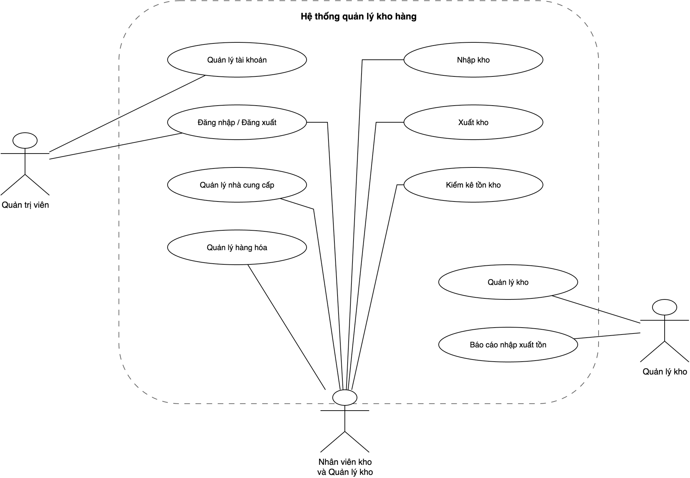{width=320}
Giải thích Hình 3.1:
- **Hộp nét đứt** là ranh giới hệ thống quản lý kho hàng - mọi use case nằm bên trong.
- **Ba tác nhân** (hình người): Quản trị viên (trái), Quản lý kho (phải), Nhân viên kho (dưới).
- **Các oval** là nhóm chức năng mức tổng quát: Đăng nhập / Đăng xuất, Quản lý tài khoản, NCC, hàng hóa, kho, Nhập kho, Xuất kho, Kiểm kê, Báo cáo NXT. Đây chưa phải use case chi tiết.
- **Đường nối** tác nhân - oval: Quản trị viên chỉ nối Đăng nhập / Đăng xuất và Quản lý tài khoản; Quản lý kho nối các nghiệp vụ kho và báo cáo; Nhân viên kho nối danh mục NCC / hàng hóa và các phiếu (không nối quản lý kho, báo cáo).
## 3.5. Phân tích chức năng bằng biểu đồ use case phân rã
Mỗi biểu đồ phân rã gắn với một nhóm chức năng; mỗi oval là **một use case** cụ thể.
### 3.5.1. Nhóm truy cập và tài khoản
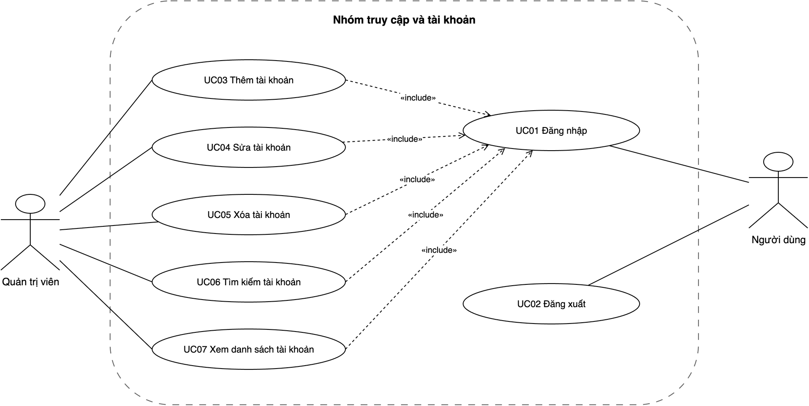{width=520}
Hình 3.2 gồm:
(1) hai use case **hệ thống** UC01 Đăng nhập, UC02 Đăng xuất dành cho mọi người dùng;
(2) năm use case quản trị tài khoản UC03 - UC07 chỉ dành cho Quản trị viên, theo nguyên tắc "mỗi hành động một use case". Các use case quản trị đều «include» UC01 (phải đăng nhập trước).
### 3.5.2. Nhóm đối tác
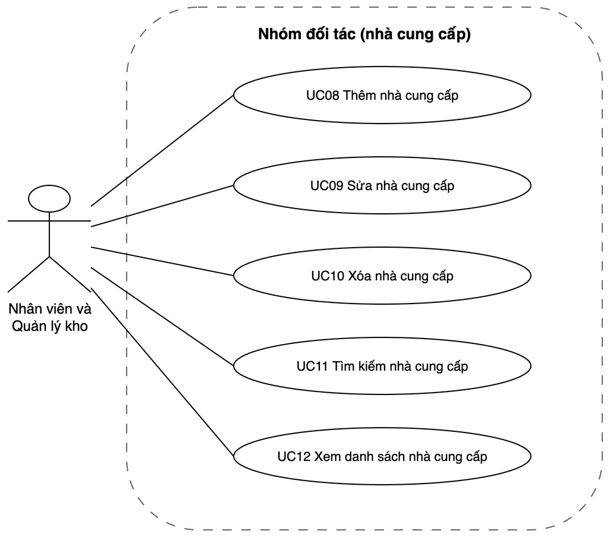{width=380}
Hình 3.3 phân rã nhóm nhà cung cấp thành đủ năm mục tiêu UC08 - UC12 (Thêm / Sửa / Xóa / Tìm kiếm / Xem danh sách); quan hệ «include» tới UC01 thể hiện điều kiện đăng nhập. Nhân viên kho và Quản lý kho đều thao tác được các use case NCC.
### 3.5.3. Nhóm hàng hóa và kho
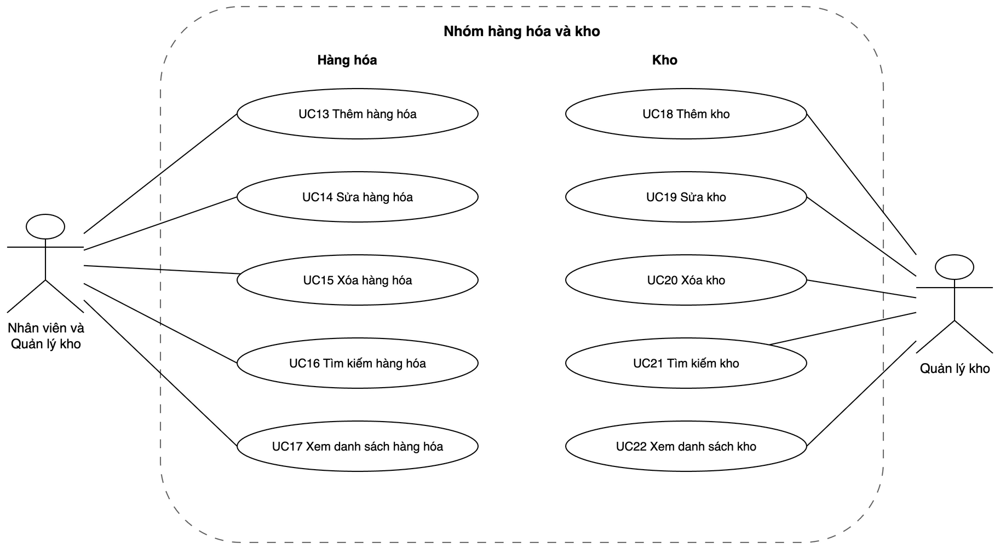{width=520}
Hình 3.4 gồm hai cột: cột trái là **hàng hóa** UC13 - UC17 (Nhân viên kho và Quản lý kho); cột phải là **kho** UC18 - UC22, chỉ dành cho Quản lý kho (Quản trị viên không tham gia). Nguyên tắc: đã thêm được thì phải sửa / xóa / tìm / xem được.
### 3.5.4. Nhóm nhập, xuất, kiểm kê, báo cáo
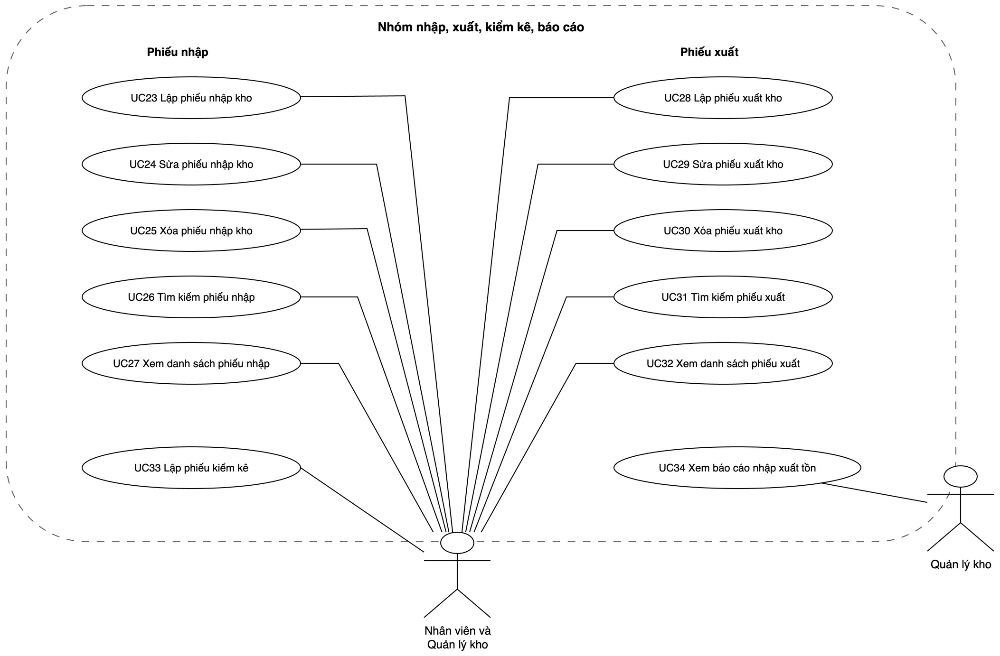{width=520}
Hình 3.5 gồm **phiếu nhập** UC23 - UC27 và **phiếu xuất** UC28 - UC32, mỗi nhóm đủ Lập / Sửa / Xóa / Tìm kiếm / Xem danh sách; thêm **UC33** Lập phiếu kiểm kê và **UC34** Xem báo cáo nhập xuất tồn. Nhân viên kho lập / sửa phiếu; Quản lý kho duyệt phiếu và là tác nhân duy nhất của UC34.
## 3.6. Bảng tổng hợp use case
Bảng 3.2 tổng hợp 34 use case của hệ thống; mã UC được dùng thống nhất ở đặc tả (mục 3.7), biểu đồ lớp cắt lát (mục 4.4) và biểu đồ trình tự (mục 5.1).
<!-- @style align=center bold /-->
Bảng 3.2: Bảng tổng hợp use case
| Mã | Tên use case | Tác nhân | Nhóm |
|---|---|---|---|
| UC01 | Đăng nhập | Tất cả người dùng | Hệ thống |
| UC02 | Đăng xuất | Tất cả người dùng | Hệ thống |
| UC03 | Thêm tài khoản | Quản trị viên | Tài khoản |
| UC04 | Sửa tài khoản | Quản trị viên | Tài khoản |
| UC05 | Xóa tài khoản | Quản trị viên | Tài khoản |
| UC06 | Tìm kiếm tài khoản | Quản trị viên | Tài khoản |
| UC07 | Xem danh sách tài khoản | Quản trị viên | Tài khoản |
| UC08 | Thêm nhà cung cấp | NV kho, QL kho | Nhà cung cấp |
| UC09 | Sửa nhà cung cấp | NV kho, QL kho | Nhà cung cấp |
| UC10 | Xóa nhà cung cấp | NV kho, QL kho | Nhà cung cấp |
| UC11 | Tìm kiếm nhà cung cấp | NV kho, QL kho | Nhà cung cấp |
| UC12 | Xem danh sách nhà cung cấp | NV kho, QL kho | Nhà cung cấp |
| UC13 | Thêm hàng hóa | NV kho, QL kho | Hàng hóa |
| UC14 | Sửa hàng hóa | NV kho, QL kho | Hàng hóa |
| UC15 | Xóa hàng hóa | NV kho, QL kho | Hàng hóa |
| UC16 | Tìm kiếm hàng hóa | NV kho, QL kho | Hàng hóa |
| UC17 | Xem danh sách hàng hóa | NV kho, QL kho | Hàng hóa |
| UC18 | Thêm kho | QL kho | Kho |
| UC19 | Sửa kho | QL kho | Kho |
| UC20 | Xóa kho | QL kho | Kho |
| UC21 | Tìm kiếm kho | QL kho | Kho |
| UC22 | Xem danh sách kho | QL kho | Kho |
| UC23 | Lập phiếu nhập kho | NV kho, QL kho | Nhập kho |
| UC24 | Sửa phiếu nhập kho | NV kho, QL kho | Nhập kho |
| UC25 | Xóa phiếu nhập kho | NV kho, QL kho | Nhập kho |
| UC26 | Tìm kiếm phiếu nhập | NV kho, QL kho | Nhập kho |
| UC27 | Xem danh sách phiếu nhập | NV kho, QL kho | Nhập kho |
| UC28 | Lập phiếu xuất kho | NV kho, QL kho | Xuất kho |
| UC29 | Sửa phiếu xuất kho | NV kho, QL kho | Xuất kho |
| UC30 | Xóa phiếu xuất kho | NV kho, QL kho | Xuất kho |
| UC31 | Tìm kiếm phiếu xuất | NV kho, QL kho | Xuất kho |
| UC32 | Xem danh sách phiếu xuất | NV kho, QL kho | Xuất kho |
| UC33 | Lập phiếu kiểm kê | NV kho (lập), QL kho (duyệt) | Kiểm kê |
| UC34 | Xem báo cáo nhập xuất tồn | QL kho | Báo cáo |
## 3.7. Đặc tả use case
Phần này đặc tả chi tiết **từng use case** theo mẫu bảng "Thành phần - Nội dung": bối cảnh, tác nhân, điều kiện trước, luồng sự kiện chính (đánh số bước), luồng ngoại lệ và hậu điều kiện. Số bước của luồng chính trong mỗi bảng khớp với số thông điệp đánh số trên biểu đồ trình tự tương ứng ở mục 5.1. Đây là cơ sở xây dựng biểu đồ lớp (Chương 4) và biểu đồ trình tự (Chương 5).
### 3.7.1. UC01 - Đăng nhập
<!-- @style align=center bold /-->
Bảng 3.3: Đặc tả use case UC01 - Đăng nhập
| Thành phần | Nội dung |
|---|---|
| Mã Use Case | UC01 |
| Tên Use Case | Đăng nhập |
| Tác nhân chính | Tất cả người dùng |
| Mô tả tóm tắt | Người dùng cung cấp tên đăng nhập và mật khẩu; hệ thống xác thực và mở phiên làm việc theo vai trò (QTV / QL kho / NV kho). |
| Tiền điều kiện | Người dùng đã được cấp tài khoản, tài khoản đang hoạt động, chưa có phiên làm việc. |
| Luồng sự kiện chính | 1. Người dùng mở trang đăng nhập, nhập tên đăng nhập và mật khẩu rồi nhấn "Đăng nhập". 2. ManHinhDangNhap chuyển yêu cầu tới lớp điều khiển DieuKhienXacThuc (yeuCauDangNhap). 3. DieuKhienXacThuc xác thực tài khoản qua NguoiDung.dangNhap(tenDangNhap, matKhau): so khớp mật khẩu đã mã hóa, kiểm tra trạng thái; hợp lệ thì tạo phiên theo vai trò. 4. Hệ thống ghi nhận thao tác vào lịch sử (LichSuThaoTac.ghiLog) và phản hồi kết quả. |
| Luồng ngoại lệ | A1 - Sai tên đăng nhập / mật khẩu: báo lỗi, cho nhập lại, không tạo phiên. A2 - Tài khoản bị khóa: báo "liên hệ quản trị viên", không tạo phiên. A3 - Bỏ trống trường bắt buộc: yêu cầu nhập đủ, không truy vấn CSDL. |
| Hậu điều kiện | Phiên làm việc được tạo và gắn vai trò; hệ thống ghi log đăng nhập; chuyển tới trang chủ. |
### 3.7.2. UC02 - Đăng xuất
<!-- @style align=center bold /-->
Bảng 3.4: Đặc tả use case UC02 - Đăng xuất
| Thành phần | Nội dung |
|---|---|
| Mã Use Case | UC02 |
| Tên Use Case | Đăng xuất |
| Tác nhân chính | Tất cả người dùng |
| Mô tả tóm tắt | Người dùng chủ động kết thúc phiên làm việc để bảo đảm an toàn truy cập trên cùng máy / trình duyệt. |
| Tiền điều kiện | Người dùng đã đăng nhập thành công (đang có phiên hợp lệ). |
| Luồng sự kiện chính | 1. Người dùng chọn "Đăng xuất" trên thanh menu. 2. ManHinhDangNhap chuyển yêu cầu tới lớp điều khiển DieuKhienXacThuc (yeuCauDangXuat). 3. DieuKhienXacThuc hủy phiên làm việc hiện tại qua NguoiDung.dangXuat(). 4. Hệ thống ghi nhận thao tác vào lịch sử (LichSuThaoTac.ghiLog) và phản hồi kết quả. |
| Luồng ngoại lệ | A1 - Đóng trình duyệt đột ngột: phiên hết hạn theo cơ chế timeout phía máy chủ. |
| Hậu điều kiện | Phiên bị hủy; mọi yêu cầu chức năng sau đó đều đòi đăng nhập lại. |
### 3.7.3. UC03 - Thêm tài khoản
<!-- @style align=center bold /-->
Bảng 3.5: Đặc tả use case UC03 - Thêm tài khoản
| Thành phần | Nội dung |
|---|---|
| Mã Use Case | UC03 |
| Tên Use Case | Thêm tài khoản |
| Tác nhân chính | Quản trị viên |
| Mô tả tóm tắt | Quản trị viên tạo tài khoản mới cho nhân sự, gán vai trò để phân quyền sử dụng hệ thống; mật khẩu được mã hóa khi lưu. |
| Tiền điều kiện | Đã đăng nhập (UC01) với vai trò phù hợp (Quản trị viên). |
| Luồng sự kiện chính | 1. Quản trị viên chọn "Thêm mới" trên màn hình, nhập các thông tin bắt buộc của tài khoản người dùng và nhấn "Lưu". 2. ManHinhTaiKhoan chuyển yêu cầu tới lớp điều khiển DieuKhienTaiKhoan (yeuCauThem). 3. DieuKhienTaiKhoan kiểm tra trùng khóa qua NguoiDung.kiemTraTrung(tenDangNhap). 4. Hợp lệ: hệ thống lưu bản ghi mới qua NguoiDung.themTaiKhoan(thongTin). 5. Hệ thống ghi nhận thao tác vào lịch sử (LichSuThaoTac.ghiLog) và phản hồi kết quả. |
| Luồng ngoại lệ | A1 - Trùng khóa (mã / tên đăng nhập): báo lỗi, yêu cầu đổi, giữ các trường khác. A2 - Thiếu trường bắt buộc: đánh dấu trường thiếu, không cho lưu. A3 - Mật khẩu nhập lại không khớp: báo lỗi, không lưu. |
| Hậu điều kiện | Bản ghi NguoiDung mới được lưu, xuất hiện trong danh sách và các form chọn. Mật khẩu được lưu ở dạng mã hóa. |
### 3.7.4. UC04 - Sửa tài khoản
<!-- @style align=center bold /-->
Bảng 3.6: Đặc tả use case UC04 - Sửa tài khoản
| Thành phần | Nội dung |
|---|---|
| Mã Use Case | UC04 |
| Tên Use Case | Sửa tài khoản |
| Tác nhân chính | Quản trị viên |
| Mô tả tóm tắt | Cập nhật thông tin tài khoản người dùng đã có khi có thay đổi; khóa định danh (mã) không đổi. |
| Tiền điều kiện | Đã đăng nhập (UC01) với vai trò phù hợp (Quản trị viên). Đã tồn tại bản ghi cần thao tác (chọn từ danh sách hoặc kết quả tìm kiếm). |
| Luồng sự kiện chính | 1. Quản trị viên chọn bản ghi cần thao tác trên danh sách. 2. Quản trị viên chỉnh các trường cho phép trên form rồi nhấn "Lưu". 3. ManHinhTaiKhoan chuyển yêu cầu tới lớp điều khiển DieuKhienTaiKhoan (yeuCauSua). 4. Hệ thống cập nhật bản ghi qua NguoiDung.suaTaiKhoan(ma, thongTin). 5. Hệ thống ghi nhận thao tác vào lịch sử (LichSuThaoTac.ghiLog) và phản hồi kết quả. |
| Luồng ngoại lệ | A1 - Hủy sửa: quay lại danh sách, không lưu. A2 - Dữ liệu không hợp lệ: báo lỗi từng trường, giữ form. |
| Hậu điều kiện | Bản ghi NguoiDung được cập nhật; khóa định danh không đổi; thao tác được ghi log. |
### 3.7.5. UC05 - Xóa tài khoản
<!-- @style align=center bold /-->
Bảng 3.7: Đặc tả use case UC05 - Xóa tài khoản
| Thành phần | Nội dung |
|---|---|
| Mã Use Case | UC05 |
| Tên Use Case | Xóa tài khoản |
| Tác nhân chính | Quản trị viên |
| Mô tả tóm tắt | Gỡ tài khoản người dùng khỏi danh mục đang dùng; nếu đã phát sinh dữ liệu liên quan thì chỉ khóa / ngừng hoạt động để giữ toàn vẹn lịch sử. |
| Tiền điều kiện | Đã đăng nhập (UC01) với vai trò phù hợp (Quản trị viên). Đã tồn tại bản ghi cần thao tác (chọn từ danh sách hoặc kết quả tìm kiếm). |
| Luồng sự kiện chính | 1. Quản trị viên chọn bản ghi cần thao tác trên danh sách. 2. ManHinhTaiKhoan chuyển yêu cầu tới lớp điều khiển DieuKhienTaiKhoan (yeuCauXoa). 3. DieuKhienTaiKhoan kiểm tra ràng buộc dữ liệu tham chiếu qua NguoiDung.kiemTraRangBuoc(ma). 4. Chưa có dữ liệu tham chiếu: xóa bản ghi qua NguoiDung.xoaTaiKhoan(ma). 5. Đã có dữ liệu tham chiếu: chỉ khóa / ngừng qua NguoiDung.khoaMoTaiKhoan(ma, trangThai). 6. Hệ thống ghi nhận thao tác vào lịch sử (LichSuThaoTac.ghiLog) và phản hồi kết quả. |
| Luồng ngoại lệ | A1 - Hủy xác nhận: không thay đổi dữ liệu. A2 - Đã có dữ liệu tham chiếu: chỉ khóa / ngừng hoạt động, không xóa cứng. |
| Hậu điều kiện | Bản ghi NguoiDung bị xóa hoặc chuyển trạng thái khóa / ngừng hoạt động; thao tác được ghi log. |
### 3.7.6. UC06 - Tìm kiếm tài khoản
<!-- @style align=center bold /-->
Bảng 3.8: Đặc tả use case UC06 - Tìm kiếm tài khoản
| Thành phần | Nội dung |
|---|---|
| Mã Use Case | UC06 |
| Tên Use Case | Tìm kiếm tài khoản |
| Tác nhân chính | Quản trị viên |
| Mô tả tóm tắt | Lọc nhanh tài khoản người dùng theo từ khóa / bộ lọc khi danh sách dài. |
| Tiền điều kiện | Đã đăng nhập (UC01) với vai trò phù hợp (Quản trị viên). |
| Luồng sự kiện chính | 1. Quản trị viên nhập từ khóa / bộ lọc tìm kiếm và nhấn "Tìm kiếm". 2. ManHinhTaiKhoan chuyển yêu cầu tới lớp điều khiển DieuKhienTaiKhoan (yeuCauTimKiem). 3. DieuKhienTaiKhoan truy vấn NguoiDung.timKiemTaiKhoan(tuKhoa, boLoc) theo điều kiện. |
| Luồng ngoại lệ | A1 - Không có kết quả: thông báo "Không tìm thấy", danh sách rỗng. |
| Hậu điều kiện | Danh sách được hiển thị; dữ liệu hệ thống không thay đổi. |
### 3.7.7. UC07 - Xem danh sách tài khoản
<!-- @style align=center bold /-->
Bảng 3.9: Đặc tả use case UC07 - Xem danh sách tài khoản
| Thành phần | Nội dung |
|---|---|
| Mã Use Case | UC07 |
| Tên Use Case | Xem danh sách tài khoản |
| Tác nhân chính | Quản trị viên |
| Mô tả tóm tắt | Mở màn hình quản lý, xem toàn bộ (có phân trang) danh sách tài khoản người dùng - điểm vào trước khi thêm / sửa / xóa / tìm. |
| Tiền điều kiện | Đã đăng nhập (UC01) với vai trò phù hợp (Quản trị viên). |
| Luồng sự kiện chính | 1. Quản trị viên chọn menu chức năng tương ứng trên giao diện. 2. ManHinhTaiKhoan chuyển yêu cầu tới lớp điều khiển DieuKhienTaiKhoan (yeuCauDanhSach). 3. DieuKhienTaiKhoan tải danh sách tài khoản qua NguoiDung.layDanhSachTaiKhoan(). |
| Luồng ngoại lệ | A1 - Danh sách rỗng: hiển thị bảng trống kèm gợi ý "Thêm mới". |
| Hậu điều kiện | Danh sách được hiển thị; dữ liệu hệ thống không thay đổi. |
### 3.7.8. UC08 - Thêm nhà cung cấp
<!-- @style align=center bold /-->
Bảng 3.10: Đặc tả use case UC08 - Thêm nhà cung cấp
| Thành phần | Nội dung |
|---|---|
| Mã Use Case | UC08 |
| Tên Use Case | Thêm nhà cung cấp |
| Tác nhân chính | Nhân viên kho, Quản lý kho |
| Mô tả tóm tắt | Bổ sung nhà cung cấp mới vào danh mục của hệ thống để dùng ở các chức năng liên quan. |
| Tiền điều kiện | Đã đăng nhập (UC01) với vai trò phù hợp (Nhân viên kho, Quản lý kho). |
| Luồng sự kiện chính | 1. Nhân viên kho chọn "Thêm mới" trên màn hình, nhập các thông tin bắt buộc của nhà cung cấp và nhấn "Lưu". 2. ManHinhNhaCungCap chuyển yêu cầu tới lớp điều khiển DieuKhienNhaCungCap (yeuCauThem). 3. DieuKhienNhaCungCap kiểm tra trùng khóa qua NhaCungCap.kiemTraTrung(ma). 4. Hợp lệ: hệ thống lưu bản ghi mới qua NhaCungCap.themMoi(thongTin). 5. Hệ thống ghi nhận thao tác vào lịch sử (LichSuThaoTac.ghiLog) và phản hồi kết quả. |
| Luồng ngoại lệ | A1 - Trùng khóa (mã / tên đăng nhập): báo lỗi, yêu cầu đổi, giữ các trường khác. A2 - Thiếu trường bắt buộc: đánh dấu trường thiếu, không cho lưu. |
| Hậu điều kiện | Bản ghi NhaCungCap mới được lưu, xuất hiện trong danh sách và các form chọn. |
### 3.7.9. UC09 - Sửa nhà cung cấp
<!-- @style align=center bold /-->
Bảng 3.11: Đặc tả use case UC09 - Sửa nhà cung cấp
| Thành phần | Nội dung |
|---|---|
| Mã Use Case | UC09 |
| Tên Use Case | Sửa nhà cung cấp |
| Tác nhân chính | Nhân viên kho, Quản lý kho |
| Mô tả tóm tắt | Cập nhật thông tin nhà cung cấp đã có khi có thay đổi; khóa định danh (mã) không đổi. |
| Tiền điều kiện | Đã đăng nhập (UC01) với vai trò phù hợp (Nhân viên kho, Quản lý kho). Đã tồn tại bản ghi cần thao tác (chọn từ danh sách hoặc kết quả tìm kiếm). |
| Luồng sự kiện chính | 1. Nhân viên kho chọn bản ghi cần thao tác trên danh sách. 2. Nhân viên kho chỉnh các trường cho phép trên form rồi nhấn "Lưu". 3. ManHinhNhaCungCap chuyển yêu cầu tới lớp điều khiển DieuKhienNhaCungCap (yeuCauSua). 4. Hệ thống cập nhật bản ghi qua NhaCungCap.capNhat(ma, thongTin). 5. Hệ thống ghi nhận thao tác vào lịch sử (LichSuThaoTac.ghiLog) và phản hồi kết quả. |
| Luồng ngoại lệ | A1 - Hủy sửa: quay lại danh sách, không lưu. A2 - Dữ liệu không hợp lệ: báo lỗi từng trường, giữ form. |
| Hậu điều kiện | Bản ghi NhaCungCap được cập nhật; khóa định danh không đổi; thao tác được ghi log. |
### 3.7.10. UC10 - Xóa nhà cung cấp
<!-- @style align=center bold /-->
Bảng 3.12: Đặc tả use case UC10 - Xóa nhà cung cấp
| Thành phần | Nội dung |
|---|---|
| Mã Use Case | UC10 |
| Tên Use Case | Xóa nhà cung cấp |
| Tác nhân chính | Nhân viên kho, Quản lý kho |
| Mô tả tóm tắt | Gỡ nhà cung cấp khỏi danh mục đang dùng; nếu đã phát sinh dữ liệu liên quan thì chỉ khóa / ngừng hoạt động để giữ toàn vẹn lịch sử. |
| Tiền điều kiện | Đã đăng nhập (UC01) với vai trò phù hợp (Nhân viên kho, Quản lý kho). Đã tồn tại bản ghi cần thao tác (chọn từ danh sách hoặc kết quả tìm kiếm). |
| Luồng sự kiện chính | 1. Nhân viên kho chọn bản ghi cần thao tác trên danh sách. 2. ManHinhNhaCungCap chuyển yêu cầu tới lớp điều khiển DieuKhienNhaCungCap (yeuCauXoa). 3. DieuKhienNhaCungCap kiểm tra ràng buộc dữ liệu tham chiếu qua NhaCungCap.kiemTraRangBuoc(ma). 4. Chưa có dữ liệu tham chiếu: xóa bản ghi qua NhaCungCap.xoa(ma). 5. Đã có dữ liệu tham chiếu: chỉ khóa / ngừng qua NhaCungCap.ngungHoatDong(ma). 6. Hệ thống ghi nhận thao tác vào lịch sử (LichSuThaoTac.ghiLog) và phản hồi kết quả. |
| Luồng ngoại lệ | A1 - Hủy xác nhận: không thay đổi dữ liệu. A2 - Đã có dữ liệu tham chiếu: chỉ khóa / ngừng hoạt động, không xóa cứng. |
| Hậu điều kiện | Bản ghi NhaCungCap bị xóa hoặc chuyển trạng thái khóa / ngừng hoạt động; thao tác được ghi log. |
### 3.7.11. UC11 - Tìm kiếm nhà cung cấp
<!-- @style align=center bold /-->
Bảng 3.13: Đặc tả use case UC11 - Tìm kiếm nhà cung cấp
| Thành phần | Nội dung |
|---|---|
| Mã Use Case | UC11 |
| Tên Use Case | Tìm kiếm nhà cung cấp |
| Tác nhân chính | Nhân viên kho, Quản lý kho |
| Mô tả tóm tắt | Lọc nhanh nhà cung cấp theo từ khóa / bộ lọc khi danh sách dài. |
| Tiền điều kiện | Đã đăng nhập (UC01) với vai trò phù hợp (Nhân viên kho, Quản lý kho). |
| Luồng sự kiện chính | 1. Nhân viên kho nhập từ khóa / bộ lọc tìm kiếm và nhấn "Tìm kiếm". 2. ManHinhNhaCungCap chuyển yêu cầu tới lớp điều khiển DieuKhienNhaCungCap (yeuCauTimKiem). 3. DieuKhienNhaCungCap truy vấn NhaCungCap.timKiem(tuKhoa) theo điều kiện. |
| Luồng ngoại lệ | A1 - Không có kết quả: thông báo "Không tìm thấy", danh sách rỗng. |
| Hậu điều kiện | Danh sách được hiển thị; dữ liệu hệ thống không thay đổi. |
### 3.7.12. UC12 - Xem danh sách nhà cung cấp
<!-- @style align=center bold /-->
Bảng 3.14: Đặc tả use case UC12 - Xem danh sách nhà cung cấp
| Thành phần | Nội dung |
|---|---|
| Mã Use Case | UC12 |
| Tên Use Case | Xem danh sách nhà cung cấp |
| Tác nhân chính | Nhân viên kho, Quản lý kho |
| Mô tả tóm tắt | Mở màn hình quản lý, xem toàn bộ (có phân trang) danh sách nhà cung cấp - điểm vào trước khi thêm / sửa / xóa / tìm. |
| Tiền điều kiện | Đã đăng nhập (UC01) với vai trò phù hợp (Nhân viên kho, Quản lý kho). |
| Luồng sự kiện chính | 1. Nhân viên kho chọn menu chức năng tương ứng trên giao diện. 2. ManHinhNhaCungCap chuyển yêu cầu tới lớp điều khiển DieuKhienNhaCungCap (yeuCauDanhSach). 3. DieuKhienNhaCungCap tải danh sách qua NhaCungCap.layDanhSach() (có phân trang). |
| Luồng ngoại lệ | A1 - Danh sách rỗng: hiển thị bảng trống kèm gợi ý "Thêm mới". |
| Hậu điều kiện | Danh sách được hiển thị; dữ liệu hệ thống không thay đổi. |
### 3.7.13. UC13 - Thêm hàng hóa
<!-- @style align=center bold /-->
Bảng 3.15: Đặc tả use case UC13 - Thêm hàng hóa
| Thành phần | Nội dung |
|---|---|
| Mã Use Case | UC13 |
| Tên Use Case | Thêm hàng hóa |
| Tác nhân chính | Nhân viên kho, Quản lý kho |
| Mô tả tóm tắt | Bổ sung mặt hàng mới vào danh mục (mã, tên, nhóm, đơn vị tính, giá); hệ thống đồng thời khởi tạo tồn kho bằng 0 tại các kho. |
| Tiền điều kiện | Đã đăng nhập (UC01) với vai trò phù hợp (Nhân viên kho, Quản lý kho). |
| Luồng sự kiện chính | 1. Nhân viên kho chọn "Thêm mới" trên màn hình, nhập các thông tin bắt buộc của hàng hóa và nhấn "Lưu". 2. ManHinhHangHoa chuyển yêu cầu tới lớp điều khiển DieuKhienHangHoa (yeuCauThem). 3. DieuKhienHangHoa kiểm tra trùng khóa qua HangHoa.kiemTraTrung(ma). 4. Hợp lệ: hệ thống lưu bản ghi mới qua HangHoa.themHangHoa(thongTin). 5. Hệ thống khởi tạo tồn kho bằng 0 cho mặt hàng mới tại các kho (TonKho.khoiTaoTon(maKho, maHang)). 6. Hệ thống ghi nhận thao tác vào lịch sử (LichSuThaoTac.ghiLog) và phản hồi kết quả. |
| Luồng ngoại lệ | A1 - Trùng khóa (mã / tên đăng nhập): báo lỗi, yêu cầu đổi, giữ các trường khác. A2 - Thiếu trường bắt buộc: đánh dấu trường thiếu, không cho lưu. |
| Hậu điều kiện | Bản ghi HangHoa mới được lưu, xuất hiện trong danh sách và các form chọn. Tồn kho của mặt hàng mới được khởi tạo bằng 0 tại các kho. |
### 3.7.14. UC14 - Sửa hàng hóa
<!-- @style align=center bold /-->
Bảng 3.16: Đặc tả use case UC14 - Sửa hàng hóa
| Thành phần | Nội dung |
|---|---|
| Mã Use Case | UC14 |
| Tên Use Case | Sửa hàng hóa |
| Tác nhân chính | Nhân viên kho, Quản lý kho |
| Mô tả tóm tắt | Cập nhật thông tin hàng hóa đã có khi có thay đổi; khóa định danh (mã) không đổi. |
| Tiền điều kiện | Đã đăng nhập (UC01) với vai trò phù hợp (Nhân viên kho, Quản lý kho). Đã tồn tại bản ghi cần thao tác (chọn từ danh sách hoặc kết quả tìm kiếm). |
| Luồng sự kiện chính | 1. Nhân viên kho chọn bản ghi cần thao tác trên danh sách. 2. Nhân viên kho chỉnh các trường cho phép trên form rồi nhấn "Lưu". 3. ManHinhHangHoa chuyển yêu cầu tới lớp điều khiển DieuKhienHangHoa (yeuCauSua). 4. Hệ thống cập nhật bản ghi qua HangHoa.capNhatThongTin(ma, thongTin). 5. Hệ thống ghi nhận thao tác vào lịch sử (LichSuThaoTac.ghiLog) và phản hồi kết quả. |
| Luồng ngoại lệ | A1 - Hủy sửa: quay lại danh sách, không lưu. A2 - Dữ liệu không hợp lệ: báo lỗi từng trường, giữ form. |
| Hậu điều kiện | Bản ghi HangHoa được cập nhật; khóa định danh không đổi; thao tác được ghi log. |
### 3.7.15. UC15 - Xóa hàng hóa
<!-- @style align=center bold /-->
Bảng 3.17: Đặc tả use case UC15 - Xóa hàng hóa
| Thành phần | Nội dung |
|---|---|
| Mã Use Case | UC15 |
| Tên Use Case | Xóa hàng hóa |
| Tác nhân chính | Nhân viên kho, Quản lý kho |
| Mô tả tóm tắt | Gỡ hàng hóa khỏi danh mục đang dùng; nếu đã phát sinh dữ liệu liên quan thì chỉ khóa / ngừng hoạt động để giữ toàn vẹn lịch sử. |
| Tiền điều kiện | Đã đăng nhập (UC01) với vai trò phù hợp (Nhân viên kho, Quản lý kho). Đã tồn tại bản ghi cần thao tác (chọn từ danh sách hoặc kết quả tìm kiếm). |
| Luồng sự kiện chính | 1. Nhân viên kho chọn bản ghi cần thao tác trên danh sách. 2. ManHinhHangHoa chuyển yêu cầu tới lớp điều khiển DieuKhienHangHoa (yeuCauXoa). 3. DieuKhienHangHoa kiểm tra ràng buộc dữ liệu tham chiếu qua HangHoa.kiemTraRangBuoc(ma). 4. Chưa có dữ liệu tham chiếu: xóa bản ghi qua HangHoa.xoa(ma). 5. Đã có dữ liệu tham chiếu: chỉ khóa / ngừng qua HangHoa.ngungSuDung(ma). 6. Hệ thống ghi nhận thao tác vào lịch sử (LichSuThaoTac.ghiLog) và phản hồi kết quả. |
| Luồng ngoại lệ | A1 - Hủy xác nhận: không thay đổi dữ liệu. A2 - Đã có dữ liệu tham chiếu: chỉ khóa / ngừng hoạt động, không xóa cứng. |
| Hậu điều kiện | Bản ghi HangHoa bị xóa hoặc chuyển trạng thái khóa / ngừng hoạt động; thao tác được ghi log. |
### 3.7.16. UC16 - Tìm kiếm hàng hóa
<!-- @style align=center bold /-->
Bảng 3.18: Đặc tả use case UC16 - Tìm kiếm hàng hóa
| Thành phần | Nội dung |
|---|---|
| Mã Use Case | UC16 |
| Tên Use Case | Tìm kiếm hàng hóa |
| Tác nhân chính | Nhân viên kho, Quản lý kho |
| Mô tả tóm tắt | Lọc nhanh hàng hóa theo từ khóa / bộ lọc khi danh sách dài. |
| Tiền điều kiện | Đã đăng nhập (UC01) với vai trò phù hợp (Nhân viên kho, Quản lý kho). |
| Luồng sự kiện chính | 1. Nhân viên kho nhập từ khóa / bộ lọc tìm kiếm và nhấn "Tìm kiếm". 2. ManHinhHangHoa chuyển yêu cầu tới lớp điều khiển DieuKhienHangHoa (yeuCauTimKiem). 3. DieuKhienHangHoa truy vấn HangHoa.timKiem(tuKhoa, boLoc) theo điều kiện. 4. Hệ thống đọc kèm số lượng tồn hiện tại qua TonKho.layTon(maKho, maHang). |
| Luồng ngoại lệ | A1 - Không có kết quả: thông báo "Không tìm thấy", danh sách rỗng. |
| Hậu điều kiện | Danh sách được hiển thị; dữ liệu hệ thống không thay đổi. |
### 3.7.17. UC17 - Xem danh sách hàng hóa
<!-- @style align=center bold /-->
Bảng 3.19: Đặc tả use case UC17 - Xem danh sách hàng hóa
| Thành phần | Nội dung |
|---|---|
| Mã Use Case | UC17 |
| Tên Use Case | Xem danh sách hàng hóa |
| Tác nhân chính | Nhân viên kho, Quản lý kho |
| Mô tả tóm tắt | Mở màn hình quản lý, xem toàn bộ (có phân trang) danh sách hàng hóa - điểm vào trước khi thêm / sửa / xóa / tìm. |
| Tiền điều kiện | Đã đăng nhập (UC01) với vai trò phù hợp (Nhân viên kho, Quản lý kho). |
| Luồng sự kiện chính | 1. Nhân viên kho chọn menu chức năng tương ứng trên giao diện. 2. ManHinhHangHoa chuyển yêu cầu tới lớp điều khiển DieuKhienHangHoa (yeuCauDanhSach). 3. DieuKhienHangHoa tải danh sách qua HangHoa.layDanhSach() (có phân trang). |
| Luồng ngoại lệ | A1 - Danh sách rỗng: hiển thị bảng trống kèm gợi ý "Thêm mới". |
| Hậu điều kiện | Danh sách được hiển thị; dữ liệu hệ thống không thay đổi. |
### 3.7.18. UC18 - Thêm kho
<!-- @style align=center bold /-->
Bảng 3.20: Đặc tả use case UC18 - Thêm kho
| Thành phần | Nội dung |
|---|---|
| Mã Use Case | UC18 |
| Tên Use Case | Thêm kho |
| Tác nhân chính | Quản lý kho |
| Mô tả tóm tắt | Bổ sung kho mới vào danh mục của hệ thống để dùng ở các chức năng liên quan. |
| Tiền điều kiện | Đã đăng nhập (UC01) với vai trò phù hợp (Quản lý kho). |
| Luồng sự kiện chính | 1. Quản lý kho chọn "Thêm mới" trên màn hình, nhập các thông tin bắt buộc của kho và nhấn "Lưu". 2. ManHinhKho chuyển yêu cầu tới lớp điều khiển DieuKhienKho (yeuCauThem). 3. DieuKhienKho kiểm tra trùng khóa qua Kho.kiemTraTrung(ma). 4. Hợp lệ: hệ thống lưu bản ghi mới qua Kho.themMoi(thongTin). 5. Hệ thống ghi nhận thao tác vào lịch sử (LichSuThaoTac.ghiLog) và phản hồi kết quả. |
| Luồng ngoại lệ | A1 - Trùng khóa (mã / tên đăng nhập): báo lỗi, yêu cầu đổi, giữ các trường khác. A2 - Thiếu trường bắt buộc: đánh dấu trường thiếu, không cho lưu. |
| Hậu điều kiện | Bản ghi Kho mới được lưu, xuất hiện trong danh sách và các form chọn. |
### 3.7.19. UC19 - Sửa kho
<!-- @style align=center bold /-->
Bảng 3.21: Đặc tả use case UC19 - Sửa kho
| Thành phần | Nội dung |
|---|---|
| Mã Use Case | UC19 |
| Tên Use Case | Sửa kho |
| Tác nhân chính | Quản lý kho |
| Mô tả tóm tắt | Cập nhật thông tin kho đã có khi có thay đổi; khóa định danh (mã) không đổi. |
| Tiền điều kiện | Đã đăng nhập (UC01) với vai trò phù hợp (Quản lý kho). Đã tồn tại bản ghi cần thao tác (chọn từ danh sách hoặc kết quả tìm kiếm). |
| Luồng sự kiện chính | 1. Quản lý kho chọn bản ghi cần thao tác trên danh sách. 2. Quản lý kho chỉnh các trường cho phép trên form rồi nhấn "Lưu". 3. ManHinhKho chuyển yêu cầu tới lớp điều khiển DieuKhienKho (yeuCauSua). 4. Hệ thống cập nhật bản ghi qua Kho.capNhat(ma, thongTin). 5. Hệ thống ghi nhận thao tác vào lịch sử (LichSuThaoTac.ghiLog) và phản hồi kết quả. |
| Luồng ngoại lệ | A1 - Hủy sửa: quay lại danh sách, không lưu. A2 - Dữ liệu không hợp lệ: báo lỗi từng trường, giữ form. |
| Hậu điều kiện | Bản ghi Kho được cập nhật; khóa định danh không đổi; thao tác được ghi log. |
### 3.7.20. UC20 - Xóa kho
<!-- @style align=center bold /-->
Bảng 3.22: Đặc tả use case UC20 - Xóa kho
| Thành phần | Nội dung |
|---|---|
| Mã Use Case | UC20 |
| Tên Use Case | Xóa kho |
| Tác nhân chính | Quản lý kho |
| Mô tả tóm tắt | Gỡ kho khỏi danh mục đang dùng; nếu đã phát sinh dữ liệu liên quan thì chỉ khóa / ngừng hoạt động để giữ toàn vẹn lịch sử. |
| Tiền điều kiện | Đã đăng nhập (UC01) với vai trò phù hợp (Quản lý kho). Đã tồn tại bản ghi cần thao tác (chọn từ danh sách hoặc kết quả tìm kiếm). |
| Luồng sự kiện chính | 1. Quản lý kho chọn bản ghi cần thao tác trên danh sách. 2. ManHinhKho chuyển yêu cầu tới lớp điều khiển DieuKhienKho (yeuCauXoa). 3. DieuKhienKho kiểm tra ràng buộc dữ liệu tham chiếu qua Kho.kiemTraRangBuoc(ma). 4. Chưa có dữ liệu tham chiếu: xóa bản ghi qua Kho.xoa(ma). 5. Đã có dữ liệu tham chiếu: chỉ khóa / ngừng qua Kho.ngungHoatDong(ma). 6. Hệ thống ghi nhận thao tác vào lịch sử (LichSuThaoTac.ghiLog) và phản hồi kết quả. |
| Luồng ngoại lệ | A1 - Hủy xác nhận: không thay đổi dữ liệu. A2 - Đã có dữ liệu tham chiếu: chỉ khóa / ngừng hoạt động, không xóa cứng. |
| Hậu điều kiện | Bản ghi Kho bị xóa hoặc chuyển trạng thái khóa / ngừng hoạt động; thao tác được ghi log. |
### 3.7.21. UC21 - Tìm kiếm kho
<!-- @style align=center bold /-->
Bảng 3.23: Đặc tả use case UC21 - Tìm kiếm kho
| Thành phần | Nội dung |
|---|---|
| Mã Use Case | UC21 |
| Tên Use Case | Tìm kiếm kho |
| Tác nhân chính | Quản lý kho |
| Mô tả tóm tắt | Lọc nhanh kho theo từ khóa / bộ lọc khi danh sách dài. |
| Tiền điều kiện | Đã đăng nhập (UC01) với vai trò phù hợp (Quản lý kho). |
| Luồng sự kiện chính | 1. Quản lý kho nhập từ khóa / bộ lọc tìm kiếm và nhấn "Tìm kiếm". 2. ManHinhKho chuyển yêu cầu tới lớp điều khiển DieuKhienKho (yeuCauTimKiem). 3. DieuKhienKho truy vấn Kho.timKiem(tuKhoa) theo điều kiện. |
| Luồng ngoại lệ | A1 - Không có kết quả: thông báo "Không tìm thấy", danh sách rỗng. |
| Hậu điều kiện | Danh sách được hiển thị; dữ liệu hệ thống không thay đổi. |
### 3.7.22. UC22 - Xem danh sách kho
<!-- @style align=center bold /-->
Bảng 3.24: Đặc tả use case UC22 - Xem danh sách kho
| Thành phần | Nội dung |
|---|---|
| Mã Use Case | UC22 |
| Tên Use Case | Xem danh sách kho |
| Tác nhân chính | Quản lý kho |
| Mô tả tóm tắt | Mở màn hình quản lý, xem toàn bộ (có phân trang) danh sách kho - điểm vào trước khi thêm / sửa / xóa / tìm. |
| Tiền điều kiện | Đã đăng nhập (UC01) với vai trò phù hợp (Quản lý kho). |
| Luồng sự kiện chính | 1. Quản lý kho chọn menu chức năng tương ứng trên giao diện. 2. ManHinhKho chuyển yêu cầu tới lớp điều khiển DieuKhienKho (yeuCauDanhSach). 3. DieuKhienKho tải danh sách qua Kho.layDanhSach() (có phân trang). |
| Luồng ngoại lệ | A1 - Danh sách rỗng: hiển thị bảng trống kèm gợi ý "Thêm mới". |
| Hậu điều kiện | Danh sách được hiển thị; dữ liệu hệ thống không thay đổi. |
### 3.7.23. UC23 - Lập phiếu nhập kho
<!-- @style align=center bold /-->
Bảng 3.25: Đặc tả use case UC23 - Lập phiếu nhập kho
| Thành phần | Nội dung |
|---|---|
| Mã Use Case | UC23 |
| Tên Use Case | Lập phiếu nhập kho |
| Tác nhân chính | Nhân viên kho, Quản lý kho |
| Mô tả tóm tắt | Nhân viên kho tạo phiếu nhập (NCC, kho, dòng hàng) và gửi duyệt; quản lý kho duyệt thì tồn kho mới tăng, từ chối thì tồn không đổi. |
| Tiền điều kiện | Đã đăng nhập (UC01) với vai trò phù hợp (Nhân viên kho, Quản lý kho). Danh mục nhà cung cấp, kho, hàng hóa đã có dữ liệu. |
| Luồng sự kiện chính | 1. Nhân viên kho chọn "Lập phiếu", nhập thông tin chung (NCC, kho, ngày, diễn giải) và các dòng hàng. 2. ManHinhPhieuNhap chuyển yêu cầu tới lớp điều khiển DieuKhienPhieuNhap (yeuCauLapPhieu). 3. DieuKhienPhieuNhap tạo phiếu mới qua PhieuNhapKho.lapPhieu(thongTinChung) (trạng thái "Mới tạo"). 4. DieuKhienPhieuNhap thêm từng dòng hàng vào phiếu qua PhieuNhapKho.themChiTiet(dongHang). 5. Hệ thống tính tổng tiền phiếu qua PhieuNhapKho.tinhTongTien(). 6. Phiếu được chuyển sang trạng thái "Chờ duyệt" (PhieuNhapKho.guiDuyet()). 7. Quản lý kho mở phiếu chờ duyệt và xác nhận duyệt. 8. ManHinhPhieuNhap chuyển yêu cầu tới lớp điều khiển DieuKhienPhieuNhap (yeuCauDuyet). 9. DieuKhienPhieuNhap duyệt phiếu qua PhieuNhapKho.duyetPhieu(): trạng thái chuyển "Đã duyệt". 10. Phiếu đã duyệt kích hoạt cộng tồn kho từng dòng hàng (TonKho.tangTon(maKho, maHang, soLuong)). 11. Hệ thống ghi nhận thao tác vào lịch sử (LichSuThaoTac.ghiLog) và phản hồi kết quả. |
| Luồng ngoại lệ | A1 - Dữ liệu phiếu không hợp lệ / thiếu dòng hàng: báo lỗi, nhập lại. A2 - Quản lý từ chối: phiếu chuyển "Từ chối" (tuChoiPhieu), tồn kho không đổi. |
| Hậu điều kiện | Phiếu ở trạng thái "Đã duyệt" (hoặc "Chờ duyệt" / "Từ chối"); khi duyệt, tồn kho tăng đúng theo các dòng hàng; thao tác được ghi log. |
### 3.7.24. UC24 - Sửa phiếu nhập kho
<!-- @style align=center bold /-->
Bảng 3.26: Đặc tả use case UC24 - Sửa phiếu nhập kho
| Thành phần | Nội dung |
|---|---|
| Mã Use Case | UC24 |
| Tên Use Case | Sửa phiếu nhập kho |
| Tác nhân chính | Nhân viên kho, Quản lý kho |
| Mô tả tóm tắt | Cập nhật thông tin phiếu nhập kho đã có khi có thay đổi; khóa định danh (mã) không đổi. |
| Tiền điều kiện | Đã đăng nhập (UC01) với vai trò phù hợp (Nhân viên kho, Quản lý kho). Đã tồn tại bản ghi cần thao tác (chọn từ danh sách hoặc kết quả tìm kiếm). |
| Luồng sự kiện chính | 1. Nhân viên kho chọn bản ghi cần thao tác trên danh sách. 2. Nhân viên kho chỉnh các trường cho phép trên form rồi nhấn "Lưu". 3. ManHinhPhieuNhap chuyển yêu cầu tới lớp điều khiển DieuKhienPhieuNhap (yeuCauSua). 4. DieuKhienPhieuNhap kiểm tra trạng thái phiếu (chỉ thao tác khi "Chờ duyệt") qua PhieuNhapKho.kiemTraTrangThai(ma). 5. Hệ thống cập nhật bản ghi qua PhieuNhapKho.capNhatPhieu(ma, thongTin). 6. Hệ thống ghi nhận thao tác vào lịch sử (LichSuThaoTac.ghiLog) và phản hồi kết quả. |
| Luồng ngoại lệ | A1 - Phiếu đã duyệt: không cho sửa (cần phiếu điều chỉnh / kiểm kê). A2 - Hủy sửa: quay lại danh sách, không lưu. |
| Hậu điều kiện | Bản ghi PhieuNhapKho được cập nhật; khóa định danh không đổi; thao tác được ghi log. |
### 3.7.25. UC25 - Xóa phiếu nhập kho
<!-- @style align=center bold /-->
Bảng 3.27: Đặc tả use case UC25 - Xóa phiếu nhập kho
| Thành phần | Nội dung |
|---|---|
| Mã Use Case | UC25 |
| Tên Use Case | Xóa phiếu nhập kho |
| Tác nhân chính | Nhân viên kho, Quản lý kho |
| Mô tả tóm tắt | Gỡ phiếu nhập kho khỏi danh mục đang dùng; nếu đã phát sinh dữ liệu liên quan thì chỉ khóa / ngừng hoạt động để giữ toàn vẹn lịch sử. |
| Tiền điều kiện | Đã đăng nhập (UC01) với vai trò phù hợp (Nhân viên kho, Quản lý kho). Đã tồn tại bản ghi cần thao tác (chọn từ danh sách hoặc kết quả tìm kiếm). |
| Luồng sự kiện chính | 1. Nhân viên kho chọn bản ghi cần thao tác trên danh sách. 2. ManHinhPhieuNhap chuyển yêu cầu tới lớp điều khiển DieuKhienPhieuNhap (yeuCauXoa). 3. DieuKhienPhieuNhap kiểm tra trạng thái phiếu (chỉ thao tác khi "Chờ duyệt") qua PhieuNhapKho.kiemTraTrangThai(ma). 4. Chưa có dữ liệu tham chiếu: xóa bản ghi qua PhieuNhapKho.xoaPhieu(ma). 5. Hệ thống ghi nhận thao tác vào lịch sử (LichSuThaoTac.ghiLog) và phản hồi kết quả. |
| Luồng ngoại lệ | A1 - Phiếu đã duyệt: không xóa cứng (giữ toàn vẹn lịch sử). A2 - Hủy xác nhận: không thay đổi dữ liệu. |
| Hậu điều kiện | Bản ghi PhieuNhapKho bị xóa hoặc chuyển trạng thái khóa / ngừng hoạt động; thao tác được ghi log. |
### 3.7.26. UC26 - Tìm kiếm phiếu nhập
<!-- @style align=center bold /-->
Bảng 3.28: Đặc tả use case UC26 - Tìm kiếm phiếu nhập
| Thành phần | Nội dung |
|---|---|
| Mã Use Case | UC26 |
| Tên Use Case | Tìm kiếm phiếu nhập |
| Tác nhân chính | Nhân viên kho, Quản lý kho |
| Mô tả tóm tắt | Lọc nhanh phiếu nhập kho theo từ khóa / bộ lọc khi danh sách dài. |
| Tiền điều kiện | Đã đăng nhập (UC01) với vai trò phù hợp (Nhân viên kho, Quản lý kho). |
| Luồng sự kiện chính | 1. Nhân viên kho nhập từ khóa / bộ lọc tìm kiếm và nhấn "Tìm kiếm". 2. ManHinhPhieuNhap chuyển yêu cầu tới lớp điều khiển DieuKhienPhieuNhap (yeuCauTimKiem). 3. DieuKhienPhieuNhap truy vấn PhieuNhapKho.timKiem(dieuKien) theo điều kiện. |
| Luồng ngoại lệ | A1 - Không có kết quả: thông báo "Không tìm thấy", danh sách rỗng. |
| Hậu điều kiện | Danh sách được hiển thị; dữ liệu hệ thống không thay đổi. |
### 3.7.27. UC27 - Xem danh sách phiếu nhập
<!-- @style align=center bold /-->
Bảng 3.29: Đặc tả use case UC27 - Xem danh sách phiếu nhập
| Thành phần | Nội dung |
|---|---|
| Mã Use Case | UC27 |
| Tên Use Case | Xem danh sách phiếu nhập |
| Tác nhân chính | Nhân viên kho, Quản lý kho |
| Mô tả tóm tắt | Mở màn hình quản lý, xem toàn bộ (có phân trang) danh sách phiếu nhập kho - điểm vào trước khi thêm / sửa / xóa / tìm. |
| Tiền điều kiện | Đã đăng nhập (UC01) với vai trò phù hợp (Nhân viên kho, Quản lý kho). |
| Luồng sự kiện chính | 1. Nhân viên kho chọn menu chức năng tương ứng trên giao diện. 2. ManHinhPhieuNhap chuyển yêu cầu tới lớp điều khiển DieuKhienPhieuNhap (yeuCauDanhSach). 3. DieuKhienPhieuNhap tải danh sách qua PhieuNhapKho.layDanhSach() (có phân trang). |
| Luồng ngoại lệ | A1 - Danh sách rỗng: hiển thị bảng trống kèm gợi ý "Thêm mới". |
| Hậu điều kiện | Danh sách được hiển thị; dữ liệu hệ thống không thay đổi. |
### 3.7.28. UC28 - Lập phiếu xuất kho
<!-- @style align=center bold /-->
Bảng 3.30: Đặc tả use case UC28 - Lập phiếu xuất kho
| Thành phần | Nội dung |
|---|---|
| Mã Use Case | UC28 |
| Tên Use Case | Lập phiếu xuất kho |
| Tác nhân chính | Nhân viên kho, Quản lý kho |
| Mô tả tóm tắt | Nhân viên kho tạo phiếu xuất (kho, lý do xuất / ghi chú người nhận); hệ thống kiểm tra tồn đủ; duyệt mới giảm tồn. |
| Tiền điều kiện | Đã đăng nhập (UC01) với vai trò phù hợp (Nhân viên kho, Quản lý kho). Danh mục kho, hàng hóa đã có dữ liệu; kho còn tồn. |
| Luồng sự kiện chính | 1. Nhân viên kho chọn "Lập phiếu", nhập thông tin chung (kho, ngày, lý do xuất / ghi chú người nhận) và các dòng hàng. 2. ManHinhPhieuXuat chuyển yêu cầu tới lớp điều khiển DieuKhienPhieuXuat (yeuCauLapPhieu). 3. DieuKhienPhieuXuat tạo phiếu mới qua PhieuXuatKho.lapPhieu(thongTinChung) (trạng thái "Mới tạo"). 4. Hệ thống kiểm tra tồn kho đủ để xuất qua TonKho.kiemTraDu(maKho, maHang, soLuong). 5. DieuKhienPhieuXuat thêm từng dòng hàng vào phiếu qua PhieuXuatKho.themChiTiet(dongHang). 6. Hệ thống tính tổng tiền phiếu qua PhieuXuatKho.tinhTongTien(). 7. Phiếu được chuyển sang trạng thái "Chờ duyệt" (PhieuXuatKho.guiDuyet()). 8. Quản lý kho mở phiếu chờ duyệt và xác nhận duyệt. 9. ManHinhPhieuXuat chuyển yêu cầu tới lớp điều khiển DieuKhienPhieuXuat (yeuCauDuyet). 10. DieuKhienPhieuXuat duyệt phiếu qua PhieuXuatKho.duyetPhieu(): trạng thái chuyển "Đã duyệt". 11. Phiếu đã duyệt kích hoạt trừ tồn kho từng dòng hàng (TonKho.giamTon(maKho, maHang, soLuong)). 12. Hệ thống ghi nhận thao tác vào lịch sử (LichSuThaoTac.ghiLog) và phản hồi kết quả. |
| Luồng ngoại lệ | A1 - Tồn kho không đủ: chặn thêm dòng hàng, báo số lượng còn lại. A2 - Quản lý từ chối: phiếu chuyển "Từ chối", tồn kho không đổi. |
| Hậu điều kiện | Phiếu ở trạng thái "Đã duyệt" (hoặc "Chờ duyệt" / "Từ chối"); khi duyệt, tồn kho giảm đúng theo các dòng hàng; thao tác được ghi log. |
### 3.7.29. UC29 - Sửa phiếu xuất kho
<!-- @style align=center bold /-->
Bảng 3.31: Đặc tả use case UC29 - Sửa phiếu xuất kho
| Thành phần | Nội dung |
|---|---|
| Mã Use Case | UC29 |
| Tên Use Case | Sửa phiếu xuất kho |
| Tác nhân chính | Nhân viên kho, Quản lý kho |
| Mô tả tóm tắt | Cập nhật thông tin phiếu xuất kho đã có khi có thay đổi; khóa định danh (mã) không đổi. |
| Tiền điều kiện | Đã đăng nhập (UC01) với vai trò phù hợp (Nhân viên kho, Quản lý kho). Đã tồn tại bản ghi cần thao tác (chọn từ danh sách hoặc kết quả tìm kiếm). |
| Luồng sự kiện chính | 1. Nhân viên kho chọn bản ghi cần thao tác trên danh sách. 2. Nhân viên kho chỉnh các trường cho phép trên form rồi nhấn "Lưu". 3. ManHinhPhieuXuat chuyển yêu cầu tới lớp điều khiển DieuKhienPhieuXuat (yeuCauSua). 4. DieuKhienPhieuXuat kiểm tra trạng thái phiếu (chỉ thao tác khi "Chờ duyệt") qua PhieuXuatKho.kiemTraTrangThai(ma). 5. Hệ thống kiểm tra tồn kho đủ để xuất qua TonKho.kiemTraDu(maKho, maHang, soLuong). 6. Hệ thống cập nhật bản ghi qua PhieuXuatKho.capNhatPhieu(ma, thongTin). 7. Hệ thống ghi nhận thao tác vào lịch sử (LichSuThaoTac.ghiLog) và phản hồi kết quả. |
| Luồng ngoại lệ | A1 - Phiếu đã duyệt: không cho sửa (cần phiếu điều chỉnh / kiểm kê). A2 - Hủy sửa: quay lại danh sách, không lưu. A3 - Tồn không đủ khi tăng số lượng xuất: chặn lưu. |
| Hậu điều kiện | Bản ghi PhieuXuatKho được cập nhật; khóa định danh không đổi; thao tác được ghi log. |
### 3.7.30. UC30 - Xóa phiếu xuất kho
<!-- @style align=center bold /-->
Bảng 3.32: Đặc tả use case UC30 - Xóa phiếu xuất kho
| Thành phần | Nội dung |
|---|---|
| Mã Use Case | UC30 |
| Tên Use Case | Xóa phiếu xuất kho |
| Tác nhân chính | Nhân viên kho, Quản lý kho |
| Mô tả tóm tắt | Gỡ phiếu xuất kho khỏi danh mục đang dùng; nếu đã phát sinh dữ liệu liên quan thì chỉ khóa / ngừng hoạt động để giữ toàn vẹn lịch sử. |
| Tiền điều kiện | Đã đăng nhập (UC01) với vai trò phù hợp (Nhân viên kho, Quản lý kho). Đã tồn tại bản ghi cần thao tác (chọn từ danh sách hoặc kết quả tìm kiếm). |
| Luồng sự kiện chính | 1. Nhân viên kho chọn bản ghi cần thao tác trên danh sách. 2. ManHinhPhieuXuat chuyển yêu cầu tới lớp điều khiển DieuKhienPhieuXuat (yeuCauXoa). 3. DieuKhienPhieuXuat kiểm tra trạng thái phiếu (chỉ thao tác khi "Chờ duyệt") qua PhieuXuatKho.kiemTraTrangThai(ma). 4. Chưa có dữ liệu tham chiếu: xóa bản ghi qua PhieuXuatKho.xoaPhieu(ma). 5. Hệ thống ghi nhận thao tác vào lịch sử (LichSuThaoTac.ghiLog) và phản hồi kết quả. |
| Luồng ngoại lệ | A1 - Phiếu đã duyệt: không xóa cứng (giữ toàn vẹn lịch sử). A2 - Hủy xác nhận: không thay đổi dữ liệu. |
| Hậu điều kiện | Bản ghi PhieuXuatKho bị xóa hoặc chuyển trạng thái khóa / ngừng hoạt động; thao tác được ghi log. |
### 3.7.31. UC31 - Tìm kiếm phiếu xuất
<!-- @style align=center bold /-->
Bảng 3.33: Đặc tả use case UC31 - Tìm kiếm phiếu xuất
| Thành phần | Nội dung |
|---|---|
| Mã Use Case | UC31 |
| Tên Use Case | Tìm kiếm phiếu xuất |
| Tác nhân chính | Nhân viên kho, Quản lý kho |
| Mô tả tóm tắt | Lọc nhanh phiếu xuất kho theo từ khóa / bộ lọc khi danh sách dài. |
| Tiền điều kiện | Đã đăng nhập (UC01) với vai trò phù hợp (Nhân viên kho, Quản lý kho). |
| Luồng sự kiện chính | 1. Nhân viên kho nhập từ khóa / bộ lọc tìm kiếm và nhấn "Tìm kiếm". 2. ManHinhPhieuXuat chuyển yêu cầu tới lớp điều khiển DieuKhienPhieuXuat (yeuCauTimKiem). 3. DieuKhienPhieuXuat truy vấn PhieuXuatKho.timKiem(dieuKien) theo điều kiện. |
| Luồng ngoại lệ | A1 - Không có kết quả: thông báo "Không tìm thấy", danh sách rỗng. |
| Hậu điều kiện | Danh sách được hiển thị; dữ liệu hệ thống không thay đổi. |
### 3.7.32. UC32 - Xem danh sách phiếu xuất
<!-- @style align=center bold /-->
Bảng 3.34: Đặc tả use case UC32 - Xem danh sách phiếu xuất
| Thành phần | Nội dung |
|---|---|
| Mã Use Case | UC32 |
| Tên Use Case | Xem danh sách phiếu xuất |
| Tác nhân chính | Nhân viên kho, Quản lý kho |
| Mô tả tóm tắt | Mở màn hình quản lý, xem toàn bộ (có phân trang) danh sách phiếu xuất kho - điểm vào trước khi thêm / sửa / xóa / tìm. |
| Tiền điều kiện | Đã đăng nhập (UC01) với vai trò phù hợp (Nhân viên kho, Quản lý kho). |
| Luồng sự kiện chính | 1. Nhân viên kho chọn menu chức năng tương ứng trên giao diện. 2. ManHinhPhieuXuat chuyển yêu cầu tới lớp điều khiển DieuKhienPhieuXuat (yeuCauDanhSach). 3. DieuKhienPhieuXuat tải danh sách qua PhieuXuatKho.layDanhSach() (có phân trang). |
| Luồng ngoại lệ | A1 - Danh sách rỗng: hiển thị bảng trống kèm gợi ý "Thêm mới". |
| Hậu điều kiện | Danh sách được hiển thị; dữ liệu hệ thống không thay đổi. |
### 3.7.33. UC33 - Lập phiếu kiểm kê
<!-- @style align=center bold /-->
Bảng 3.35: Đặc tả use case UC33 - Lập phiếu kiểm kê
| Thành phần | Nội dung |
|---|---|
| Mã Use Case | UC33 |
| Tên Use Case | Lập phiếu kiểm kê |
| Tác nhân chính | Nhân viên kho (lập), Quản lý kho (duyệt) |
| Mô tả tóm tắt | Đối chiếu số lượng thực tế với sổ sách theo kho; quản lý duyệt điều chỉnh thì tồn kho được gán bằng số thực tế. |
| Tiền điều kiện | Đã đăng nhập (UC01) với vai trò phù hợp (Nhân viên kho (lập), Quản lý kho (duyệt)). Kho cần kiểm kê đã có dữ liệu tồn. |
| Luồng sự kiện chính | 1. Nhân viên kho chọn kho cần kiểm kê. 2. ManHinhKiemKe chuyển yêu cầu tới lớp điều khiển DieuKhienKiemKe (yeuCauTaoPhieu). 3. DieuKhienKiemKe tạo phiếu kiểm kê theo kho qua PhieuKiemKe.taoPhieu(maKho, ngay). 4. Hệ thống nạp số lượng theo sổ sách từ TonKho.layTon(maKho, maHang) vào các dòng kiểm kê. 5. Nhân viên kho nhập số lượng thực tế đếm được cho từng mặt hàng. 6. ManHinhKiemKe chuyển yêu cầu tới lớp điều khiển DieuKhienKiemKe (yeuCauNhapThucTe). 7. DieuKhienKiemKe ghi số lượng thực tế từng dòng qua PhieuKiemKe.nhapSoThucTe(maHang, soLuong). 8. Hệ thống tính chênh lệch = thực tế - sổ sách (PhieuKiemKe.tinhChenhLech()). 9. Phiếu được chuyển sang trạng thái "Chờ duyệt" (PhieuKiemKe.guiDuyet()). 10. Quản lý kho mở phiếu chờ duyệt và xác nhận duyệt. 11. ManHinhKiemKe chuyển yêu cầu tới lớp điều khiển DieuKhienKiemKe (yeuCauDuyet). 12. DieuKhienKiemKe duyệt điều chỉnh qua PhieuKiemKe.duyetDieuChinh(). 13. Hệ thống gán tồn kho bằng số thực tế cho các dòng chênh lệch (TonKho.ganTheoKiemKe(maKho, maHang, slThucTe)). 14. Hệ thống ghi nhận thao tác vào lịch sử (LichSuThaoTac.ghiLog) và phản hồi kết quả. |
| Luồng ngoại lệ | A1 - Quản lý không duyệt: yêu cầu kiểm đếm lại, tồn kho không đổi. |
| Hậu điều kiện | Phiếu kiểm kê được duyệt; tồn kho được gán bằng số thực tế cho các dòng chênh lệch; thao tác được ghi log. |
### 3.7.34. UC34 - Xem báo cáo nhập xuất tồn
<!-- @style align=center bold /-->
Bảng 3.36: Đặc tả use case UC34 - Xem báo cáo nhập xuất tồn
| Thành phần | Nội dung |
|---|---|
| Mã Use Case | UC34 |
| Tên Use Case | Xem báo cáo nhập xuất tồn |
| Tác nhân chính | Quản lý kho |
| Mô tả tóm tắt | Quản lý kho xem tồn hiện tại và tổng hợp nhập - xuất - tồn theo kỳ / kho / mặt hàng; có thể xuất Excel. |
| Tiền điều kiện | Đã đăng nhập (UC01) với vai trò phù hợp (Quản lý kho). Đã phát sinh phiếu nhập / xuất được duyệt trong kỳ. |
| Luồng sự kiện chính | 1. Quản lý kho chọn kỳ báo cáo, kho, mặt hàng cần tổng hợp. 2. ManHinhBaoCao chuyển yêu cầu tới lớp điều khiển DieuKhienBaoCao (yeuCauBaoCao). 3. DieuKhienBaoCao gọi lớp BaoCaoNXT.tongHopNXT(dieuKien) tổng hợp dữ liệu theo điều kiện. 4. BaoCaoNXT đọc các phiếu đã duyệt trong kỳ qua PhieuNhapKho.layDanhSach(). 5. BaoCaoNXT đọc các phiếu đã duyệt trong kỳ qua PhieuXuatKho.layDanhSach(). 6. BaoCaoNXT đọc số lượng tồn hiện tại qua TonKho.layTon(maKho, maHang). |
| Luồng ngoại lệ | A1 - Danh sách rỗng: hiển thị bảng trống kèm gợi ý "Thêm mới". |
| Hậu điều kiện | Danh sách được hiển thị; dữ liệu hệ thống không thay đổi. |
<!-- @pagebreak -->
# CHƯƠNG 4: PHÂN TÍCH CẤU TRÚC
Chương này thực hiện giai đoạn phân tích thứ hai - **phân tích cấu trúc** - bằng biểu đồ lớp: xác định các lớp, thuộc tính, phương thức và quan hệ giữa chúng, làm nền cho phân tích hành vi (Chương 5) và thiết kế CSDL (Chương 7).
## 4.1. Giới thiệu giai đoạn
Phân tích cấu trúc trả lời câu hỏi: hệ thống được cấu thành từ những **lớp đối tượng** nào, mỗi lớp có thuộc tính, phương thức gì và quan hệ giữa các lớp ra sao. Từ đặc tả use case ở Chương 3, các danh từ nghiệp vụ quan trọng được chọn làm ứng viên lớp (hàng hóa, phiếu nhập, tồn kho, người dùng...). Để dễ đọc, biểu đồ lớp được trình bày theo hai mức: **lớp tổng thể** theo ba nhóm dữ liệu (mục 4.3) và **lớp cắt lát** theo tám nhóm entity gắn với use case (mục 4.4), trong đó lát cắt bổ sung các lớp giao diện («boundary») và điều khiển («control»).
## 4.2. Xác định các lớp chính
Bảng 4.1 liệt kê các lớp thực thể chính, vai trò và use case liên quan.
<!-- @style align=center bold /-->
Bảng 4.1: Các lớp thực thể chính của hệ thống
| Lớp | Vai trò | Use case liên quan |
|---|---|---|
| NguoiDung | Tài khoản, vai trò, trạng thái; xác thực và phân quyền | UC01 - UC07 |
| NhaCungCap | Danh mục nhà cung cấp phục vụ phiếu nhập | UC08 - UC12, UC23 |
| HangHoa | Thông tin mặt hàng - trung tâm danh mục | UC13 - UC17, các phiếu |
| NhomHangHoa | Phân loại hàng hóa | UC13 |
| DonViTinh | Đơn vị đo (cái, kg, thùng...) | UC13 |
| Kho | Danh mục kho hàng | UC18 - UC22, các phiếu |
| TonKho | Số lượng tồn theo cặp (kho, hàng) | UC13, UC16, UC23 - UC34 |
| PhieuNhapKho | Phiếu nhập kho (header) | UC23 - UC27 |
| ChiTietPhieuNhap | Dòng hàng trên phiếu nhập | UC23 |
| PhieuXuatKho | Phiếu xuất kho | UC28 - UC32 |
| ChiTietPhieuXuat | Dòng hàng trên phiếu xuất | UC28 |
| PhieuKiemKe | Phiếu kiểm kê theo kho | UC33 |
| ChiTietKiemKe | Dòng kiểm kê (số thực tế, sổ sách, chênh lệch) | UC33 |
| LichSuThaoTac | Nhật ký thao tác (audit log) | Xuyên suốt các UC |
Ngoài các lớp thực thể, mỗi nhóm chức năng có một cặp lớp phân tích: lớp giao diện ManHinh... («boundary») và lớp điều khiển DieuKhien... («control»); riêng nhóm báo cáo có lớp BaoCaoNXT đảm nhận logic tổng hợp (chỉ đọc).
## 4.3. Phân tích cấu trúc bằng biểu đồ lớp tổng thể
Biểu đồ lớp tổng thể mô tả cấu trúc thực thể toàn hệ thống, tách thành ba nhóm để tránh chồng chéo.
### 4.3.1. Nhóm danh mục (Master Data)
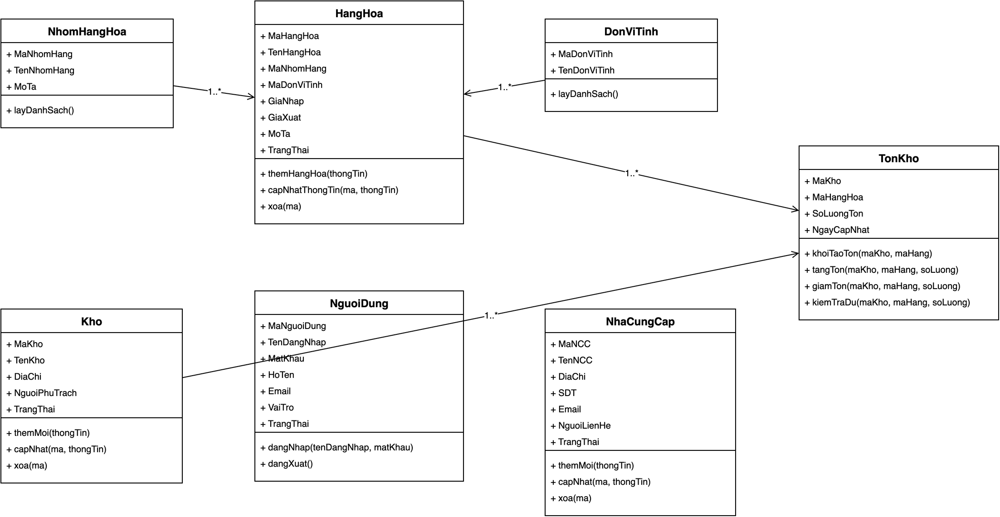
Hình 4.1 là "xương sống" dữ liệu tĩnh: HangHoa ở trung tâm - thuộc một NhomHangHoa (quan hệ 1..\*), gắn một DonViTinh và có nhiều dòng TonKho (mỗi kho một dòng). Kho quan hệ 1..\* với TonKho. NhaCungCap dùng trên phiếu nhập; NguoiDung đại diện tài khoản / vai trò. Bội số trên các đường nối cho biết ràng buộc: một mặt hàng có nhiều dòng tồn theo kho, nhiều mặt hàng chung một nhóm.
### 4.3.2. Nhóm nghiệp vụ nhập - xuất
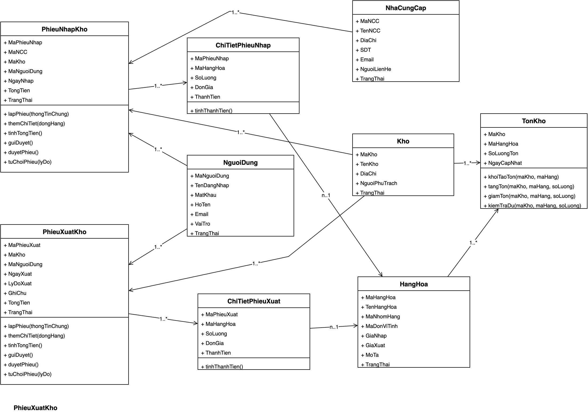
Hình 4.2 mô tả cấu trúc **giao dịch** dạng master - detail: PhieuNhapKho gắn NhaCungCap, Kho, NguoiDung (người lập) và có nhiều ChiTietPhieuNhap; mỗi chi tiết trỏ một HangHoa. PhieuXuatKho đối xứng nhưng không gắn NhaCungCap - thông tin người nhận ghi ở LyDoXuat, GhiChu. TonKho liên kết Kho - HangHoa, là lớp bị cập nhật bởi hành vi duyệt phiếu (thể hiện rõ ở biểu đồ trình tự Chương 5).
### 4.3.3. Nhóm kiểm kê và lịch sử
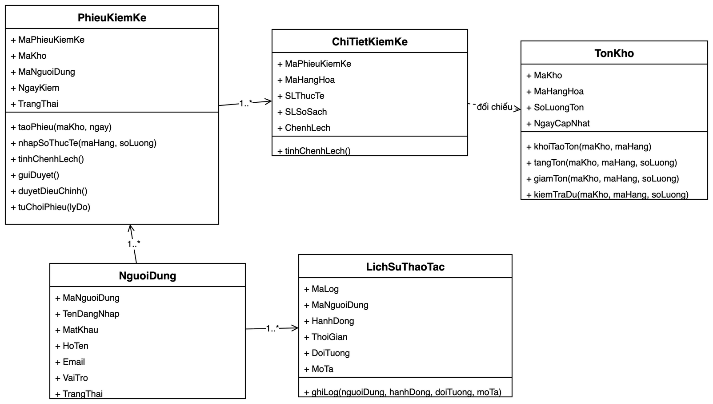
Hình 4.3: PhieuKiemKe - ChiTietKiemKe cũng theo mẫu master - detail; mỗi dòng lưu số lượng sổ sách, thực tế và chênh lệch, đối chiếu với TonKho. LichSuThaoTac ghi nhận ai làm gì (đăng nhập, duyệt phiếu, thêm hàng...), quan hệ 1..\* với NguoiDung. Nhóm này phục vụ UC33 và yêu cầu audit (FR-10), tách khỏi sơ đồ nhập xuất để tránh rối.
## 4.4. Phân tích cấu trúc theo nhóm entity (biểu đồ lớp cắt lát)
Thay vì vẽ lặp biểu đồ lớp cho từng use case CRUD (năm use case cùng nhóm dùng chung một tập lớp), phần này **cắt lát theo nhóm entity**: mỗi nhóm chức năng một biểu đồ lớp gồm lớp giao diện, lớp điều khiển và các lớp thực thể. Các use case cùng nhóm chia sẻ cấu trúc lớp; khác biệt nằm ở **phương thức** được gọi (thêm / sửa / xóa / tìm / xem) và thể hiện ở biểu đồ trình tự (Chương 5). Bảng 4.2 ánh xạ nhóm entity với use case.
<!-- @style align=center bold /-->
Bảng 4.2: Ánh xạ nhóm entity với use case và biểu đồ trình tự
| Nhóm entity | Use case | Biểu đồ lớp | Biểu đồ trình tự (Chương 5) |
|---|---|---|---|
| Tài khoản / xác thực | UC01 - UC07 | Hình 4.4 | 5.1.1 - 5.1.7 |
| Nhà cung cấp | UC08 - UC12 | Hình 4.5 | 5.1.8 - 5.1.12 |
| Hàng hóa | UC13 - UC17 | Hình 4.6 | 5.1.13 - 5.1.17 |
| Kho | UC18 - UC22 | Hình 4.7 | 5.1.18 - 5.1.22 |
| Phiếu nhập | UC23 - UC27 | Hình 4.8 | 5.1.23 - 5.1.27 |
| Phiếu xuất | UC28 - UC32 | Hình 4.9 | 5.1.28 - 5.1.32 |
| Kiểm kê | UC33 | Hình 4.10 | 5.1.33 |
| Báo cáo NXT | UC34 | Hình 4.11 | 5.1.34 |
Mỗi use case có đúng **một** biểu đồ trình tự tương ứng ở Chương 5 (tổng cộng 34 biểu đồ).
### 4.4.1. Nhóm tài khoản / xác thực (UC01-UC07)
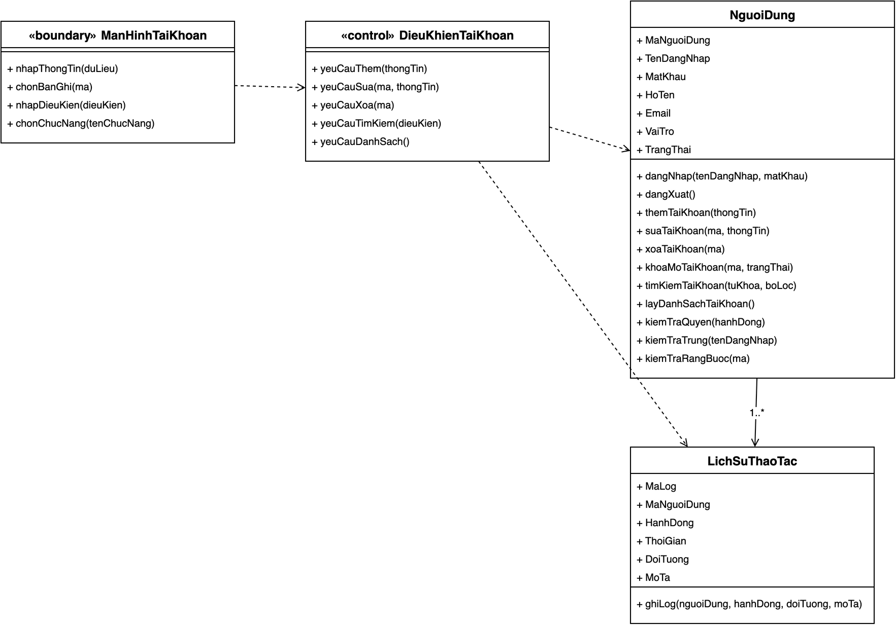
Hình 4.4: cùng lớp NguoiDung phục vụ cả xác thực (dangNhap / dangXuat - UC01, UC02) lẫn CRUD tài khoản (themTaiKhoan, suaTaiKhoan, xoaTaiKhoan / khoaMoTaiKhoan, timKiemTaiKhoan, layDanhSachTaiKhoan - UC03 - UC07). ManHinhTaiKhoan nhận thao tác của Quản trị viên, DieuKhienTaiKhoan điều phối và ghi LichSuThaoTac.
### 4.4.2. Nhóm nhà cung cấp (UC08-UC12)
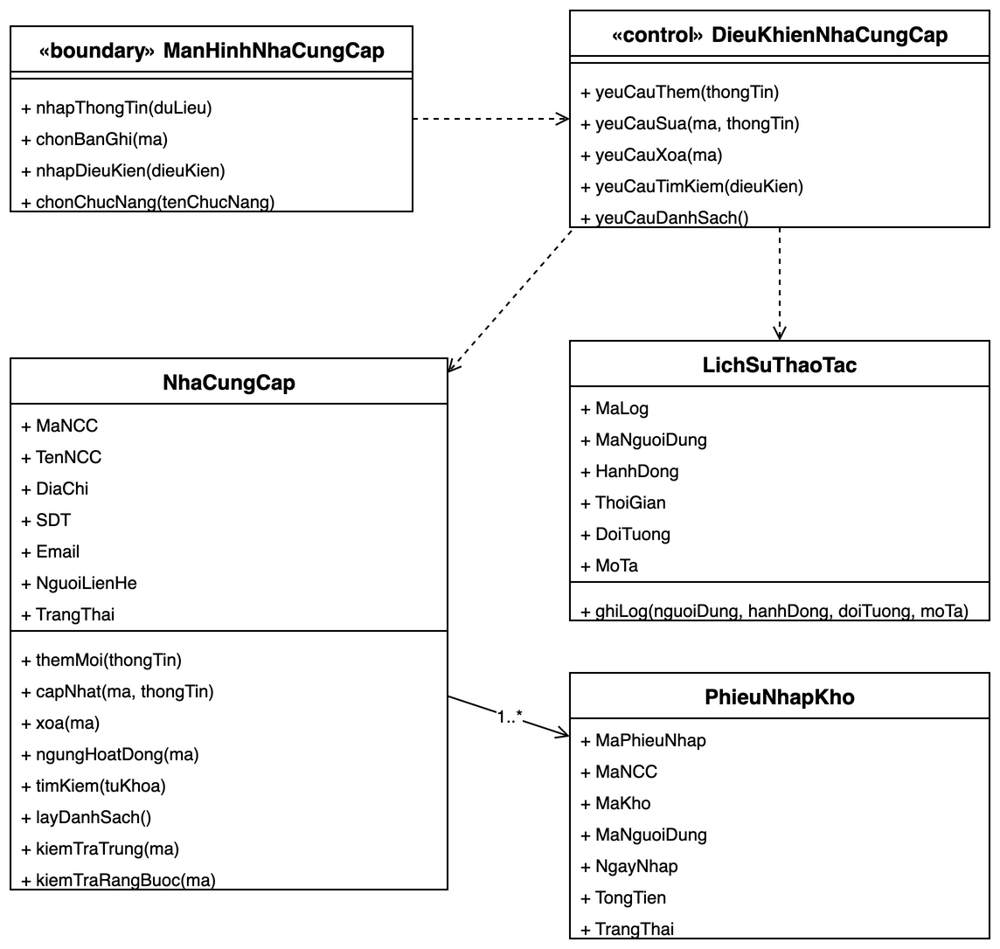
Hình 4.5: CRUD nhà cung cấp thao tác trên cùng lớp NhaCungCap (themMoi, capNhat, xoa / ngungHoatDong, timKiem, layDanhSach). Quan hệ 1..\* tới PhieuNhapKho giải thích vì sao UC10 có thể chỉ **ngừng hoạt động** thay vì xóa cứng khi NCC đã có phiếu nhập.
### 4.4.3. Nhóm hàng hóa (UC13-UC17)
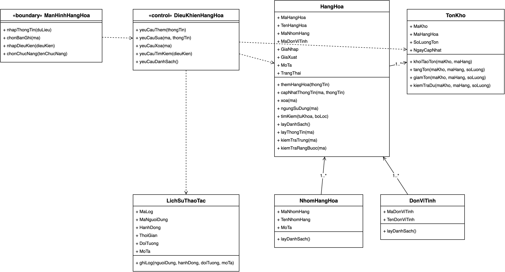
Hình 4.6: HangHoa ở trung tâm, quan hệ n..1 với NhomHangHoa, DonViTinh và 1..\* với TonKho. UC13 (thêm hàng) gọi thêm TonKho.khoiTaoTon; UC16 (tìm kiếm) đọc kèm TonKho.layTon. UC14 - UC17 không thay đổi cấu trúc lớp, chỉ đổi phương thức gọi.
### 4.4.4. Nhóm kho (UC18-UC22)
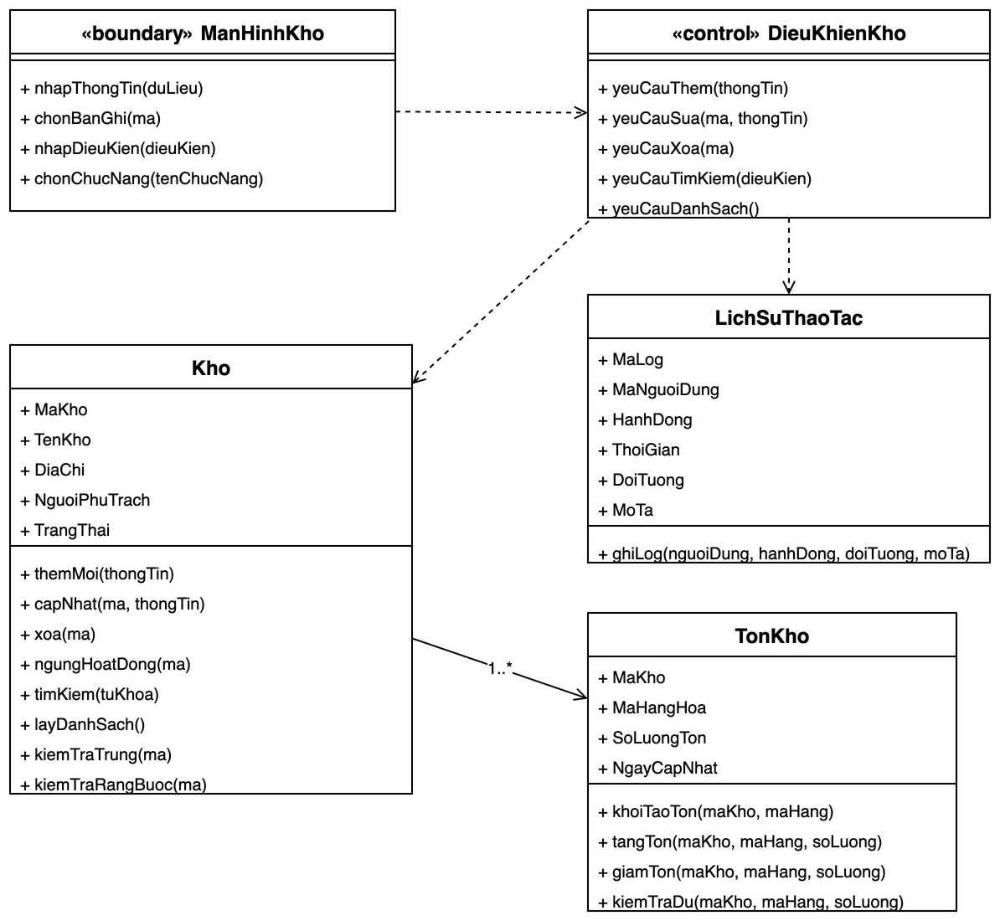
Hình 4.7: Kho quan hệ 1..\* với TonKho; xóa kho bị chặn (chỉ ngừng hoạt động) nếu kho còn tồn hoặc còn phiếu tham chiếu - thể hiện qua kiemTraRangBuoc.
### 4.4.5. Nhóm phiếu nhập (UC23-UC27)
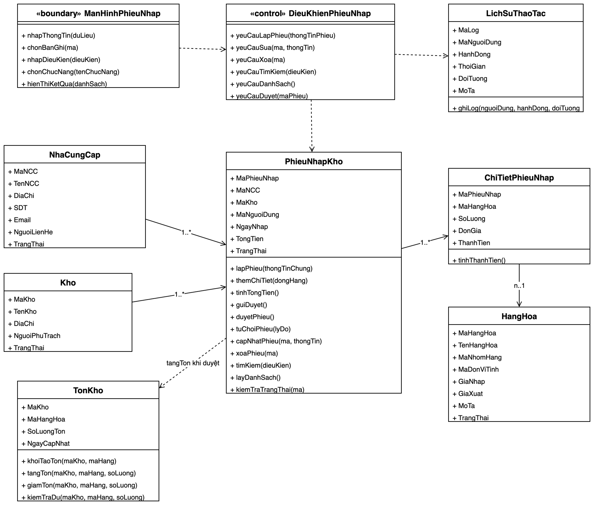
Hình 4.8: cấu trúc master - detail PhieuNhapKho - ChiTietPhieuNhap; phiếu gắn NhaCungCap, Kho. Phụ thuộc nét đứt "tangTon khi duyệt" nhấn mạnh: chỉ duyetPhieu() mới làm thay đổi TonKho. UC24 - UC27 dùng cùng cấu trúc, khác bước kiểm tra trạng thái / truy vấn.
### 4.4.6. Nhóm phiếu xuất (UC28-UC32)
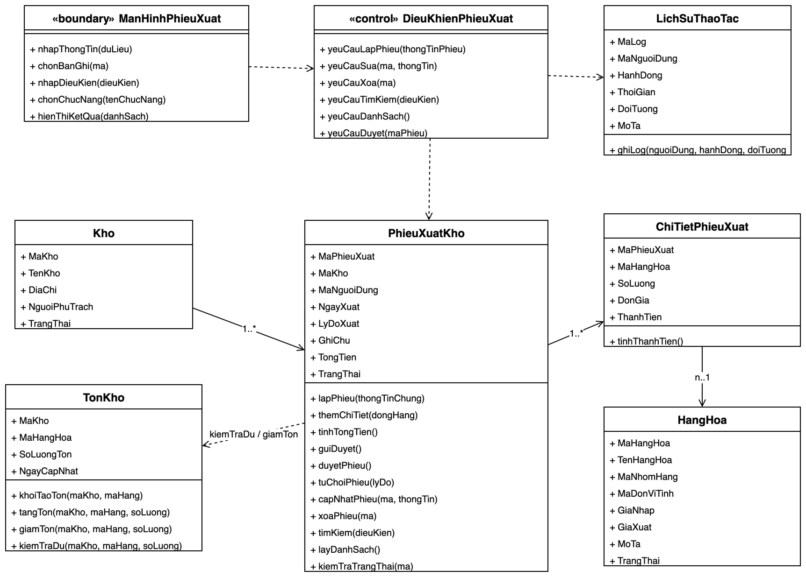
Hình 4.9: đối xứng nhóm phiếu nhập nhưng không gắn NhaCungCap; TonKho tham gia hai vai: kiểm tra đủ tồn (kiemTraDu) khi thêm dòng hàng và trừ tồn (giamTon) khi duyệt.
### 4.4.7. Nhóm kiểm kê (UC33)
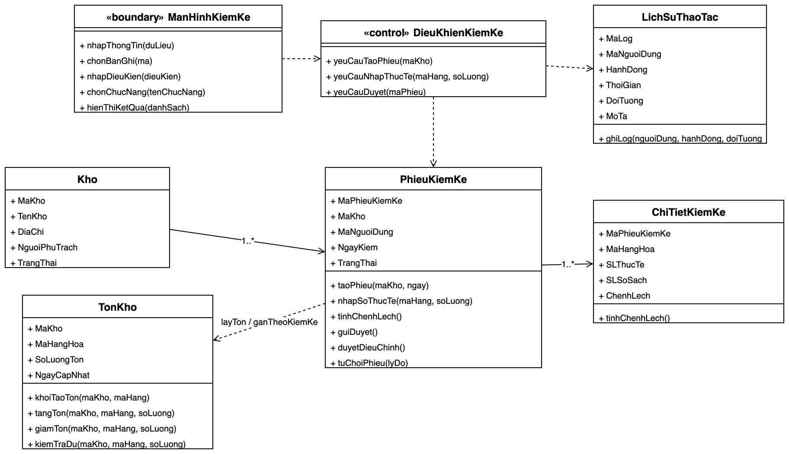
Hình 4.10: master - detail PhieuKiemKe - ChiTietKiemKe; phiếu đọc số sổ sách từ TonKho.layTon khi tạo và chỉ sau khi duyệt mới gán lại tồn qua ganTheoKiemKe.
### 4.4.8. Nhóm báo cáo NXT (UC34)
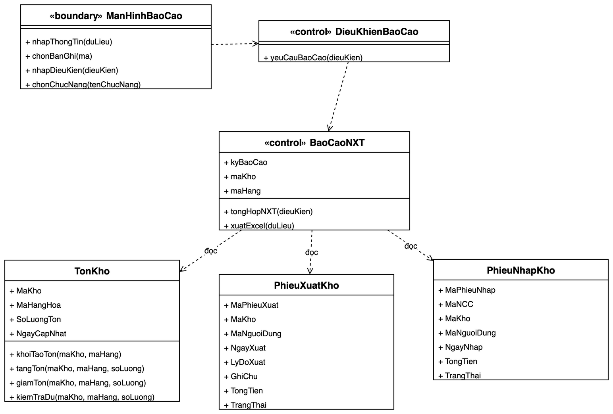
Hình 4.11: nhóm báo cáo không tạo entity giao dịch mới; lớp BaoCaoNXT chỉ **đọc** các phiếu đã duyệt (PhieuNhapKho, PhieuXuatKho) và TonKho để tổng hợp nhập - xuất - tồn.
## 4.5. Bảng mô tả thuộc tính các lớp
Bảng 4.3 mô tả thuộc tính chính của các lớp thực thể; tên thuộc tính được dùng thống nhất với bảng CSDL ở Chương 7.
<!-- @style align=center bold /-->
Bảng 4.3: Thuộc tính chính của các lớp thực thể
| Lớp | Thuộc tính chính | Ghi chú |
|---|---|---|
| NguoiDung | MaNguoiDung, TenDangNhap, MatKhau, HoTen, Email, VaiTro, TrangThai | Phân quyền theo VaiTro |
| NhaCungCap | MaNCC, TenNCC, DiaChi, SDT, Email, NguoiLienHe, TrangThai | Phục vụ phiếu nhập |
| HangHoa | MaHangHoa, TenHangHoa, MaNhomHang, MaDonViTinh, GiaNhap, GiaXuat, MoTa, TrangThai | Trung tâm danh mục |
| NhomHangHoa | MaNhomHang, TenNhomHang, MoTa | Phân loại hàng |
| DonViTinh | MaDonViTinh, TenDonViTinh | Cái, kg, thùng... |
| Kho | MaKho, TenKho, DiaChi, NguoiPhuTrach, TrangThai | Nhiều kho |
| TonKho | MaKho, MaHangHoa, SoLuongTon, NgayCapNhat | Khóa phức hợp (MaKho, MaHangHoa) |
| PhieuNhapKho | MaPhieuNhap, MaNCC, MaKho, MaNguoiDung, NgayNhap, TongTien, TrangThai | Chờ duyệt / Đã duyệt / Từ chối |
| ChiTietPhieuNhap | MaPhieuNhap, MaHangHoa, SoLuong, DonGia, ThanhTien | Dòng nhập |
| PhieuXuatKho | MaPhieuXuat, MaKho, MaNguoiDung, NgayXuat, LyDoXuat, GhiChu, TongTien, TrangThai | Chờ duyệt / Đã duyệt / Từ chối |
| ChiTietPhieuXuat | MaPhieuXuat, MaHangHoa, SoLuong, DonGia, ThanhTien | Dòng xuất |
| PhieuKiemKe | MaPhieuKiemKe, MaKho, MaNguoiDung, NgayKiem, TrangThai | Kiểm kê theo kho |
| ChiTietKiemKe | MaPhieuKiemKe, MaHangHoa, SLThucTe, SLSoSach, ChenhLech | Điều chỉnh tồn |
| LichSuThaoTac | MaLog, MaNguoiDung, HanhDong, ThoiGian, DoiTuong, MoTa | Audit log |
## 4.6. Giải thích các phương thức của lớp
Ngoài thuộc tính (dữ liệu), mỗi lớp có **phương thức** (hành vi). Các phương thức được liệt kê ở Bảng 4.4 - 4.11, xuất hiện đúng tên trên biểu đồ lớp (mục 4.3, 4.4) và là các thông điệp trong biểu đồ trình tự (mục 5.1); mã UC ghi kèm để truy vết.
### 4.6.1. Lớp NguoiDung
<!-- @style align=center bold /-->
Bảng 4.4: Phương thức của lớp NguoiDung
| Phương thức | Mô tả / khi nào dùng |
|---|---|
| dangNhap(tenDangNhap, matKhau) | So khớp mật khẩu mã hóa, kiểm tra trạng thái tài khoản; trả kết quả xác thực (UC01) |
| dangXuat() | Hủy phiên làm việc hiện tại (UC02) |
| themTaiKhoan(thongTin) | Tạo tài khoản mới, mã hóa mật khẩu, gán vai trò (UC03) |
| suaTaiKhoan(ma, thongTin) | Cập nhật họ tên, email, vai trò, mật khẩu nếu đổi (UC04) |
| xoaTaiKhoan(ma) / khoaMoTaiKhoan(ma, trangThai) | Xóa nếu chưa có phiếu / log; đã có thì chỉ khóa (UC05) |
| timKiemTaiKhoan(tuKhoa, boLoc) | Lọc theo tên đăng nhập / họ tên / vai trò / trạng thái (UC06) |
| layDanhSachTaiKhoan() | Tải danh sách có phân trang (UC07) |
| kiemTraTrung(tenDangNhap) | Kiểm tra tên đăng nhập chưa tồn tại (UC03) |
| kiemTraRangBuoc(ma) / kiemTraQuyen(hanhDong) | Kiểm tra dữ liệu tham chiếu trước khi xóa; kiểm tra quyền theo vai trò |
### 4.6.2. Lớp HangHoa
<!-- @style align=center bold /-->
Bảng 4.5: Phương thức của lớp HangHoa
| Phương thức | Mô tả / khi nào dùng |
|---|---|
| themHangHoa(thongTin) | Lưu mặt hàng mới; sau đó hệ thống khởi tạo tồn (UC13) |
| capNhatThongTin(ma, thongTin) | Sửa tên, giá, nhóm, mô tả (UC14) |
| xoa(ma) / ngungSuDung(ma) | Xóa cứng nếu chưa có phiếu; đã có thì ngừng sử dụng (UC15) |
| timKiem(tuKhoa, boLoc) | Tìm theo mã / tên / nhóm (UC16) |
| layDanhSach() | Xem danh sách, phân trang (UC17) |
| layThongTin(ma) / kiemTraTrung(ma) / kiemTraRangBuoc(ma) | Lấy chi tiết một mặt hàng; kiểm tra trùng mã; kiểm tra ràng buộc trước khi xóa |
### 4.6.3. Lớp TonKho
<!-- @style align=center bold /-->
Bảng 4.6: Phương thức của lớp TonKho
| Phương thức | Mô tả / khi nào dùng |
|---|---|
| khoiTaoTon(maKho, maHang) | Tạo dòng tồn = 0 khi thêm hàng mới (UC13) |
| tangTon(maKho, maHang, soLuong) | Cộng số lượng khi duyệt phiếu nhập (UC23) |
| giamTon(maKho, maHang, soLuong) | Trừ số lượng khi duyệt phiếu xuất (UC28); chỉ gọi sau khi đã kiểm tra đủ |
| kiemTraDu(maKho, maHang, soLuong) | Trả về đúng / sai - tồn có đủ để xuất không (UC28, UC29) |
| ganTheoKiemKe(maKho, maHang, slThucTe) | Gán tồn = số thực tế khi duyệt kiểm kê (UC33) |
| layTon(maKho, maHang) | Đọc số lượng hiện tại (UC16, UC33, UC34) |
### 4.6.4. Lớp PhieuNhapKho
<!-- @style align=center bold /-->
Bảng 4.7: Phương thức của lớp PhieuNhapKho
| Phương thức | Mô tả / khi nào dùng |
|---|---|
| lapPhieu(thongTinChung) | Tạo phiếu mới (NCC, kho, ngày, người lập), trạng thái "Mới tạo" (UC23) |
| themChiTiet(dongHang) | Thêm dòng hàng (mã hàng, số lượng, đơn giá) |
| tinhTongTien() | Cộng thành tiền các dòng thành TongTien |
| guiDuyet() | Chuyển trạng thái sang "Chờ duyệt" |
| duyetPhieu() | Quản lý duyệt: "Đã duyệt", kích hoạt TonKho.tangTon từng dòng, ghi log |
| tuChoiPhieu(lyDo) | "Từ chối"; không đổi tồn; lưu lý do |
| capNhatPhieu(ma, thongTin) / xoaPhieu(ma) | Sửa / xóa khi phiếu chưa duyệt (UC24, UC25) |
| timKiem(dieuKien) / layDanhSach() / kiemTraTrangThai(ma) | Tìm kiếm, xem danh sách, kiểm tra trạng thái phiếu (UC26, UC27) |
### 4.6.5. Lớp PhieuXuatKho
<!-- @style align=center bold /-->
Bảng 4.8: Phương thức của lớp PhieuXuatKho
| Phương thức | Mô tả / khi nào dùng |
|---|---|
| lapPhieu(thongTinChung) | Tạo phiếu xuất (kho, ngày, lý do / ghi chú), trạng thái "Mới tạo" (UC28) |
| themChiTiet(dongHang) | Thêm dòng hàng; trước đó hệ thống gọi TonKho.kiemTraDu, đủ mới cho thêm |
| tinhTongTien() / guiDuyet() | Tính tổng giá trị; chuyển "Chờ duyệt" |
| duyetPhieu() | "Đã duyệt"; kích hoạt TonKho.giamTon từng dòng; ghi log |
| tuChoiPhieu(lyDo) | Từ chối; tồn không đổi |
| capNhatPhieu(ma, thongTin) / xoaPhieu(ma) | Sửa / xóa khi phiếu chưa duyệt (UC29, UC30) |
| timKiem(dieuKien) / layDanhSach() / kiemTraTrangThai(ma) | Tìm kiếm, xem danh sách, kiểm tra trạng thái (UC31, UC32) |
### 4.6.6. Lớp PhieuKiemKe
<!-- @style align=center bold /-->
Bảng 4.9: Phương thức của lớp PhieuKiemKe
| Phương thức | Mô tả / khi nào dùng |
|---|---|
| taoPhieu(maKho, ngay) | Tạo phiếu kiểm kê; nạp danh sách hàng và số lượng sổ từ TonKho (UC33) |
| nhapSoThucTe(maHang, soLuong) | Ghi số thực tế từng dòng |
| tinhChenhLech() | Chênh lệch = thực tế - sổ sách |
| guiDuyet() | Gửi quản lý xem xét |
| duyetDieuChinh() | Quản lý duyệt: gọi TonKho.ganTheoKiemKe cho từng dòng lệch |
| tuChoiPhieu(lyDo) | Không duyệt; yêu cầu kiểm lại; tồn không đổi |
### 4.6.7. Lớp NhaCungCap / Kho (và các danh mục tương tự)
<!-- @style align=center bold /-->
Bảng 4.10: Phương thức chung của các lớp danh mục NhaCungCap / Kho
| Phương thức | Mô tả / khi nào dùng |
|---|---|
| themMoi(thongTin) | Thêm bản ghi mới: NCC (UC08), Kho (UC18) |
| capNhat(ma, thongTin) | Sửa thông tin danh mục: NCC (UC09), Kho (UC19) |
| xoa(ma) / ngungHoatDong(ma) | Xóa cứng nếu chưa có dữ liệu tham chiếu; đã có thì ngừng: NCC (UC10), Kho (UC20) |
| timKiem(tuKhoa) | Tra cứu theo mã / tên / SĐT: NCC (UC11), Kho (UC21) |
| layDanhSach() | Tải danh sách phân trang: NCC (UC12), Kho (UC22) |
| kiemTraTrung(ma) / kiemTraRangBuoc(ma) | Kiểm tra trùng khóa khi thêm; kiểm tra ràng buộc trước khi xóa |
### 4.6.8. Lớp LichSuThaoTac
<!-- @style align=center bold /-->
Bảng 4.11: Phương thức của lớp LichSuThaoTac
| Phương thức | Mô tả / khi nào dùng |
|---|---|
| ghiLog(nguoiDung, hanhDong, doiTuong, moTa) | Ghi nhận ai làm gì, lúc nào (đăng nhập, duyệt phiếu, thêm hàng...) - phục vụ FR-10 |
### 4.6.9. Liên hệ phương thức với use case (tóm tắt)
- **UC01 / UC02**: NguoiDung.dangNhap / dangXuat, kèm LichSuThaoTac.ghiLog.
- **UC03 - UC07**: themTaiKhoan, suaTaiKhoan, xoaTaiKhoan / khoaMoTaiKhoan, timKiemTaiKhoan, layDanhSachTaiKhoan.
- **UC08 - UC12**: NhaCungCap.themMoi / capNhat / xoa - ngungHoatDong / timKiem / layDanhSach.
- **UC13 - UC17**: HangHoa.themHangHoa (+ TonKho.khoiTaoTon) / capNhatThongTin / xoa - ngungSuDung / timKiem (+ TonKho.layTon) / layDanhSach.
- **UC18 - UC22**: Kho.themMoi / capNhat / xoa - ngungHoatDong / timKiem / layDanhSach.
- **UC23 - UC27**: PhieuNhapKho.lapPhieu / themChiTiet / guiDuyet / duyetPhieu (+ TonKho.tangTon) / capNhatPhieu / xoaPhieu / timKiem / layDanhSach.
- **UC28 - UC32**: PhieuXuatKho tương tự, thêm TonKho.kiemTraDu và TonKho.giamTon.
- **UC33**: PhieuKiemKe.taoPhieu / nhapSoThucTe / tinhChenhLech / guiDuyet / duyetDieuChinh (+ TonKho.ganTheoKiemKe).
- **UC34**: BaoCaoNXT.tongHopNXT đọc PhieuNhapKho, PhieuXuatKho, TonKho.
## 4.7. Tóm tắt quan hệ quan trọng
- **1 - n**: NguoiDung - Phieu (nhập / xuất / kiểm kê); NhaCungCap - PhieuNhapKho; Phieu - ChiTiet; Kho - TonKho; HangHoa - TonKho; NguoiDung - LichSuThaoTac.
- **n - 1**: ChiTiet - HangHoa; HangHoa - NhomHangHoa; HangHoa - DonViTinh.
- **Bất biến nghiệp vụ**: tồn kho chỉ thay đổi qua ba phương thức tangTon / giamTon / ganTheoKiemKe, và chỉ khi phiếu tương ứng được **duyệt**.
## 4.8. Kết luận chương
Chương 4 hoàn thành phân tích cấu trúc: biểu đồ lớp tổng thể theo ba nhóm dữ liệu (Hình 4.1 - 4.3) và **tám biểu đồ lớp cắt lát** theo nhóm entity (Hình 4.4 - 4.11) phủ toàn bộ UC01 - UC34. Thuộc tính (Bảng 4.3), phương thức (Bảng 4.4 - 4.11) và quan hệ đã được mô tả nhất quán; các phương thức then chốt sẽ xuất hiện lại đúng tên trên biểu đồ trình tự ở Chương 5.
<!-- @pagebreak -->
# CHƯƠNG 5: PHÂN TÍCH HÀNH VI
Chương này thực hiện giai đoạn phân tích thứ ba - **phân tích hành vi**: dùng biểu đồ trình tự (sequence) mô tả tương tác giữa các đối tượng theo thời gian cho **từng use case**, và biểu đồ trạng thái (state machine) mô tả vòng đời của đối tượng phiếu.
## 5.1. Phân tích hành vi bằng biểu đồ trình tự
**Nguyên tắc**: mỗi use case đã đặc tả ở mục 3.7 (UC01 - UC34) có đúng **một** biểu đồ trình tự. Các biểu đồ dùng chung một mẫu lifeline: tác nhân thao tác trên lớp giao diện ManHinh..., lớp điều khiển DieuKhien... tiếp nhận yêu cầu và gọi các lớp thực thể (đúng tên lớp và phương thức đã khai báo ở Chương 4). Thông điệp nét liền là lời gọi (đánh số khớp các bước luồng chính trong đặc tả); nét đứt là phản hồi. Các use case CRUD cùng entity khác nhau chủ yếu ở tên phương thức và ràng buộc (xóa hay ngừng, kiểm tra tồn, trạng thái phiếu...).
### 5.1.1. UC01 - Đăng nhập
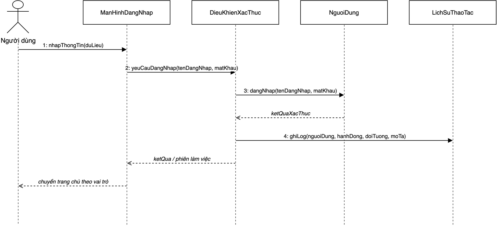
Hình 5.1 thể hiện luồng xử lý use case UC01: Tất cả người dùng thao tác trên ManHinhDangNhap; DieuKhienXacThuc tiếp nhận yêu cầu và điều phối các lớp thực thể LichSuThaoTac, NguoiDung. 4 thông điệp đánh số trên biểu đồ khớp 4 bước của luồng sự kiện chính trong đặc tả ở mục 3.7.1 (Bảng 3.3).
Điểm mấu chốt: chỉ khi so khớp mật khẩu và trạng thái tài khoản hợp lệ, hệ thống mới tạo phiên và ghi log.
### 5.1.2. UC02 - Đăng xuất
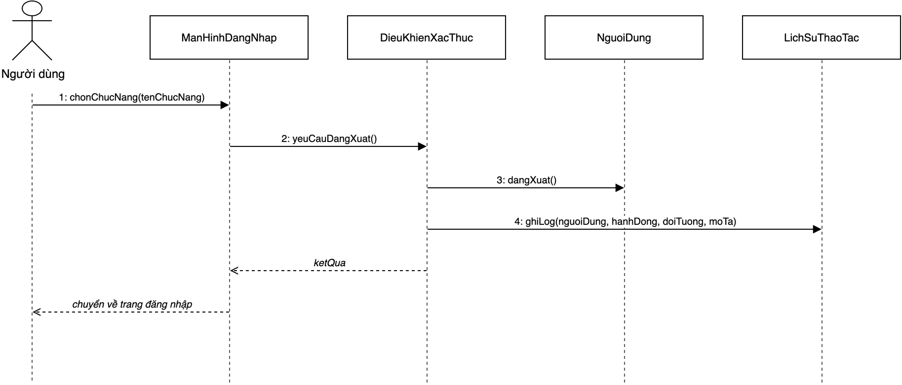
Hình 5.2 thể hiện luồng xử lý use case UC02: Tất cả người dùng thao tác trên ManHinhDangNhap; DieuKhienXacThuc tiếp nhận yêu cầu và điều phối các lớp thực thể LichSuThaoTac, NguoiDung. 4 thông điệp đánh số trên biểu đồ khớp 4 bước của luồng sự kiện chính trong đặc tả ở mục 3.7.2 (Bảng 3.4).
### 5.1.3. UC03 - Thêm tài khoản

Hình 5.3 thể hiện luồng xử lý use case UC03: Quản trị viên thao tác trên ManHinhTaiKhoan; DieuKhienTaiKhoan tiếp nhận yêu cầu và điều phối các lớp thực thể LichSuThaoTac, NguoiDung. 5 thông điệp đánh số trên biểu đồ khớp 5 bước của luồng sự kiện chính trong đặc tả ở mục 3.7.3 (Bảng 3.5).
### 5.1.4. UC04 - Sửa tài khoản

Hình 5.4 thể hiện luồng xử lý use case UC04: Quản trị viên thao tác trên ManHinhTaiKhoan; DieuKhienTaiKhoan tiếp nhận yêu cầu và điều phối các lớp thực thể LichSuThaoTac, NguoiDung. 5 thông điệp đánh số trên biểu đồ khớp 5 bước của luồng sự kiện chính trong đặc tả ở mục 3.7.4 (Bảng 3.6).
### 5.1.5. UC05 - Xóa tài khoản

Hình 5.5 thể hiện luồng xử lý use case UC05: Quản trị viên thao tác trên ManHinhTaiKhoan; DieuKhienTaiKhoan tiếp nhận yêu cầu và điều phối các lớp thực thể LichSuThaoTac, NguoiDung. 6 thông điệp đánh số trên biểu đồ khớp 6 bước của luồng sự kiện chính trong đặc tả ở mục 3.7.5 (Bảng 3.7).
Điểm mấu chốt: kiểm tra ràng buộc trước - tài khoản đã phát sinh phiếu / log thì chỉ khóa (khoaMoTaiKhoan), không xóa cứng.
### 5.1.6. UC06 - Tìm kiếm tài khoản
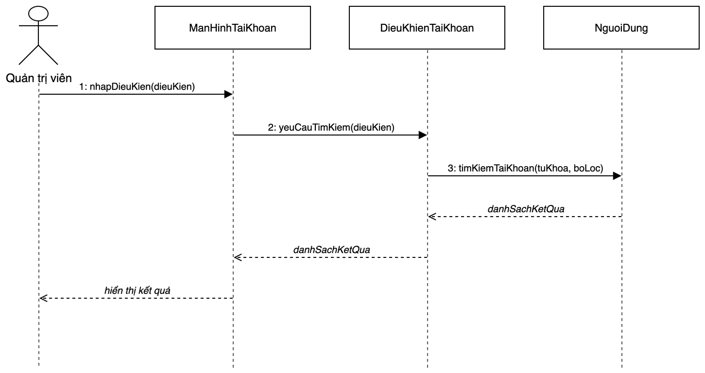
Hình 5.6 thể hiện luồng xử lý use case UC06: Quản trị viên thao tác trên ManHinhTaiKhoan; DieuKhienTaiKhoan tiếp nhận yêu cầu và điều phối các lớp thực thể NguoiDung. 3 thông điệp đánh số trên biểu đồ khớp 3 bước của luồng sự kiện chính trong đặc tả ở mục 3.7.6 (Bảng 3.8).
### 5.1.7. UC07 - Xem danh sách tài khoản
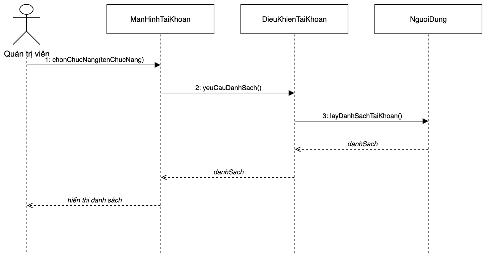
Hình 5.7 thể hiện luồng xử lý use case UC07: Quản trị viên thao tác trên ManHinhTaiKhoan; DieuKhienTaiKhoan tiếp nhận yêu cầu và điều phối các lớp thực thể NguoiDung. 3 thông điệp đánh số trên biểu đồ khớp 3 bước của luồng sự kiện chính trong đặc tả ở mục 3.7.7 (Bảng 3.9).
### 5.1.8. UC08 - Thêm nhà cung cấp

Hình 5.8 thể hiện luồng xử lý use case UC08: Nhân viên kho, Quản lý kho thao tác trên ManHinhNhaCungCap; DieuKhienNhaCungCap tiếp nhận yêu cầu và điều phối các lớp thực thể LichSuThaoTac, NhaCungCap. 5 thông điệp đánh số trên biểu đồ khớp 5 bước của luồng sự kiện chính trong đặc tả ở mục 3.7.8 (Bảng 3.10).
### 5.1.9. UC09 - Sửa nhà cung cấp
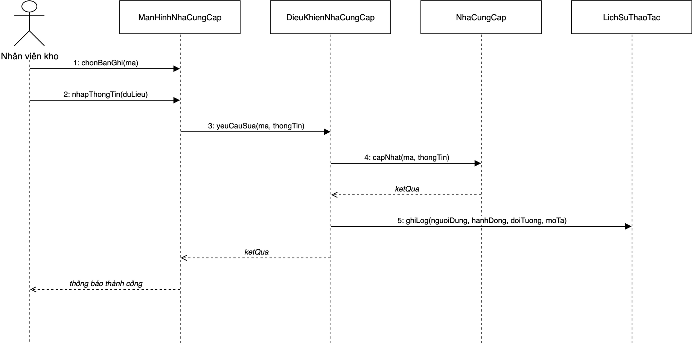
Hình 5.9 thể hiện luồng xử lý use case UC09: Nhân viên kho, Quản lý kho thao tác trên ManHinhNhaCungCap; DieuKhienNhaCungCap tiếp nhận yêu cầu và điều phối các lớp thực thể LichSuThaoTac, NhaCungCap. 5 thông điệp đánh số trên biểu đồ khớp 5 bước của luồng sự kiện chính trong đặc tả ở mục 3.7.9 (Bảng 3.11).
### 5.1.10. UC10 - Xóa nhà cung cấp
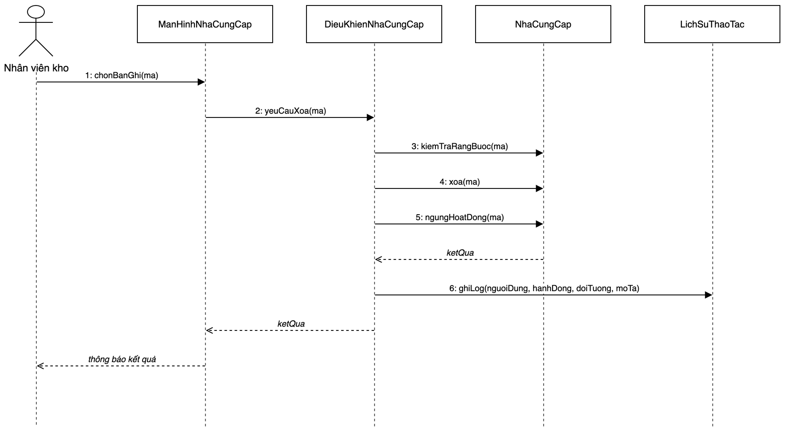
Hình 5.10 thể hiện luồng xử lý use case UC10: Nhân viên kho, Quản lý kho thao tác trên ManHinhNhaCungCap; DieuKhienNhaCungCap tiếp nhận yêu cầu và điều phối các lớp thực thể LichSuThaoTac, NhaCungCap. 6 thông điệp đánh số trên biểu đồ khớp 6 bước của luồng sự kiện chính trong đặc tả ở mục 3.7.10 (Bảng 3.12).
Điểm mấu chốt: nhà cung cấp đã có phiếu nhập tham chiếu thì chỉ ngừng hoạt động (ngungHoatDong), không xóa cứng.
### 5.1.11. UC11 - Tìm kiếm nhà cung cấp

Hình 5.11 thể hiện luồng xử lý use case UC11: Nhân viên kho, Quản lý kho thao tác trên ManHinhNhaCungCap; DieuKhienNhaCungCap tiếp nhận yêu cầu và điều phối các lớp thực thể NhaCungCap. 3 thông điệp đánh số trên biểu đồ khớp 3 bước của luồng sự kiện chính trong đặc tả ở mục 3.7.11 (Bảng 3.13).
### 5.1.12. UC12 - Xem danh sách nhà cung cấp
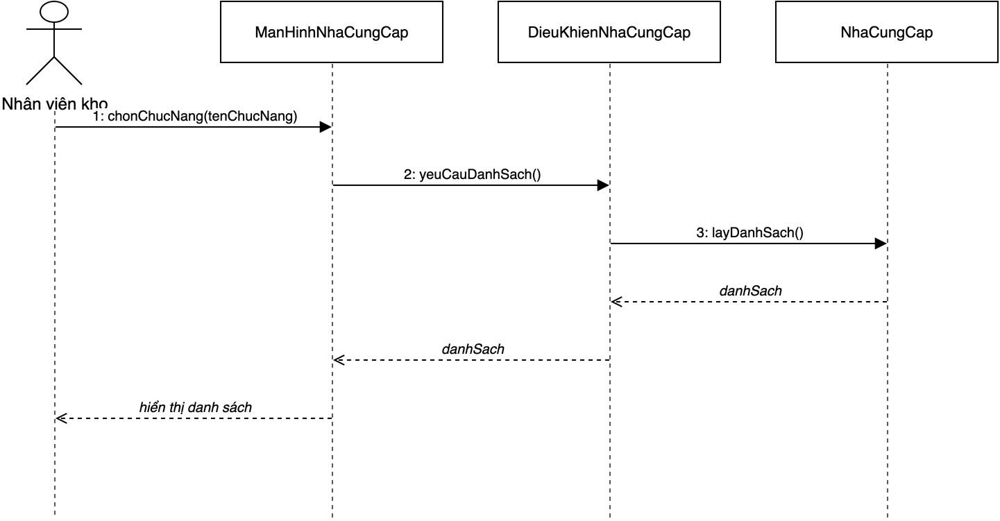
Hình 5.12 thể hiện luồng xử lý use case UC12: Nhân viên kho, Quản lý kho thao tác trên ManHinhNhaCungCap; DieuKhienNhaCungCap tiếp nhận yêu cầu và điều phối các lớp thực thể NhaCungCap. 3 thông điệp đánh số trên biểu đồ khớp 3 bước của luồng sự kiện chính trong đặc tả ở mục 3.7.12 (Bảng 3.14).
### 5.1.13. UC13 - Thêm hàng hóa
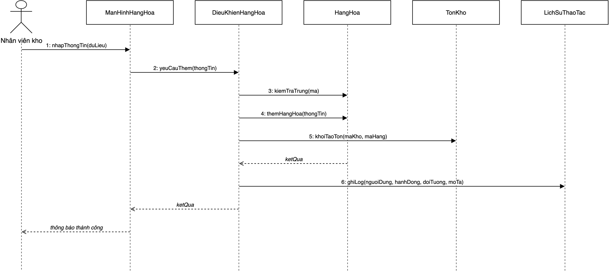
Hình 5.13 thể hiện luồng xử lý use case UC13: Nhân viên kho, Quản lý kho thao tác trên ManHinhHangHoa; DieuKhienHangHoa tiếp nhận yêu cầu và điều phối các lớp thực thể HangHoa, LichSuThaoTac, TonKho. 6 thông điệp đánh số trên biểu đồ khớp 6 bước của luồng sự kiện chính trong đặc tả ở mục 3.7.13 (Bảng 3.15).
Điểm mấu chốt: sau khi lưu hàng hóa, hệ thống gọi ngay TonKho.khoiTaoTon - hai thao tác ghi CSDL tuần tự.
### 5.1.14. UC14 - Sửa hàng hóa

Hình 5.14 thể hiện luồng xử lý use case UC14: Nhân viên kho, Quản lý kho thao tác trên ManHinhHangHoa; DieuKhienHangHoa tiếp nhận yêu cầu và điều phối các lớp thực thể HangHoa, LichSuThaoTac. 5 thông điệp đánh số trên biểu đồ khớp 5 bước của luồng sự kiện chính trong đặc tả ở mục 3.7.14 (Bảng 3.16).
### 5.1.15. UC15 - Xóa hàng hóa

Hình 5.15 thể hiện luồng xử lý use case UC15: Nhân viên kho, Quản lý kho thao tác trên ManHinhHangHoa; DieuKhienHangHoa tiếp nhận yêu cầu và điều phối các lớp thực thể HangHoa, LichSuThaoTac. 6 thông điệp đánh số trên biểu đồ khớp 6 bước của luồng sự kiện chính trong đặc tả ở mục 3.7.15 (Bảng 3.17).
Điểm mấu chốt: hàng đã phát sinh phiếu thì chỉ ngừng sử dụng (ngungSuDung), không xóa cứng.
### 5.1.16. UC16 - Tìm kiếm hàng hóa
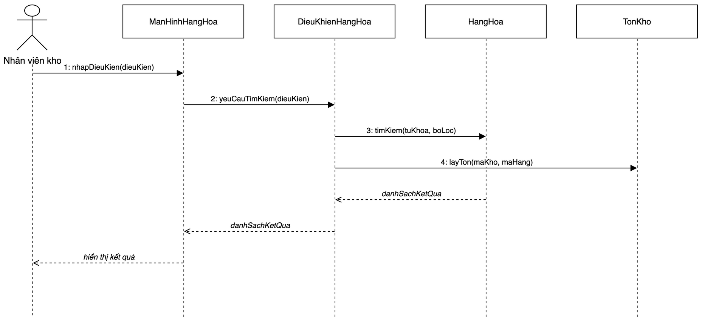
Hình 5.16 thể hiện luồng xử lý use case UC16: Nhân viên kho, Quản lý kho thao tác trên ManHinhHangHoa; DieuKhienHangHoa tiếp nhận yêu cầu và điều phối các lớp thực thể HangHoa, TonKho. 4 thông điệp đánh số trên biểu đồ khớp 4 bước của luồng sự kiện chính trong đặc tả ở mục 3.7.16 (Bảng 3.18).
Điểm mấu chốt: luồng chỉ đọc, kết quả được ghép kèm tồn kho hiện tại từ TonKho.layTon.
### 5.1.17. UC17 - Xem danh sách hàng hóa
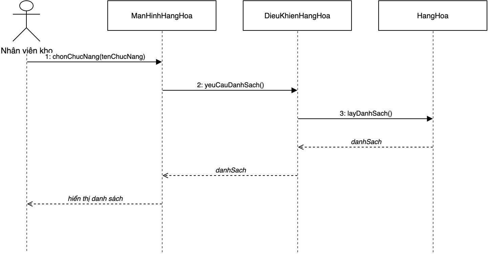
Hình 5.17 thể hiện luồng xử lý use case UC17: Nhân viên kho, Quản lý kho thao tác trên ManHinhHangHoa; DieuKhienHangHoa tiếp nhận yêu cầu và điều phối các lớp thực thể HangHoa. 3 thông điệp đánh số trên biểu đồ khớp 3 bước của luồng sự kiện chính trong đặc tả ở mục 3.7.17 (Bảng 3.19).
### 5.1.18. UC18 - Thêm kho
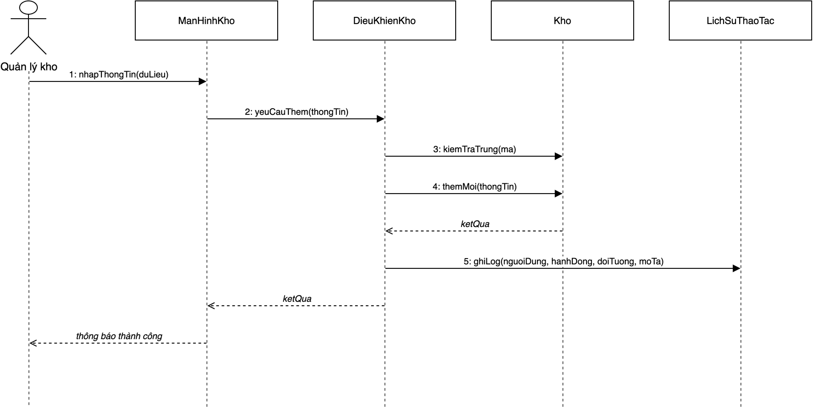
Hình 5.18 thể hiện luồng xử lý use case UC18: Quản lý kho thao tác trên ManHinhKho; DieuKhienKho tiếp nhận yêu cầu và điều phối các lớp thực thể Kho, LichSuThaoTac. 5 thông điệp đánh số trên biểu đồ khớp 5 bước của luồng sự kiện chính trong đặc tả ở mục 3.7.18 (Bảng 3.20).
### 5.1.19. UC19 - Sửa kho
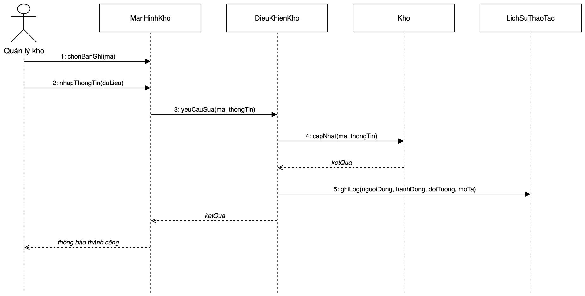
Hình 5.19 thể hiện luồng xử lý use case UC19: Quản lý kho thao tác trên ManHinhKho; DieuKhienKho tiếp nhận yêu cầu và điều phối các lớp thực thể Kho, LichSuThaoTac. 5 thông điệp đánh số trên biểu đồ khớp 5 bước của luồng sự kiện chính trong đặc tả ở mục 3.7.19 (Bảng 3.21).
### 5.1.20. UC20 - Xóa kho

Hình 5.20 thể hiện luồng xử lý use case UC20: Quản lý kho thao tác trên ManHinhKho; DieuKhienKho tiếp nhận yêu cầu và điều phối các lớp thực thể Kho, LichSuThaoTac. 6 thông điệp đánh số trên biểu đồ khớp 6 bước của luồng sự kiện chính trong đặc tả ở mục 3.7.20 (Bảng 3.22).
Điểm mấu chốt: kho còn tồn hoặc còn phiếu tham chiếu thì chỉ ngừng hoạt động, không xóa cứng.
### 5.1.21. UC21 - Tìm kiếm kho
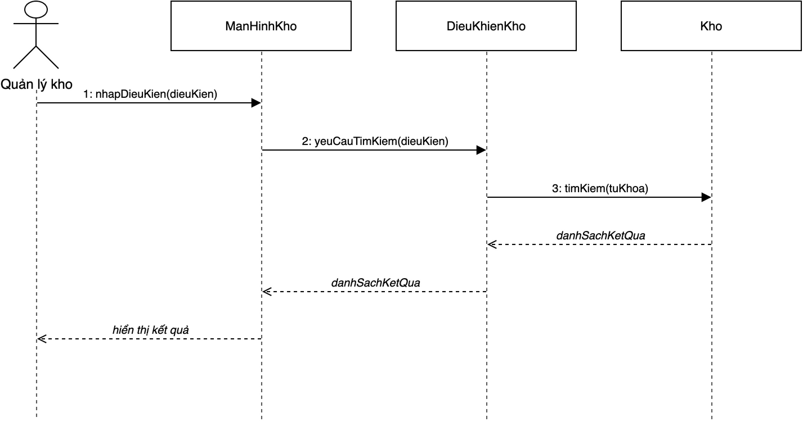
Hình 5.21 thể hiện luồng xử lý use case UC21: Quản lý kho thao tác trên ManHinhKho; DieuKhienKho tiếp nhận yêu cầu và điều phối các lớp thực thể Kho. 3 thông điệp đánh số trên biểu đồ khớp 3 bước của luồng sự kiện chính trong đặc tả ở mục 3.7.21 (Bảng 3.23).
### 5.1.22. UC22 - Xem danh sách kho
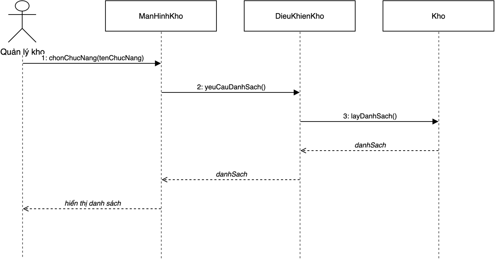
Hình 5.22 thể hiện luồng xử lý use case UC22: Quản lý kho thao tác trên ManHinhKho; DieuKhienKho tiếp nhận yêu cầu và điều phối các lớp thực thể Kho. 3 thông điệp đánh số trên biểu đồ khớp 3 bước của luồng sự kiện chính trong đặc tả ở mục 3.7.22 (Bảng 3.24).
### 5.1.23. UC23 - Lập phiếu nhập kho
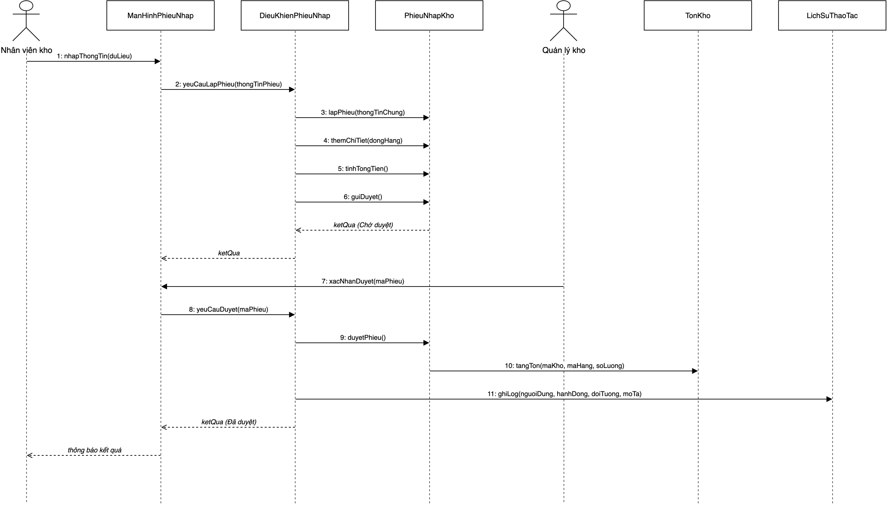
Hình 5.23 thể hiện luồng xử lý use case UC23: Nhân viên kho, Quản lý kho thao tác trên ManHinhPhieuNhap; DieuKhienPhieuNhap tiếp nhận yêu cầu và điều phối các lớp thực thể LichSuThaoTac, PhieuNhapKho, TonKho. 11 thông điệp đánh số trên biểu đồ khớp 11 bước của luồng sự kiện chính trong đặc tả ở mục 3.7.23 (Bảng 3.25).
Điểm mấu chốt: tồn kho chỉ tăng ở bước duyệt - duyetPhieu() mới kích hoạt TonKho.tangTon cho từng dòng hàng.
### 5.1.24. UC24 - Sửa phiếu nhập kho
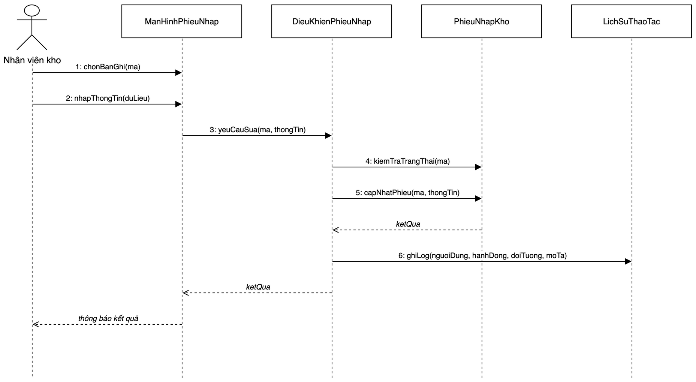
Hình 5.24 thể hiện luồng xử lý use case UC24: Nhân viên kho, Quản lý kho thao tác trên ManHinhPhieuNhap; DieuKhienPhieuNhap tiếp nhận yêu cầu và điều phối các lớp thực thể LichSuThaoTac, PhieuNhapKho. 6 thông điệp đánh số trên biểu đồ khớp 6 bước của luồng sự kiện chính trong đặc tả ở mục 3.7.24 (Bảng 3.26).
Điểm mấu chốt: kiểm tra trạng thái trước khi sửa - chỉ sửa được phiếu "Chờ duyệt", tồn kho không đổi.
### 5.1.25. UC25 - Xóa phiếu nhập kho
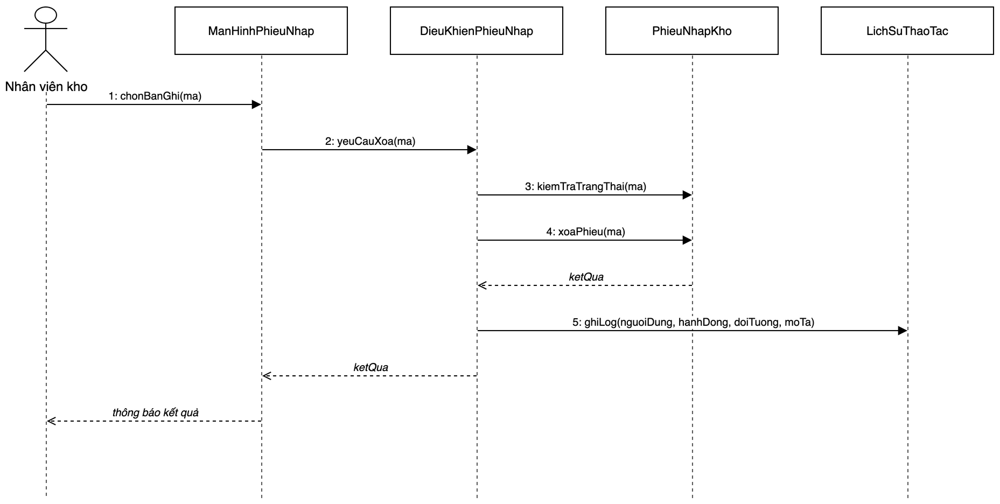
Hình 5.25 thể hiện luồng xử lý use case UC25: Nhân viên kho, Quản lý kho thao tác trên ManHinhPhieuNhap; DieuKhienPhieuNhap tiếp nhận yêu cầu và điều phối các lớp thực thể LichSuThaoTac, PhieuNhapKho. 5 thông điệp đánh số trên biểu đồ khớp 5 bước của luồng sự kiện chính trong đặc tả ở mục 3.7.25 (Bảng 3.27).
Điểm mấu chốt: chỉ xóa / hủy phiếu chưa duyệt nên không phải hoàn tồn.
### 5.1.26. UC26 - Tìm kiếm phiếu nhập
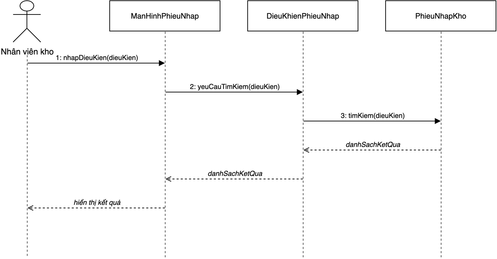
Hình 5.26 thể hiện luồng xử lý use case UC26: Nhân viên kho, Quản lý kho thao tác trên ManHinhPhieuNhap; DieuKhienPhieuNhap tiếp nhận yêu cầu và điều phối các lớp thực thể PhieuNhapKho. 3 thông điệp đánh số trên biểu đồ khớp 3 bước của luồng sự kiện chính trong đặc tả ở mục 3.7.26 (Bảng 3.28).
### 5.1.27. UC27 - Xem danh sách phiếu nhập
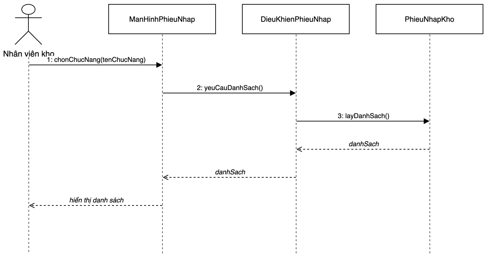
Hình 5.27 thể hiện luồng xử lý use case UC27: Nhân viên kho, Quản lý kho thao tác trên ManHinhPhieuNhap; DieuKhienPhieuNhap tiếp nhận yêu cầu và điều phối các lớp thực thể PhieuNhapKho. 3 thông điệp đánh số trên biểu đồ khớp 3 bước của luồng sự kiện chính trong đặc tả ở mục 3.7.27 (Bảng 3.29).
### 5.1.28. UC28 - Lập phiếu xuất kho
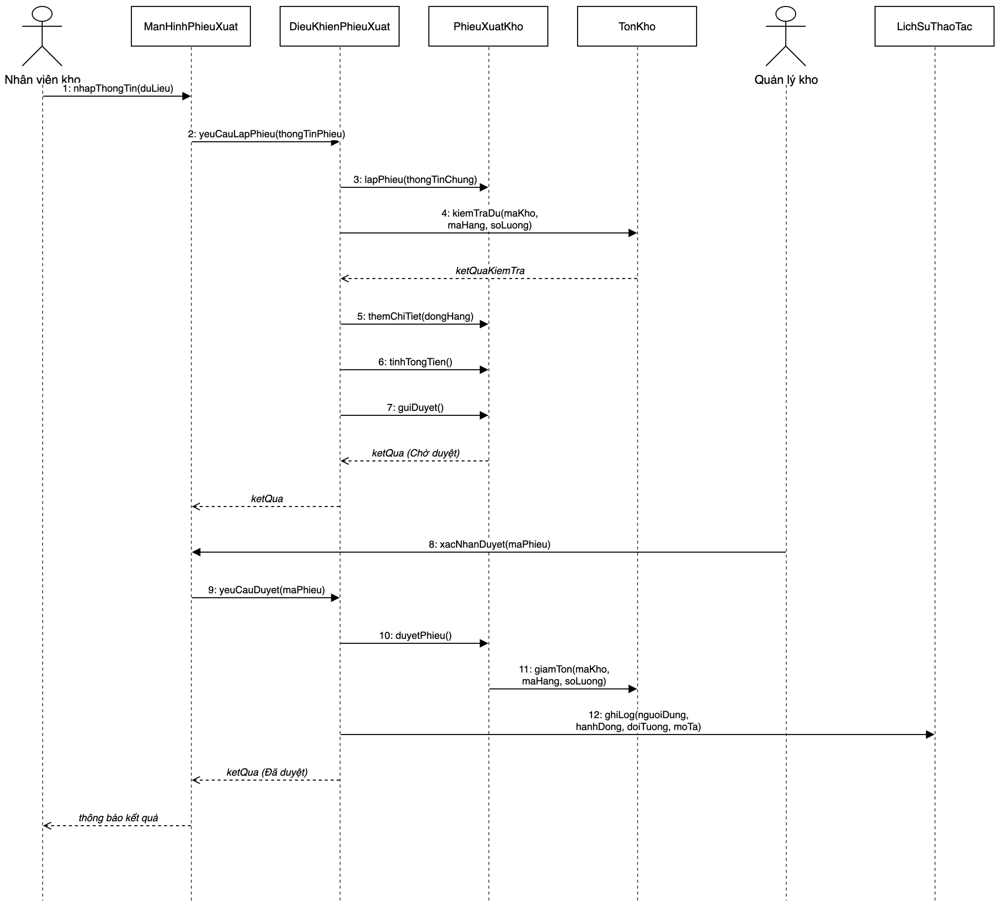
Hình 5.28 thể hiện luồng xử lý use case UC28: Nhân viên kho, Quản lý kho thao tác trên ManHinhPhieuXuat; DieuKhienPhieuXuat tiếp nhận yêu cầu và điều phối các lớp thực thể LichSuThaoTac, PhieuXuatKho, TonKho. 12 thông điệp đánh số trên biểu đồ khớp 12 bước của luồng sự kiện chính trong đặc tả ở mục 3.7.28 (Bảng 3.30).
Điểm mấu chốt: TonKho.kiemTraDu chặn xuất vượt tồn ngay khi thêm dòng hàng; duyệt mới gọi TonKho.giamTon.
### 5.1.29. UC29 - Sửa phiếu xuất kho
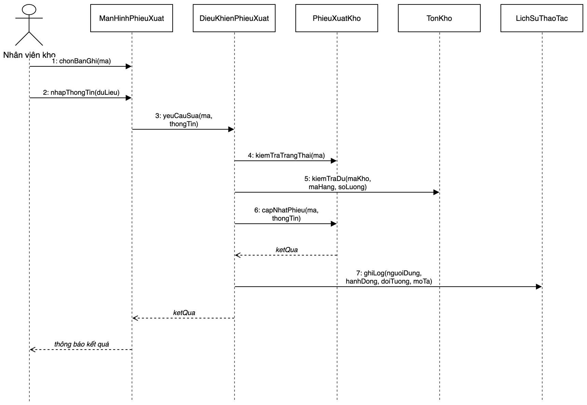
Hình 5.29 thể hiện luồng xử lý use case UC29: Nhân viên kho, Quản lý kho thao tác trên ManHinhPhieuXuat; DieuKhienPhieuXuat tiếp nhận yêu cầu và điều phối các lớp thực thể LichSuThaoTac, PhieuXuatKho, TonKho. 7 thông điệp đánh số trên biểu đồ khớp 7 bước của luồng sự kiện chính trong đặc tả ở mục 3.7.29 (Bảng 3.31).
Điểm mấu chốt: đổi số lượng xuất phải kiểm tra tồn lại (kiemTraDu) trước khi cập nhật.
### 5.1.30. UC30 - Xóa phiếu xuất kho

Hình 5.30 thể hiện luồng xử lý use case UC30: Nhân viên kho, Quản lý kho thao tác trên ManHinhPhieuXuat; DieuKhienPhieuXuat tiếp nhận yêu cầu và điều phối các lớp thực thể LichSuThaoTac, PhieuXuatKho. 5 thông điệp đánh số trên biểu đồ khớp 5 bước của luồng sự kiện chính trong đặc tả ở mục 3.7.30 (Bảng 3.32).
Điểm mấu chốt: phiếu chưa duyệt nên xóa / hủy không ảnh hưởng tồn kho.
### 5.1.31. UC31 - Tìm kiếm phiếu xuất
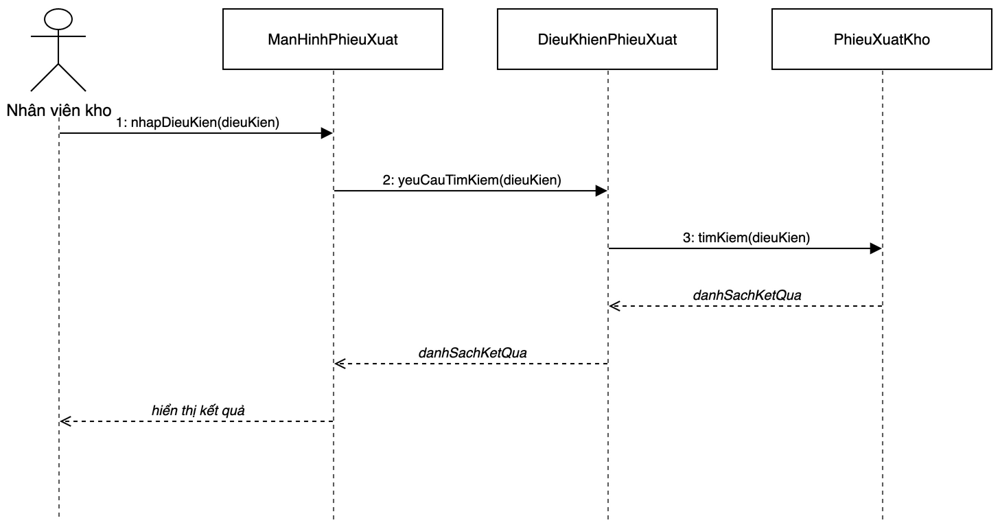
Hình 5.31 thể hiện luồng xử lý use case UC31: Nhân viên kho, Quản lý kho thao tác trên ManHinhPhieuXuat; DieuKhienPhieuXuat tiếp nhận yêu cầu và điều phối các lớp thực thể PhieuXuatKho. 3 thông điệp đánh số trên biểu đồ khớp 3 bước của luồng sự kiện chính trong đặc tả ở mục 3.7.31 (Bảng 3.33).
### 5.1.32. UC32 - Xem danh sách phiếu xuất

Hình 5.32 thể hiện luồng xử lý use case UC32: Nhân viên kho, Quản lý kho thao tác trên ManHinhPhieuXuat; DieuKhienPhieuXuat tiếp nhận yêu cầu và điều phối các lớp thực thể PhieuXuatKho. 3 thông điệp đánh số trên biểu đồ khớp 3 bước của luồng sự kiện chính trong đặc tả ở mục 3.7.32 (Bảng 3.34).
### 5.1.33. UC33 - Lập phiếu kiểm kê
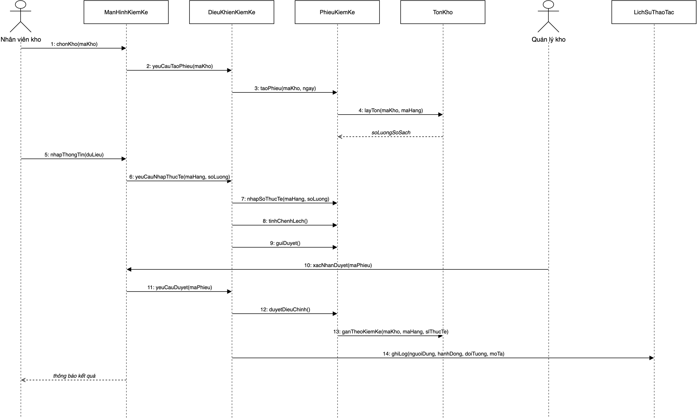
Hình 5.33 thể hiện luồng xử lý use case UC33: Nhân viên kho (lập), Quản lý kho (duyệt) thao tác trên ManHinhKiemKe; DieuKhienKiemKe tiếp nhận yêu cầu và điều phối các lớp thực thể LichSuThaoTac, PhieuKiemKe, TonKho. 14 thông điệp đánh số trên biểu đồ khớp 14 bước của luồng sự kiện chính trong đặc tả ở mục 3.7.33 (Bảng 3.35).
Điểm mấu chốt: tồn kho chỉ thay đổi sau khi quản lý duyệt điều chỉnh - duyetDieuChinh() gọi TonKho.ganTheoKiemKe.
### 5.1.34. UC34 - Xem báo cáo nhập xuất tồn
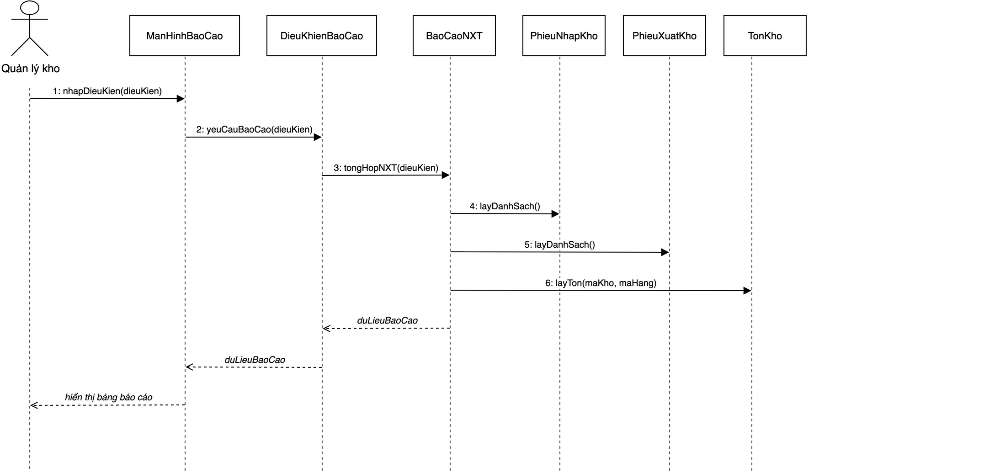
Hình 5.34 thể hiện luồng xử lý use case UC34: Quản lý kho thao tác trên ManHinhBaoCao; DieuKhienBaoCao tiếp nhận yêu cầu và điều phối các lớp thực thể PhieuNhapKho, PhieuXuatKho, TonKho. 6 thông điệp đánh số trên biểu đồ khớp 6 bước của luồng sự kiện chính trong đặc tả ở mục 3.7.34 (Bảng 3.36).
Điểm mấu chốt: luồng chỉ đọc / tổng hợp phiếu đã duyệt và tồn kho, không tạo giao dịch mới.
## 5.2. Phân tích hành vi đối tượng phiếu (biểu đồ trạng thái)
Biểu đồ trình tự mô tả tương tác **giữa** các đối tượng; biểu đồ trạng thái mô tả hành vi **của chính** đối tượng phiếu qua các trạng thái. Hai đối tượng có vòng đời đáng chú ý nhất là phiếu nhập và phiếu xuất; sự kiện chuyển trạng thái mang đúng tên phương thức ở Chương 4.
### 5.2.1. Phiếu nhập kho

Hình 5.35: phiếu nhập đi qua các trạng thái Mới tạo --> Chờ duyệt (guiDuyet) --> Đã duyệt (duyetPhieu) --> Đã nhập kho (tangTon). Từ "Chờ duyệt" có thể bị Từ chối (tuChoiPhieu) rồi bị hủy; phiếu "Mới tạo" có thể bị xóa (xoaPhieu). Chỉ trạng thái **"Đã duyệt"** mới làm thay đổi tồn kho - nhất quán với đặc tả UC23 và biểu đồ trình tự Hình 5.23.
### 5.2.2. Phiếu xuất kho
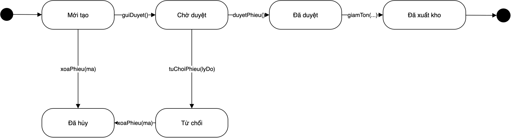
Hình 5.36: đối xứng với phiếu nhập; khi "Đã duyệt", hệ thống **giảm** tồn (giamTon) và phiếu chuyển "Đã xuất kho" - nhất quán với UC28 và Hình 5.28.
## 5.3. Kết luận chương
Chương 5 hoàn thành phân tích hành vi với **34 biểu đồ trình tự** tương ứng 34 use case (Hình 5.1 - 5.34) và **2 biểu đồ trạng thái** cho phiếu nhập / phiếu xuất (Hình 5.35, 5.36). Mọi thông điệp trên biểu đồ trình tự khớp phương thức khai báo ở biểu đồ lớp Chương 4; số bước luồng chính trong đặc tả (mục 3.7) khớp số thông điệp đánh số. Ba giai đoạn phân tích - chức năng (Chương 3), cấu trúc (Chương 4), hành vi (Chương 5) - đã khép kín; hai chương tiếp theo chuyển sang thiết kế.
<!-- @pagebreak -->
# CHƯƠNG 6: KIẾN TRÚC HỆ THỐNG
Sau ba giai đoạn phân tích (chức năng - cấu trúc - hành vi), chương này chuyển sang **thiết kế**: kiến trúc thành phần của hệ thống và các quan hệ lớp phục vụ triển khai.
## 6.1. Component Diagram
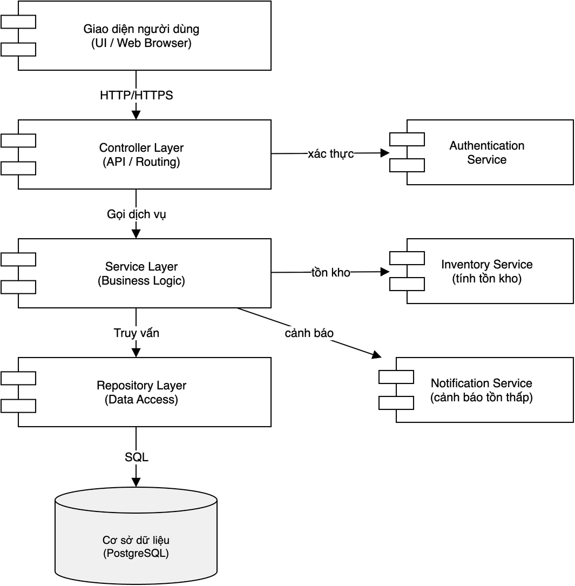
Hình 6.1 mô tả kiến trúc triển khai logic theo tầng:
- **Giao diện người dùng (UI / Web Browser)**: các form đăng nhập, màn hình phiếu, danh mục - hiện thực hóa các lớp giao diện ManHinh... ở phân tích.
- **Controller Layer**: nhận HTTP request, định tuyến tới service - tương ứng các lớp «control» DieuKhien....
- **Service Layer**: logic nghiệp vụ (duyệt phiếu, tính tồn, xác thực...); gọi các service chuyên biệt: Authentication (xác thực - UC01, UC02), Inventory (tính tồn kho - TonKho), Notification (cảnh báo tồn thấp).
- **Repository Layer**: truy cập dữ liệu qua ORM.
- **Database (PostgreSQL)**: lưu các bảng NguoiDung, HangHoa, phiếu, tồn... (Chương 7).

Mũi tên từ trên xuống thể hiện chiều phụ thuộc: UI không gọi thẳng Database mà đi qua Controller, Service rồi Repository. Kiến trúc này nhất quán với các biểu đồ trình tự ở Chương 5 và đáp ứng NFR-04 về tính mở rộng.
## 6.2. Quan hệ chính giữa các lớp (thiết kế)
Các quan hệ lớp mang sang thiết kế (làm cơ sở đặt khóa ngoại ở Chương 7):
- NguoiDung 1 - n PhieuNhapKho / PhieuXuatKho / PhieuKiemKe (người lập phiếu).
- NhaCungCap 1 - n PhieuNhapKho; PhieuXuatKho ghi thông tin người nhận ở LyDoXuat / GhiChu.
- Phiếu 1 - n Chi tiết; Chi tiết n - 1 HangHoa.
- Kho 1 - n TonKho; HangHoa 1 - n TonKho (khóa phức hợp MaKho, MaHangHoa).
- NguoiDung 1 - n LichSuThaoTac.
## 6.3. Kết luận chương
Chương 6 xác định kiến trúc thành phần bốn tầng (Hình 6.1) và chốt các quan hệ lớp thiết kế, làm nền trực tiếp cho thiết kế cơ sở dữ liệu (Chương 7) và thiết kế giao diện (Chương 8).
<!-- @pagebreak -->
# CHƯƠNG 7: THIẾT KẾ CƠ SỞ DỮ LIỆU
Chương này ánh xạ các lớp thực thể (Chương 4) sang bảng cơ sở dữ liệu quan hệ, đặc tả các bảng quan trọng theo mẫu từ điển dữ liệu, và thiết kế sơ đồ điều hướng màn hình.
## 7.1. Danh sách bảng
Cơ sở dữ liệu quan hệ gồm 14 bảng - mỗi lớp thực thể ở Bảng 4.1 ánh xạ đúng một bảng cùng tên; khóa chính / khóa ngoại bám theo quan hệ lớp ở mục 6.2. Bảng 7.1 liệt kê toàn bộ.
<!-- @style align=center bold /-->
Bảng 7.1: Danh sách bảng cơ sở dữ liệu
| Bảng | Mô tả |
|---|---|
| NguoiDung | Tài khoản: mã, tên đăng nhập, mật khẩu (mã hóa), họ tên, email, vai trò, trạng thái |
| HangHoa | Hàng hóa: mã, tên, nhóm, ĐVT, giá nhập / xuất, mô tả, trạng thái |
| NhomHangHoa | Nhóm hàng: mã, tên, mô tả |
| DonViTinh | Đơn vị tính: mã, tên |
| NhaCungCap | NCC: mã, tên, địa chỉ, SĐT, email, người liên hệ, trạng thái |
| Kho | Kho: mã, tên, địa chỉ, người phụ trách, trạng thái |
| TonKho | Tồn: (mã kho, mã hàng) là khóa phức hợp, số lượng, ngày cập nhật |
| PhieuNhapKho | Phiếu nhập: mã, NCC, kho, người lập, ngày, tổng tiền, trạng thái |
| ChiTietPhieuNhap | Chi tiết nhập: mã phiếu, mã hàng, số lượng, đơn giá, thành tiền |
| PhieuXuatKho | Phiếu xuất: mã, kho, người lập, ngày, lý do, ghi chú, tổng tiền, trạng thái |
| ChiTietPhieuXuat | Chi tiết xuất: mã phiếu, mã hàng, số lượng, đơn giá, thành tiền |
| PhieuKiemKe | Phiếu kiểm kê: mã, kho, người kiểm, ngày, trạng thái |
| ChiTietKiemKe | Chi tiết kiểm kê: mã phiếu, mã hàng, SL thực tế, SL sổ sách, chênh lệch |
| LichSuThaoTac | Log: mã, người dùng, hành động, thời gian, đối tượng, mô tả |
## 7.2. Đặc tả một số bảng quan trọng
Bốn bảng cốt lõi được đặc tả theo mẫu từ điển dữ liệu bốn cột ở Bảng 7.2 - 7.5.
### 7.2.1. Bảng HangHoa
<!-- @style align=center bold /-->
Bảng 7.2: Từ điển dữ liệu bảng HangHoa
| Tên trường | Kiểu dữ liệu | Kích thước | Ràng buộc toàn vẹn |
|---|---|---|---|
| MaHangHoa | VARCHAR | 20 | Khóa chính |
| TenHangHoa | NVARCHAR | 255 | NOT NULL |
| MaNhomHang | VARCHAR | 20 | Khóa ngoại tới NhomHangHoa |
| MaDonViTinh | VARCHAR | 20 | Khóa ngoại tới DonViTinh |
| GiaNhap | DECIMAL(18,2) | | >= 0 |
| GiaXuat | DECIMAL(18,2) | | >= 0 |
| MoTa | NVARCHAR | 500 | Cho phép NULL |
| TrangThai | BIT | | 1 = đang dùng, 0 = ngừng |
### 7.2.2. Bảng TonKho
<!-- @style align=center bold /-->
Bảng 7.3: Từ điển dữ liệu bảng TonKho
| Tên trường | Kiểu dữ liệu | Kích thước | Ràng buộc toàn vẹn |
|---|---|---|---|
| MaKho | VARCHAR | 20 | Khóa chính + khóa ngoại tới Kho |
| MaHangHoa | VARCHAR | 20 | Khóa chính + khóa ngoại tới HangHoa |
| SoLuongTon | INT | | >= 0; chỉ cập nhật khi duyệt nhập / xuất / kiểm kê |
| NgayCapNhat | DATETIME | | Thời điểm cập nhật gần nhất |
### 7.2.3. Bảng PhieuNhapKho / PhieuXuatKho
<!-- @style align=center bold /-->
Bảng 7.4: Từ điển dữ liệu bảng PhieuNhapKho và PhieuXuatKho
| Tên trường | Kiểu dữ liệu | Kích thước | Ràng buộc toàn vẹn |
|---|---|---|---|
| MaPhieuNhap / MaPhieuXuat | VARCHAR | 20 | Khóa chính |
| MaNCC | VARCHAR | 20 | Khóa ngoại tới NhaCungCap (chỉ phiếu nhập) |
| MaKho | VARCHAR | 20 | Khóa ngoại tới Kho |
| MaNguoiDung | VARCHAR | 20 | Khóa ngoại tới NguoiDung (người lập) |
| NgayNhap / NgayXuat | DATETIME | | NOT NULL |
| LyDoXuat, GhiChu | NVARCHAR | 500 | Chỉ có ở phiếu xuất |
| TongTien | DECIMAL(18,2) | | >= 0 |
| TrangThai | NVARCHAR | 20 | Chờ duyệt / Đã duyệt / Từ chối / Đã hủy |
Bảng chi tiết đi kèm (ChiTietPhieuNhap / ChiTietPhieuXuat): MaPhieu + MaHangHoa (khóa phức hợp, khóa ngoại), SoLuong > 0, DonGia >= 0, ThanhTien = SoLuong x DonGia.
### 7.2.4. Bảng PhieuKiemKe
<!-- @style align=center bold /-->
Bảng 7.5: Từ điển dữ liệu bảng PhieuKiemKe và ChiTietKiemKe
| Tên trường | Kiểu dữ liệu | Kích thước | Ràng buộc toàn vẹn |
|---|---|---|---|
| MaPhieuKiemKe | VARCHAR | 20 | Khóa chính |
| MaKho | VARCHAR | 20 | Khóa ngoại tới Kho |
| MaNguoiDung | VARCHAR | 20 | Khóa ngoại tới NguoiDung |
| NgayKiem | DATETIME | | NOT NULL |
| TrangThai | NVARCHAR | 20 | Chờ duyệt / Đã duyệt / Từ chối |
| MaHangHoa (chi tiết) | VARCHAR | 20 | Khóa ngoại tới HangHoa |
| SLThucTe, SLSoSach | INT | | >= 0 |
| ChenhLech | INT | | = SLThucTe - SLSoSach |
## 7.3. Kết luận chương
Chương 7 hoàn tất thiết kế dữ liệu: 14 bảng CSDL ánh xạ 1-1 từ các lớp thực thể (Bảng 7.1) và từ điển dữ liệu cho các bảng cốt lõi (Bảng 7.2 - 7.5), với đầy đủ khóa chính / khóa ngoại và ràng buộc toàn vẹn theo quan hệ lớp ở Chương 6.

<!-- @pagebreak -->

# CHƯƠNG 8: THIẾT KẾ GIAO DIỆN
Chương này thiết kế giao diện người dùng ở mức cấu trúc màn hình: sơ đồ điều hướng gắn với các use case đã phân tích, làm cơ sở triển khai UI.
## 8.1. Sơ đồ điều hướng màn hình
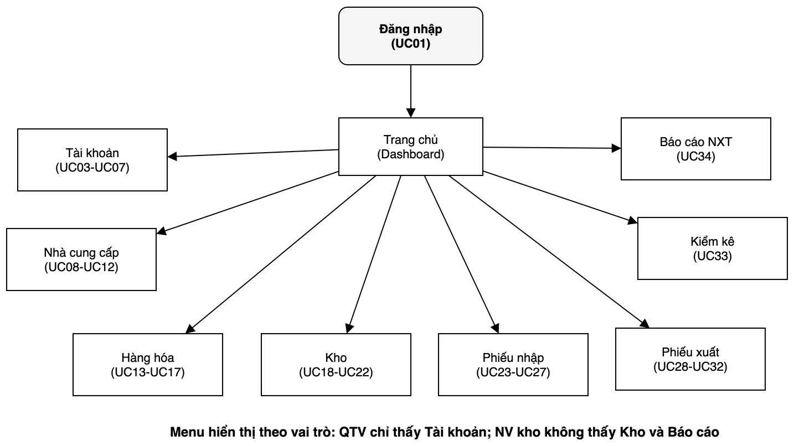
Hình 8.1 mô tả người dùng đi từ màn hình nào sang màn hình nào:
- Điểm vào là **Đăng nhập (UC01)**, thành công thì tới **Trang chủ (Dashboard)**.
- Từ trang chủ tỏa ra các màn chức năng theo **vai trò**: Quản trị viên chỉ thấy Tài khoản (UC03 - UC07); Quản lý kho / Nhân viên kho thấy hàng hóa, NCC, kho, phiếu, báo cáo theo đúng quyền (Nhân viên kho không thấy Kho và Báo cáo).
- Mỗi hộp màn hình gắn mã UC để truy vết thiết kế giao diện về phân tích chức năng.

Sơ đồ không mô tả layout chi tiết từng form mà mô tả cấu trúc menu / luồng màn hình phục vụ triển khai UI. Các màn hình chính: Đăng nhập; Trang chủ; bốn màn danh mục (Tài khoản, NCC, Hàng hóa, Kho - mỗi màn đủ thêm / sửa / xóa / tìm / xem); Phiếu nhập; Phiếu xuất; Kiểm kê; Báo cáo nhập - xuất - tồn (chọn điều kiện, bảng kết quả, nút xuất Excel).
## 8.2. Kết luận chương
Chương 8 hoàn tất thiết kế giao diện với sơ đồ điều hướng màn hình gắn mã use case (Hình 8.1). Đến đây báo cáo khép kín chuỗi truy vết: yêu cầu (FR) --> use case --> biểu đồ trình tự --> lớp / phương thức --> bảng CSDL --> màn hình.
<!-- @pagebreak -->
# TÀI LIỆU THAM KHẢO
1. G. Booch, J. Rumbaugh, and I. Jacobson, *The Unified Modeling Language User Guide*, 2nd ed. Boston, MA: Addison-Wesley, 2005.
2. C. Larman, *Applying UML and Patterns: An Introduction to Object-Oriented Analysis and Design and Iterative Development*, 3rd ed. Upper Saddle River, NJ: Prentice Hall, 2004.
3. I. Sommerville, *Software Engineering*, 10th ed. Harlow, England: Pearson, 2016.
4. Nguyễn Nhật Quang, *Bài giảng Phân tích và Thiết kế Hệ thống*, Trường Công nghệ Thông tin và Truyền thông, Đại học Bách khoa Hà Nội.
5. Gin Web Framework, "Gin documentation," https://gin-gonic.com/docs/, và Meta Platforms, "React documentation," https://react.dev/, truy cập tháng 7 năm 2026.
6. The PostgreSQL Global Development Group, "PostgreSQL documentation," https://www.postgresql.org/docs/, truy cập tháng 7 năm 2026.
